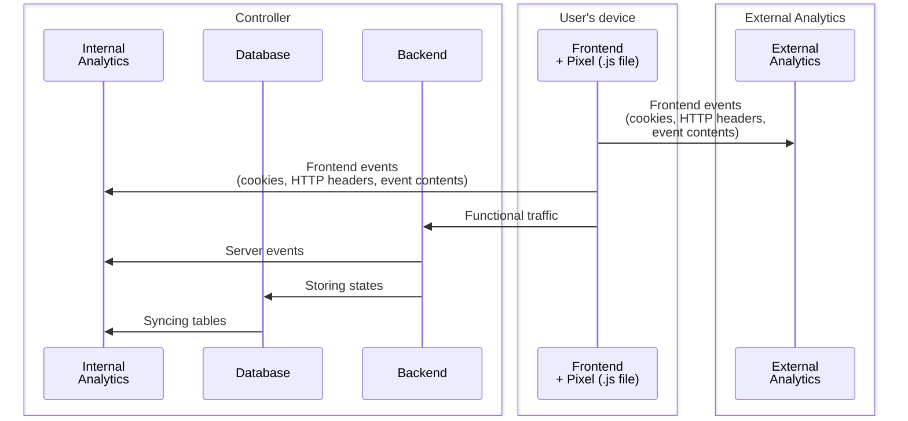

```mermaid
sequenceDiagram
    box Controller
    participant IA as Internal<br>Analytics
    participant DB as Database
    participant B as Backend
    end

    box User's device
    participant F as Frontend<br>+ Pixel (.js file)

    end

    box External Analytics
    participant EA as External<br>Analytics
    end

    F->>EA: Frontend events<br>(cookies, HTTP headers,<br>event contents)
    F->>IA: Frontend events<br>(cookies, HTTP headers, event contents)
    F->>B: Functional traffic
    B->>IA: Server events
    B->>DB: Storing states
    DB->>IA: Syncing tables    
```