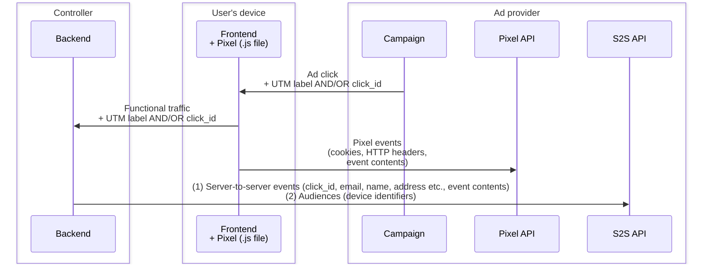

```mermaid
sequenceDiagram
    box Controller
    participant B as Backend
    end

    box User's device
    participant F as Frontend<br>+ Pixel (.js file)

    end


    box Ad provider
    participant C as Campaign
    participant PA as Pixel API
    participant SA as S2S API
    end

    C->>F: Ad click<br>+ UTM label AND/OR click_id
    F->>B: Functional traffic<br>+ UTM label AND/OR click_id
    F->>PA: Pixel events<br/>(cookies, HTTP headers,<br/>event contents)
    B->>SA: (1) Server-to-server events (click_id, email, name, address etc., event contents)<br>(2) Audiences (device identifiers)

    
```