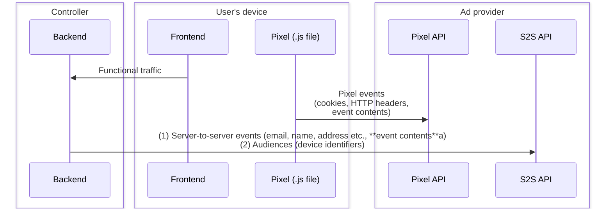

```mermaid
sequenceDiagram
    box Controller
    participant B as Backend
    end

    box User's device
    participant F as Frontend
    participant P as Pixel (.js file)
    end

    
    
    box Ad provider
    participant PA as Pixel API
    participant SA as S2S API
    end

    F->>B: Functional traffic
    P->>PA: Pixel events<br/>(cookies, HTTP headers,<br/>event contents)
    B->>SA: (1) Server-to-server events (email, name, address etc., **event contents**a)<br>(2) Audiences (device identifiers)

    
```