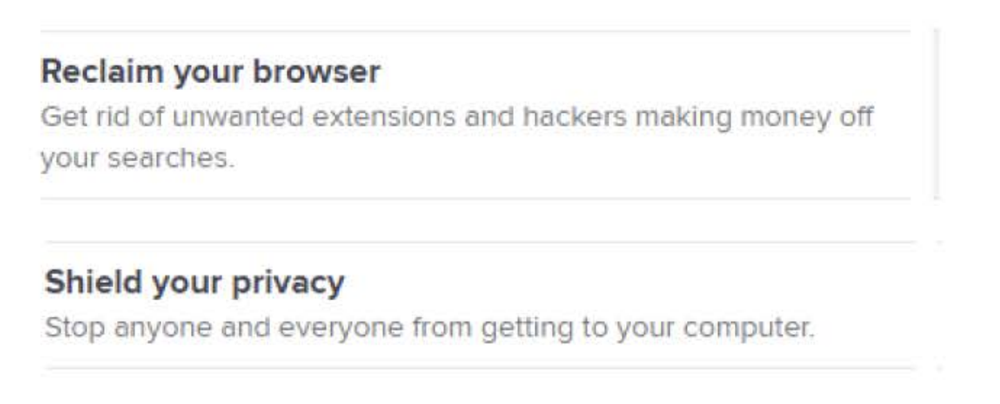

2023033

UNITED STATES OF AMERICA BEFORE THE FEDERAL TRADE COMMISSION

COMMISSIONERS:	Lina M. Khan, Chair Rebecca Kelly Slaughter Alvaro M. Bedoya

DOCKET NO.

# COMPLAINT

The Federal Trade Commission, having reason to believe that Avast Limited, a limited liability company, Avast Software s.r.o., a limited liability company, and Jumpshot, Inc., a Delaware company, have violated the provisions of the Federal Trade Commission Act, and it appearing to the Commission that this proceeding is in the public interest, alleges:

**1.**	Respondent Avast Limited (“Avast Ltd”) is a United Kingdom limited liability company with its principal place of business at 100 New Bridge Street, London EC4V 6JA, England. Respondent Avast Ltd is the indirect parent company of Respondent Avast Software s.r.o. and Respondent Jumpshot, Inc.

**2.**	Respondent Avast Software s.r.o. (“Avast Software s.r.o.” and, collectively with Avast Ltd, “Avast”) is a Czech Republic limited liability company with its principal place of business at Enterprise Office Center, Pikrtova 1737/1A, 140 00 Prague 4, Czech Republic. Respondent Avast Software s.r.o. is a wholly-owned, indirect subsidiary of Avast Ltd.

**3.**	Respondent Jumpshot, Inc. (“Jumpshot”) is a Delaware corporation with its principal place of business at Suite 450, 9300 Harris Corners Parkway, Charlotte, NC 28269. Respondent Jumpshot was a wholly-owned subsidiary of Avast Ltd prior to the closing of Jumpshot’s operations in January 2020.

**4.**	Respondents Avast Ltd, Avast Software s.r.o., and Jumpshot (collectively, “Respondents”) have operated as a common enterprise while engaging in the unlawful acts and practices alleged below. Respondents have conducted the business practices described below through interrelated companies that have common ownership, officers, managers, business functions, employees, and office locations, and that commingled funds. Because the Respondents have operated as a common enterprise, each of them is jointly and severally liable for the acts and practices alleged below.

**5.**	As detailed below, from at least 2014 to the present day, Respondents distributed software that they promoted with a variety of privacy claims. During this time period, Respondents have claimed their software would “block[] annoying tracking cookies that collect data on your browsing activities” and “[p]rotect your privacy by preventing . . . web services from tracking your online activity.” In fact, from 2014 through January 2020, Respondents sold the browsing information that they purported to protect, in many instances without notice to users. Furthermore, where they did describe their information practices, Respondents claimed that any sharing of user information would be in “anonymous and aggregate” form. In fact, Respondents sold consumers’ browsing data to third parties in non-aggregate, re-identifiable form. Respondents failed to obtain consumers’ consent to engage in these practices and deceived consumers about their conduct.

**6.**	The acts and practices of Respondents alleged in this complaint have been in or affecting commerce, as “commerce” is defined in Section 4 of the Federal Trade Commission Act.

## Collection of Browsing Information

**7.**	Since at least 2014, Respondents have collected consumers’ browsing information through browser extensions and antivirus software installed on consumers’ computers and mobile devices.

**8.**	Browser extensions are software programs that can modify or extend the functionality of consumers’ web browsers. Respondents developed and distributed two browser extensions that collected information about consumers’ browsing activities: Avast Online Security and AVG Online Security (collectively, “the Avast Extensions”). Respondents also distribute the “Avast Secure Browser,” a browser that comes pre-installed with the Avast Online Security browser extension.

**9.**	Antivirus software programs for consumers’ computers or mobile devices are designed to identify and address potential risks to consumers’ privacy or security, such as malware. Avast Software s.r.o. developed and distributed antivirus software for Windows computers and Android devices that collected information about consumers’ browsing activities: Avast Free Antivirus (“Avast Desktop Software”) and Avast Antivirus – Mobile Security & Virus Cleaner (“Avast Mobile Software”).

**10.**	Ostensibly to provide security and privacy services, Respondents used the Avast Extensions, the Avast Secure Browser, Avast Mobile Software, and Avast Desktop Software (collectively, “Avast Software”) to collect browsing information from users of these products ("Avast users"), including: unifo1m resource locators (URLs) of webpages visited; the URLs of background resources (such as the domains of third parties placing cookies, or of images pulled from domains other than the displayed URL); consumers' search queries; and the value of cookies placed on consumers' computers by third parties.

## Representations Regarding the Purpose of Respondents' Products

**11.**	Respondents advertised the privacy and security functionality of the Avast Software on webpages Respondents maintained or controlled, where consumers were able to download the Avast Software.

## Respondents' Browser Extensions

**12.**	Respondents described the Avast Extensions in the Chrome Web Store as protecting privacy and security. A consumer that searched for "Avast Online Security" in the Chrome Web Store could install the extension without viewing any disclosures about Respondents' collection or sale of browsing info1matio11 or seeing a link to Avast's privacy policy. The Avast Online Security extension could be installed using the "Add to Chrome" button on the search result page, as shown here:

The description for the AVG Online Security results page was the same as for the Avast Online Secmi.ty results page.

**13.**	For consumers who clicked past the search results page and viewed the info1matio11page for each Avast Extension, Respondents failed to disclose any infonnation about their collection or sale of browsing info1mation. Indeed, Respondents affi1matively represented that the extensions would decrease tracking on the Internet, as shown on the inf01mation page for the Avast Online Security extension:

The information page for AVG Online Security was identical to the inf01mation page for Avast Online Security. In fact, as described below at Paragraphs 18-30, the Avast Extensions tracked consumers' browsing activities more extensively than could ordinaiy tracking cookies.

## Respondents' Mobile Software

**14.**	The info1mation page for Avast Mobile Software also affi1matively represented that the product would enhance consumer privacy while browsing the Internet:

These disclosures equate apps that ai·e "sending your personal data to their servers" with "spywai·e and adware," and state that Avast Mobile Softwai·e will provide alerts when this occurs. Once installed, as described below at Paragraphs 18-30, the Avast Mobile Software itself sent consumers' personal data to Avast's servers, and some of that data was ultimately sold to third parties.

## Respondents' Desktop Software

**15.**	Since at least 2015, on the download page for the Avast Desktop Softwai·e, Avast included the following representations, which consumers would view prior to downloading the softwai·e:

Avast represented that its software would"[s]hield your privacy. Stop anyone and eve1yone from getting to your computer." Avast also represented that its softwai·e would allow consumers to "[r]eclaim your browser. Get rid of unwanted extensions and hackers making money off your searches." Avast continued to make these claims until Febmaiy 2017.

**16.**	Beginning in April 2018, Avast began to distribute the Avast Secure Browser, which came pre-installed with an Avast Browser Extension, which was not visible to the consumer and which could not be uninstalled. Avast marketed the Avast Secure Browser for its privacy features, including making the following representations on the download page, which consumers viewed prior to choosing to download the software:

In this image, Avast Software s.r.o. represents that the Avast Secure Browser is “Anti-Tracking” and “[p]rotects your privacy by preventing websites, advertising companies, and other web services from tracking your online activity.”

**17.**	Consumers who purchased the premium versions of Avast Software were told that it would “remove ads” or “remove third-party advertising.” As discussed below at Paragraphs 18–30, however, Respondents still sold those consumers’ browsing information to third parties.

## Sale and Use of Browsing Information

**18.**	Prior to its acquisition by Avast Software s.r.o. in 2013, Jumpshot was a competing antivirus company. In early 2014, Avast Software s.r.o. rebranded Jumpshot as an analytics company, which advertised that its “[m]ore than 100 million online consumers worldwide” would give Jumpshot’s customers “unique insights to make better business decisions.” Jumpshot offered its customers the ability to “[s]ee where your audience is going before and after they visit your site or your competitors’ sites, and even track those who visit a specific URL.”

**19.**	From 2014 through January 2020, Jumpshot sold browsing information that Avast collected to a variety of clients, including consulting firms, investment companies, advertising companies, marketing data analytics companies, individual brands, search engine optimization firms, and data brokers.

**20.**	Using a proprietary algorithm developed by Avast, Avast and Jumpshot purported to find and remove identifying information prior to each transfer of consumer browsing information to Jumpshot’s servers. But this process was not sufficient to anonymize consumers’ browsing information, which Jumpshot then sold, in non-aggregate form, through a variety of different products to third parties.

**21.**	Many of the Jumpshot products (or “data feeds”) provided third-party data buyers with extraordinary detail regarding how consumers navigated the Internet, including each webpage visited, precise timestamp, the type of device and browser, and the city, state, and country. Most of the data feeds included a unique and persistent device identifier associated with each particular browser (“Jumpshot GUID”), allowing Jumpshot and the third-party buyer to trace individuals across multiple domains over time.

**22.**	Jumpshot data feed products included the “All Clicks Feed” (all URLs clicked during particular consumers’ browsing sessions); “Search Plus Click Feed” (consumers’ search terms plus the selected results); “Insights Feed” (all commerce “events”—e.g., consumers’ searches, adding items to a shopping cart, and purchases on a domain); “Transaction Feed” (details on each purchase event, such as price, brand, seller); “Marketplace Feed” (all consumer interactions with a particular product across multiple domains); and “Cookie Feed” (consumer clickstream data filtered based on cookie values provided by Jumpshot’s customers, allowing Jumpshot’s customers to assess behavior on domains where the third party was not able to place a cookie directly).

**23.**	Jumpshot entered unique contracts with large data buyers to provide a large number of custom data feeds that permitted invasive uses of consumers’ browsing information. For example, from May 2017 to April 2019, Jumpshot granted LiveRamp, a data company that specializes in various identity services, a “world-wide license” to use consumers’ granular browsing information, including all clicks, timestamps, persistent identifiers, and cookie values, for a number of specified purposes. One specified purpose was “targeting, messaging and other data driven marketing activities served to consumers and businesses.” Other terms appear to permit LiveRamp to use Jumpshot’s consumer data to track and target consumers across multiple devices.

**24.**	One agreement between LiveRamp and Jumpshot stated that Jumpshot would use two services: first, “ID Syncing Services,” in which “LiveRamp and [Jumpshot] will engage in a synchronization and matching of identifiers,” and second, “Data Distribution Services,” in which “LiveRamp will ingest online Client Data and facilitate the distribution of Client’s Data (i.e., data segments and attributes of its users associated with Client IDs) to third-party platforms for the purpose of performing ad targeting and measurement.” These provisions permit the targeting of Avast consumers using LiveRamp’s ability to match Respondents’ persistent identifiers to LiveRamp’s own persistent identifiers, thereby associating data collected from Avast users with LiveRamp’s data.

**25.**	In August 2018, Jumpshot entered into a contract with Lotame, a data enrichment company, that permitted Lotame to “match[], combin[e], append[], and model[]” Jumpshot’s data with Lotame’s data, and then “license such Modeled Data to customers of Lotame’s products and services.” The contract expressly permitted Lotame to use Jumpshot data, combined with its own, “for marketing purposes, including targeting of digital advertisements and digital content.” The parties agreed that Jumpshot would receive a share of the revenue that Lotame earned through the targeting of consumer audiences made up of, or derived from, browsing information held by Jumpshot.

**26.**	In December 2017, Jumpshot entered into a contract with Omnicom, an advertising conglomerate. The contract between Jumpshot and Omnicom stated that Jumpshot would provide Omnicom with an “All Clicks Feed” for 50% of its customers in the United States, United Kingdom, Mexico, Australia, Canada, and Germany. Jumpshot’s “All Clicks Feed” ordinarily was limited to clicks associated with a particular domain; for example, an investment company might purchase the “All Clicks Feed” for the domains of a potential investment target. In the Omnicom contract, however, Jumpshot agreed to provide the “All Clicks Feed” for 50% of its entire user base, across all domains. According to the contract, Omnicom was “allowed to map out/translate Jumpshot GUIDs into [data broker Neustar’s] Neustar IDs. Customer can also match with LiveRamp.” These provisions permitted Omnicom to associate Respondents’ data with other sources of data, on an individual user basis. The contract also permitted Omnicom to “transmit, market and sublicense” to its own customers products derived from the raw data. The production fee schedule stated in the first work order to the contract was approximately $2 million per year.

**27.**	Some of the contracts, including the agreement between LiveRamp and Jumpshot, did not prohibit the data buyer from re-identifying Avast users based on data that Jumpshot provided. In other instances, Jumpshot prohibited data buyers from re-identifying Avast users, but those prohibitions were limited. The Jumpshot contracts that did prohibit re-identification defined re-identification as associating personally-identifiable information (such as a consumer’s home address) with the browsing information—meaning such data buyers were free to associate non-personally-identifiable information with Avast users’ browsing information. Indeed, in some cases, it was clear that the client was purchasing the data to do just that. And Jumpshot failed to audit or otherwise confirm that its data buyers complied with such prohibitions.

**28.**	Respondents, through Jumpshot, sold consumers’ browsing information to more than 100 customers, beginning in 2014. Jumpshot earned tens of millions in gross revenues by selling user data collected by the Avast Software, and insights derived from such data, to its customers.

**29.**	After the Commission issued a civil investigative demand, Respondents announced on January 30, 2020, that they would shut down Jumpshot’s operations. In an open letter posted on Avast’s website explaining the decision, Avast’s CEO stated: “I—together with our board of directors—have decided to terminate the Jumpshot data collection and wind down Jumpshot’s operations, with immediate effect.”

**30.**	Through the entire period that Jumpshot received browsing information from Avast, Jumpshot never deleted any of the data. By January 2020, Jumpshot had more than eight petabytes of browsing information dating back to 2014.

## Representations Regarding Disclosure of Browsing Information

**31.**	While Respondents made prominent claims touting the privacy and security features of its products, Respondents in many instances failed to disclose that consumers’ browsing information would be sold to third parties, or misrepresented how such data would be disclosed. For example, until 2018, Respondents’ privacy policy did not indicate that consumers’ browsing information would be disclosed to third parties outside a law enforcement or service provider context, and when the policy was revised in 2018, the revised policy misrepresented how the data was disclosed, as discussed below.

**32.**	Respondents first provided details about their data sales practices in 2015, but only to individuals who participated in Avast forums, a technically-oriented informational site hosted by Avast for users to exchange information about Avast products. And, even this technically-oriented post misrepresented the privacy protections for consumers’ browsing information.

**33.**	In a May 30, 2015, post on Avast’s web forum, Avast’s Chief Technology Officer highlighted Avast’s “recent[] . . . investment in a marketing analytics platform called Jumpshot,” and explained:

To further protect our users’ privacy, we only accept websites where we can observe at least 20 users. This ensures that no reverse engineering is possible on the aggregated data—there’s nothing that can lead back to a specific user. All aggregated data is then stored . . . on a per-domain and keyword basis. These aggregated results are the only thing that Avast makes available to Jumpshot customers and end users.

In fact, as described above at Paragraphs 18–30, Respondent Jumpshot received from Respondent Avast Software s.r.o., and provided Jumpshot customers with, non-aggregate data. Not only did Jumpshot provide data that could lead back to a specific user, but the entire purpose of some of the Jumpshot products was to enable clients to track specific users or even to associate specific users—and their browsing history—with identifiers known to the Jumpshot customer and in turn to information the Jumpshot customer had associated with that identifier.

**34.**	This forum post also described the notice that Respondents would provide during the installation process:

Avast is committed to protecting its customers on all fronts, which is why we inform our users, even beyond our EULA and Privacy policy, that their browsing information will be collected but stripped of personally identifiable information and will be used to help us better understand new and interesting trends. We actually tried to make this very, very explicit, and that’s why we have an extra step in the Avast installer which informs our users in a very straightforward way about what we’re doing.

In fact, contrary to this promise, Respondents only provided a pop-up notification during the installation of one of their products—the Avast Desktop Software. No such notification was provided during the installation process for any other product, and no notification was provided to Avast users (including Avast Desktop Software users) who had already downloaded Avast Software, even though Respondents not only sold information collected from those users on a going-forward basis but also information that had previously been collected from those users in 2014. And, at least one version of the pop-up notification for the Avast Desktop Software claimed, incorrectly, that the data collected “is fully de-identified and aggregated.”

**35.**	Respondents included a privacy setting that enabled users of the Avast Mobile Software to turn off third-party data sharing (the default setting allowed disclosure of browsing information to third parties). Respondents did not disclose the existence of this setting either before or during the installation process—consumers would have to explore their settings to find it after downloading the software. Even if they did find the setting, the description of the setting indicated incorrectly that data the consumer permitted to be shared with third parties would be anonymized:

**36.**	The online download pages of the Avast Software products contain links to Respondents’ privacy policy. Prior to October 2018, Respondents’ sale of consumers’ browsing information to third parties through Jumpshot was not disclosed in the privacy policy. Privacy policies prior to October 2018 stated that browsing information would be collected only “to ascertain the source of [malware] infection” and that these products “collect no more information than is required in order to provide full functionality.” These policies stated that personally identifiable information would be provided to third parties only when required by law or in the context of a service provider.

**37.**	Beginning in October 2018, Respondents stated in their privacy policy for the first time that browsing information, referred to in the policy as “Clickstream Data,” would be disclosed to third parties, but indicated that “[w]e pseudonymize and anonymize the Clickstream Data and re-use it for cross-product direct marketing, cross-product development and third party trend analytics.” In the same policy, Respondents stated, “[w]e also share statistical data that has been anonymized and aggregated geographically and so cannot be used to identify individuals, with third parties for trend analytics.” Respondents’ privacy policy defined “anonymized” as “removing or de-identifying all specific identifiers	When we refer to anonymous data, we mean data that cannot be reversed into personal data.”

**38.**	In 2019, Respondents revised their privacy policy to indicate that certain data would be disclosed to Respondent Jumpshot:

This statement represents, among other things, that “all that Jumpshot gets is an aggregated, de- identified data set of online trends.” In fact, as described above at Paragraphs 18–30, Jumpshot received granular, non-aggregate browsing information from Avast.

**39.**	Respondents removed the “Trend Analytics” language from its privacy policy in December 2019, after Google banned the Avast Extensions for violating the Chrome Web Store’s policy, in place since April 2016, which prohibits “[c]ollection and use of web browsing activity . . . except to the extent required for a user-facing feature described prominently in the Product’s Chrome Web Store page and in the Product’s user interface.”

## Consumer Harm Related to Browsing Information

**40.**	The vast majority of consumers would not know that the Avast Software would surveil their every move on the Internet or that their browsing information might be sold to more than 100 third parties and stored indefinitely, in granular, re-identifiable form.

**41.**	Re-identifiable browsing information is sensitive data. Among other things, the Avast Extensions and Avast Antivirus Software collected browsing information—including web searches and webpages visited—revealing consumers’ religious beliefs, health concerns, political leanings, location, financial status, visits to child-directed content, and interest in prurient content. For example, a sample of just 100 entries out of trillions retained by Respondents showed visits by consumers to the following pages: an academic paper on a study of symptoms of breast cancer; Sen. Elizabeth Warren’s presidential candidacy announcement; a CLE course on tax exemptions; government jobs in Fort Meade, Maryland with a salary greater than

$100,000; a link (then broken) to the mid-point of a FAFSA (financial aid) application; directions on Google Maps from one location to another; a Spanish-language children’s YouTube video; a link to a French dating website, including a unique member ID; and cosplay erotica.

**42.**	Respondents combined this type of information with persistent identifiers— including identifiers created by Respondents that identified each consumer’s device uniquely, as well as identifiers collected directly from consumers’ devices—as well as coarse location information. The fact that browsing information was linked to an identifier over time increased the likelihood that a consumer could be reidentified.

**43.**	Respondents had direct evidence that many consumers did not want their browsing information to be sold to third parties, even when they were told that the information would only be shared in de-identified form. In 2019, when Avast asked users of other Avast antivirus software to opt-in to the collection and sale of de-identified browsing information, fewer than 50% of consumers did so.

# VIOLATIONS OF THE FTC ACT

## Count 1

### Unfair Collection, Retention, and Sale of Consumers’ Browsing Information

**44.**	As described in Paragraphs 7–10 and 18–30, through the Avast Software, Respondents collected consumers’ browsing information, stored that information in granular form indefinitely, and sold that information in granular form to third parties, without adequate notice and without consumer consent.

**45.**	These practices caused or are likely to cause substantial injury to consumers that is not outweighed by countervailing benefits to consumers or competition and is not reasonably avoidable by consumers themselves. These practices are unfair acts or practices.

## Count 2

### Deceptive Failure to Disclose Tracking of Consumers

**46.**	In numerous instances, including through the means described in Paragraphs 11– 17, Respondents represented, directly or indirectly, expressly or by implication, that the Avast Software would stop the collection and sale of consumers’ browsing information.

**47.**	Respondents failed to disclose, or failed to disclose adequately, to consumers that that Respondents, through the Avast Software, collected and sold consumers’ browsing information as alleged in Paragraphs 7–10 and 18–30. These facts would be material to consumers in their decision to use Respondents’ services.

**48.**	Respondents’ failure to disclose or disclose adequately the material information described in Paragraph 47, in light of the representation set forth in Paragraph 46, is a deceptive act or practice.

## Count 3

### Misrepresentations Regarding Aggregation and Anonymization

**49.**	In numerous instances, including through the means described in Paragraphs 31– 39, Respondents represented, directly or indirectly, expressly or by implication, that consumers’ browsing information would be transferred to Respondent Jumpshot and to third parties only in aggregate and anonymous form.

**50.**	In fact, as set forth in Paragraphs 18–30, Respondents transferred to Respondent Jumpshot, and to third parties, consumers’ browsing information in non-aggregate and non- anonymous form. Therefore, the representation set forth in Paragraph 49 is false or misleading.

## Violations of Section 5

**51.**	The acts and practices of Respondents as alleged in this complaint constitute unfair or deceptive acts or practices in or affecting commerce in violation of Section 5(a) of the Federal Trade Commission Act.

THEREFORE, the Federal Trade Commission this 	 day of 	 2024, has issued

this complaint against Respondents.

By the Commission.

April J. Tabor

Secretary

SEAL: