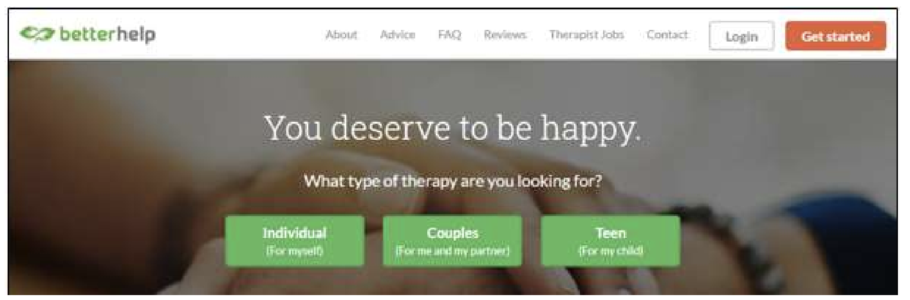
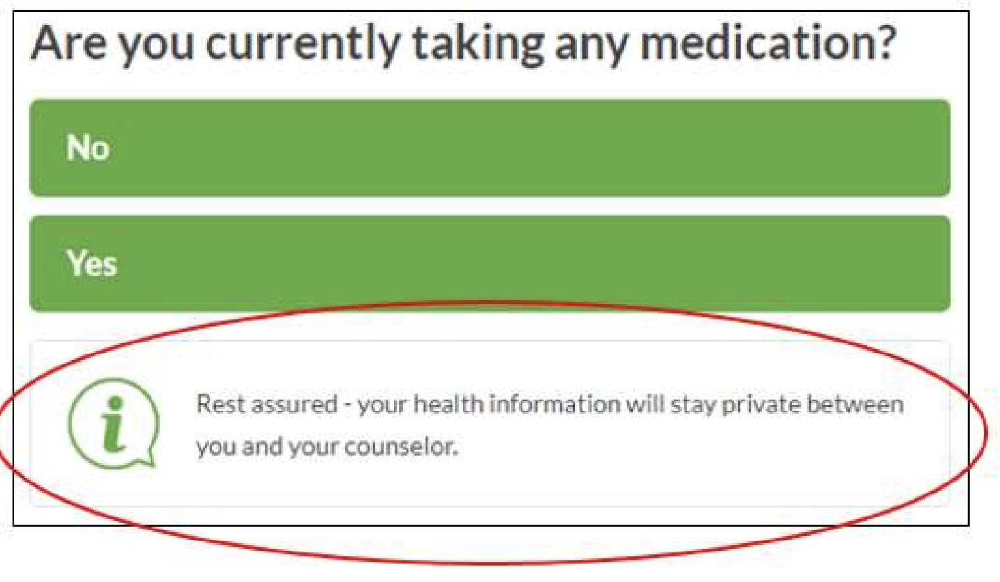
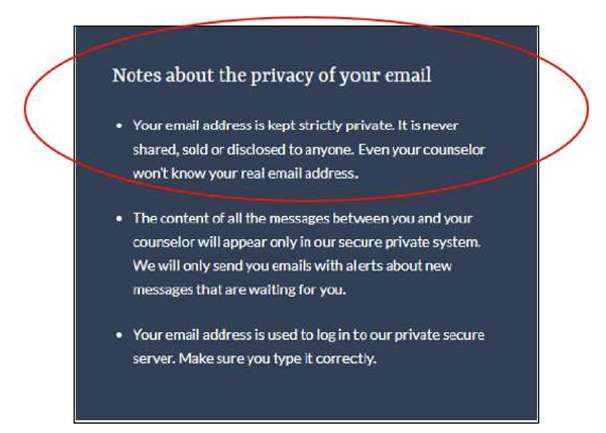
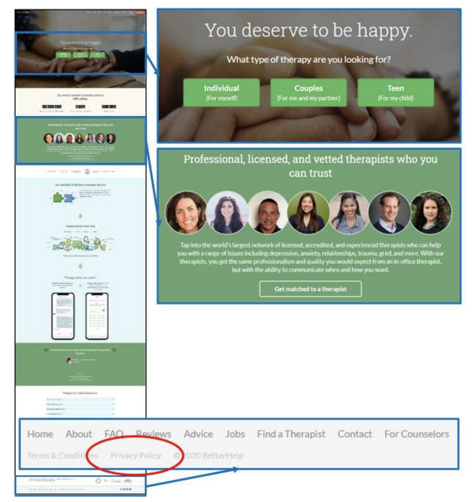
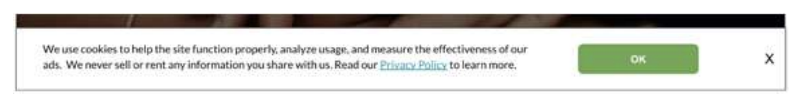
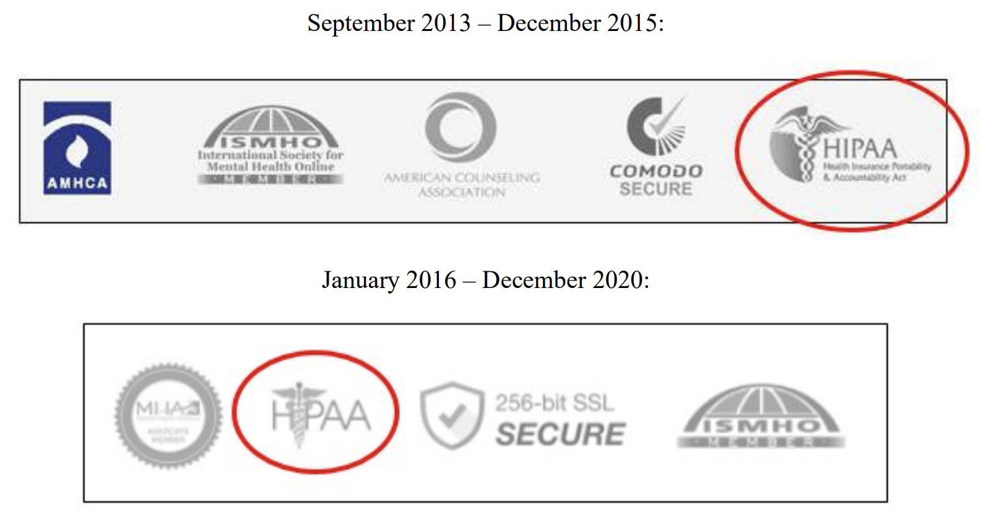

2023169

UNITED STATES OF AMERICA BEFORE THE FEDERAL TRADE COMMISSION

COMMISSIONERS: Lina M. Khan, Chair

Rebecca Kelly Slaughter Alvaro M. Bedoya

DOCKET NO. C-4796

COMPLAINT

The Federal Trade Commission (“FTC” or “Commission”), having reason to believe that BetterHelp, Inc., a corporation, has violated the provisions of the Federal Trade Commission Act, and it appearing to the Commission that this proceeding is in the public interest, alleges:

**1.** Respondent BetterHelp, Inc. (“BetterHelp” or “Respondent”), also doing business as Compile, Inc.; MyTherapist; Teen Counseling; Faithful Counseling; Pride Counseling; iCounseling; ReGain; and Terappeuta, is a Delaware corporation with its principal office or place of business at 990 Villa Street, Mountain View, CA 94041.

**2.** Respondent has developed, advertised, and offered for sale an online counseling service (the “Service”)—including specialized versions of the Service for people of the Christian faith, members of the LGBTQ community, and teenagers—which matches users with Respondent’s therapists and then facilitates counseling via Respondent’s websites and apps.

**3.** Millions of consumers have signed up for the Service, entrusting Respondent with their email addresses, IP addresses, and certain information about their health status and histories— such as the fact that they are seeking or are in therapy, and whether they have previously been in therapy. Because Respondent collects certain types of personal information from consumers when they take affirmative steps to sign up for the Service, Respondent’s disclosure of that information to a third party would implicitly disclose the consumer’s interest in or use of the Service and therefore constitute a disclosure of the consumer’s health information. For example, because Respondent obtained a consumer’s email address only when the consumer took affirmative steps to utilize the Service, Respondent’s disclosure of this information would identify the consumer as associated with seeking and/or receiving mental health treatment.

Similarly, Respondent’s disclosure that a consumer took affirmative steps to sign up for the Service (such as by filling out Respondent’s intake questionnaire for the Service or becoming a paying user), along with an identifier (for example, an IP address), would disclose the consumer’s seeking of mental health treatment via the Service.

**4.** Recognizing the sensitivity of this health information, Respondent has repeatedly promised to keep it private and use it only for non-advertising purposes such as to facilitate consumers’ therapy.

**5.** From 2013 to December 2020, however, Respondent continually broke these privacy promises, monetizing consumers’ health information to target them and others with advertisements for the Service. For example, from 2018 to 2020, Respondent used these consumers’ email addresses and the fact that they had previously been in therapy to instruct Facebook to identify similar consumers and target them with advertisements for the Service, bringing in tens of thousands of new paying users, and millions of dollars in revenue, as a result.

**6.** To capitalize on these consumers’ health information, Respondent handed it over to numerous third-party advertising platforms, including Facebook, Pinterest, Snapchat, and Criteo, often permitting these companies to use the information for their own research and product development as well.

**7.** In addition, Respondent failed to employ reasonable measures to safeguard the health information it collected from consumers. In particular, Respondent did not properly train its employees on how to protect the information when using it for advertising, and Respondent did not properly supervise its staff in the use of the information. Respondent also failed to provide consumers with proper notice as to the collection, use, and disclosure of their health information. And Respondent failed to limit contractually how third parties could use consumers’ health information, instead merely agreeing to their stock contracts and terms.

**8.** It was only in December 2020, well after reporters brought these practices to light and the FTC began investigating the practices, that Respondent curtailed its unauthorized use and disclosure of consumers’ health information.

**9.** The acts and practices of Respondent alleged in this complaint have been in or affecting commerce, as “commerce” is defined in Section 4 of the Federal Trade Commission Act.

# I. Background

## A. The Service

**10.** Respondent offers the Service under several names, each of which has its own website and app (collectively, the “Multi-Sites”). Its primary website and app, which is named “BetterHelp,” serves general audiences and has been in operation since 2013. Faithful Counseling, in operation since July 2017, is aimed at consumers of the Christian faith. Pride Counseling, in operation since August 2017, caters to the LGBTQ community. Teen Counseling, in operation since January 2017, offers counseling to 13- to 18-year-olds with parental consent. And ReGain, in operation since May 2016, offers couples counseling.1 The Multi-Sites all function similarly and facilitate therapy via the Service, and they are all subject to Respondent’s policies, practices, and procedures.

**11.** Users pay $60 to $90 per week for counseling through the Service. To sign up for the Service and become a paying user (a “User”), an individual visiting one of the Multi-Sites (a “Visitor”) must fill out a questionnaire (the “Intake Questionnaire”), answering detailed questions about the Visitor’s mental health.

**12.** Upon completing the Intake Questionnaire, a Visitor is prompted to create an account for the Service by entering the Visitor’s name or nickname, email address, phone number, and emergency contact information. The Visitor is then asked to enter credit card information to become a paying User.

**13.** Respondent then utilizes the User’s responses to the Intake Questionnaire to match the User with one of Respondent’s more than 25,000 licensed therapists. Respondent’s therapists provide Users with mental health therapy via video conferencing, text messaging, live chat, and audio calls.

**14.** Respondent’s primary website and app, “BetterHelp,” has seen explosive growth over the last few years, adding over 118,000 U.S. Users in 2018, over 158,000 U.S. Users in 2019, and over 641,000 U.S. Users in 2020. Since its inception, BetterHelp has signed up over 2 million Users, and, today, it has over 374,000 active Users in the United States. As a result, Respondent earned over $345 million in revenue in 2020, and over $720 million in revenue in 2021.

## B. Respondent’s Marketing History

**15.** Since its inception, Respondent has utilized numerous third parties to market the Service, including, at various times, Facebook, Snapchat, Pinterest, and Criteo. In addition, Respondent has advertised the Service on search engines, television, podcasts, and radio.

**16.** In 2017, Respondent delegated most decision-making authority over its use of Facebook’s advertising services to a Junior Marketing Analyst who was a recent college graduate, had never worked in marketing, and had no experience and little training in safeguarding consumers’ health information when using that information for advertising. In doing so, Respondent gave the Junior Marketing Analyst carte blanche to decide which Visitors’ and Users’ health information to upload to Facebook and how to use that information. This same individual, who now holds the title “Senior Marketing Analyst,” continues to oversee Respondent’s use of Facebook’s advertising tools.

**17.** Respondent provided this marketing analyst with little training on how to protect Visitors’ and Users’ health information in connection with advertising until 2021. In fact, while Respondent also offered the Service through the iCounseling website and app from February 2017-November 2020, the Terappeuta website and app from March 2017-March 2019, and the MyTherapist website and app from June 2017-March 2019. Respondent has purported to provide privacy training to its employees since 2015, it was not until 2021 that Respondent gave them any training specific to its business or advertising.

**18.** Respondent has spent tens of millions of dollars annually to market the Service. In 2020, for example, it spent $10-$20 million on Facebook advertising, and by 2021 Respondent’s advertising on Facebook was bringing in approximately 30,000 to 40,000 new Users per quarter.

# II. Respondent’s Deceptive Business Practices

**19.** In connection with the advertisement and sale of the Service, Respondent has disseminated, or caused to be disseminated, false and deceptive statements about its use and disclosure of consumers’ health information. Respondent also disseminated, or caused to be disseminated, misleading and deceptive representations regarding its compliance with federal health privacy laws. Visitors and Users relied on these representations and were misled as a result.

## A. Deceptive Statements About Privacy on Respondent’s Websites and Apps 
### Respondent’s deceptive statements concerning Intake Questionnaire responses

**20.** Upon arriving at any of the Multi-Sites, a Visitor is immediately prompted to begin the Intake Questionnaire. For example, on the BetterHelp website, a Visitor begins the Intake Questionnaire by selecting whether he or she is looking for “Individual,” “Couples,” or “Teen” therapy, as shown below:

**21.** After making a selection, the Visitor is ushered through the Intake Questionnaire, which asks an array of questions. For many Visitors, these questions include whether the Visitor is “experiencing overwhelming sadness, grief, or depression”; whether the Visitor has been having thoughts that the Visitor “would be better off dead or hurting yourself in some way”; whether the Visitor is “currently taking any medication”; whether the Visitor has “problems or worries about intimacy”; and whether the Visitor has previously been in therapy.

**22.** The Intake Questionnaire also asks whether the Visitor identifies as a member of the Christian faith, shuttling such individuals to Faithful Counseling. Similarly, the Intake Questionnaire takes those who identify as members of the LGBTQ community to Pride Counseling. And Respondent ushers teenagers to Teen Counseling, where the teenage Visitors provide their responses to the Intake Questionnaire before Respondent obtains parental consent.

**23.** Respondent has included privacy assurances throughout the Intake Questionnaire. Until November 2021, each Multi-Site displayed a banner at the top of each question, explaining that Respondent is merely asking for “some general and anonymous background information about you and the issues you’d like to deal with in online therapy” (emphasis added) so that the Visitor can be matched “with the most suitable therapist for you.”

**24.** As Visitors proceed through the Intake Questionnaire, Respondent includes additional periodic privacy assurances. From at least August 2017 to December 2020, when a Visitor reached the question as to whether the Visitor was taking medication, the Visitor was shown the statement: “Rest assured—any information provided in this questionnaire will stay private between you and your counselor.”

**25.** In December 2020, Respondent changed the statement to read: “Rest assured—this information will stay private between you and your counselor” (emphasis on alteration added). And in January 2021, Respondent changed it again to state: “Rest assured—your health information will stay private between you and your counselor” (emphasis on alteration added). This version, which was in use until September 2021, is circled in red below:

In October 2021, Respondent removed this representation altogether.

**26.** After being presented with these repeated promises of privacy, millions of Visitors, including those that became Users, filled out the Intake Questionnaire and shared their health information with Respondent.

**27.** Despite the aforementioned assurances of privacy, Respondent disclosed Visitors’ and Users’ Intake Questionnaire responses, as well as their email addresses and IP addresses, to Facebook for advertising purposes, as well as for Facebook’s own purposes, as discussed in Paragraphs 51-54 and 57 below.

### Respondent falsely promised to keep Christian, LGBTQ, and teenage consumers’ email addresses “strictly private”

**28.** From at least August 2017 to as recently as December 2020, Respondent gave additional privacy assurances to Faithful Counseling, Pride Counseling, and Teen Counseling Visitors to induce them to sign up for the Service, stating that their email addresses would be “kept strictly private” and “never shared, sold or disclosed to anyone.” This representation, which Respondent displayed prominently and unavoidably during the sign-up process, is circled in red below:

**29.** Tens of thousands of Visitors provided Respondent with their email addresses and signed up for Faithful Counseling, Pride Counseling, and Teen Counseling after viewing this privacy assurance.

**30.** Respondent understood that its disclosure of Visitors’ email addresses in association with BetterHelp would reveal that the Visitors were seeking mental health treatment through the Service. And Respondent understood that consumers would want to keep this information private. In fact, a senior BetterHelp employee acknowledged at an investigational hearing conducted by FTC staff that individuals “want to keep . . . the fact that they’re in therapy private” and at times even “keep their identities . . . secret from their therapist[s].”

**31.** Nevertheless, Respondent disclosed the email addresses of thousands of these Visitors to various third parties for advertising purposes and the third parties’ own purposes, as discussed in further detail in Paragraphs 47-55 and 57, thereby revealing to the third parties that these Visitors were seeking and/or receiving mental health treatment via the Service.

### Respondent pushed Visitors and Users into disclosing their health information

**32.** In addition to making false representations, Respondent has pushed Visitors and Users into handing over their health information before they have ever had a chance to read any privacy disclosures.

**33.** Upon visiting any of the Multi-Sites, Visitors are urged to begin the Intake Questionnaire and hand over their health information. At the same time, Visitors are repeatedly presented with the aforementioned privacy assurances discussed in Paragraphs 23-25 and 28—displayed in large, high-contrast, unavoidable text.

**34.** By contrast, Respondent linked to the privacy policy in small, low-contrast writing that is barely visible at the bottom of the page.

**35.** The image below depicts the BetterHelp homepage (www.betterhelp.com), with the prompts to enter the Intake Questionnaire magnified at the top and the link to the privacy policy magnified at the bottom and circled in red:

**36.** In September 2020, Respondent added the below banner to the bottom of every page of its Multi-Sites (until a Visitor closed it), which stated: “We use cookies to help the site function properly, analyze usage, and measure the effectiveness of our ads. We never sell or rent any information you share with us. Read our Privacy Policy [(linked)] to learn more.”

**37.** Despite including a link to the privacy policy, the banner effectively dissuaded Visitors from reading the privacy policy by stating, until October 2020, that Respondent would “never sell or rent any information you share with us.”

**38.** In May 2021, Respondent revised the banner and added the following underlined language: “We use BetterHelp and third-party cookies and web beacons to help the site function properly, analyze usage, target and measure the effectiveness of our ads. Read our Privacy Policy [(linked)] to learn more and go to Cookie Preferences to manage your settings” (emphasis added). But this banner still did not inform Visitors that Respondent would use and disclose their health information for advertising or that third parties would be able to use Visitors’ information for their own purposes.

**39.** It was not until October 2021 that Respondent revised the banner to state that it discloses Visitors’ IP addresses and other personal identifiers for advertising and offered Visitors an opportunity to opt out of the disclosures via the banner.

### Respondent’s privacy policies claimed limited use and disclosure of consumers’ information

**40.** Those Visitors and Users that persevered and read Respondent’s privacy policy were presented with additional deceptive statements about Respondent’s use and disclosure of health information.

**41.** From August 2013 to November 2018, Respondent’s privacy policies represented that it would use and disclose Visitors’ and Users’ email addresses, IP addresses, enrollment in the Service, and Intake Questionnaire responses for certain purposes, including to connect them with therapists and operate the Service. Notably, these privacy policies made no mention of using or disclosing this information for advertising purposes, and they said nothing about permitting third parties to use this information for their own purposes.

**42.** In November 2018, Respondent updated the privacy policy to state affirmatively that it would use and disclose this information only for limited purposes, such as to operate and improve the Service. These limited purposes did not include using or disclosing the information for advertising or disclosing the information to third parties for their own purposes.

**43.** Respondent revised its privacy policy again in September 2019, stating that it might use this health information for advertising. But the policy continued to say that Respondent would only disclose this information to third parties for certain stated limited purposes, which did not include advertising or the third parties’ own purposes. In September 2020, Respondent revised the privacy policy yet again, finally stating that it may both use and disclose Visitors’ and Users’ information for advertising. But, even then, the privacy policy continued to claim that Respondent would disclose this information to third parties for only the stated limited purposes, which did not include third parties’ own purposes.

**44.** From August 2013 to June 2021, Respondent’s privacy policies stated that it would use web beacons (including pixels) and cookies for limited purposes. These limited purposes did not include the use or disclosure of Visitors’ or Users’ health information for advertising purposes, or the disclosure of this information for third parties’ own purposes. These tools allow Respondent and third parties to collect Visitors’ and Users’ information when they use one of the Multi-Sites, including what pages a Visitor or User visits and what information a Visitor or User inputs into the website (which would include the Visitor’s or User’s email address, IP address, and certain Intake Questionnaire responses).

**45.** But, as discussed in Paragraphs 46-57 below, these privacy policy representations misled Visitors and Users. In fact, Respondent used and disclosed Visitors’ and Users’ health information for advertising purposes, and Respondent disclosed this information to third parties for their own purposes, from 2013 to December 2020. Respondent used and disclosed this information for advertising purposes through various means, including by uploading consumers’ email addresses to third-party advertising platforms and through web beacons (specifically pixels) Respondent had placed on various pages of the Multi-Sites.

## B. Respondent Used and Disclosed Millions of Consumers’ Health Information for Advertising

**46.** Since 2013, Respondent has repeatedly broken each of its aforementioned privacy promises, using Visitors’ and Users’ email addresses, IP addresses, enrollment in the Service, and certain Intake Questionnaire responses for various advertising purposes, including (1) re- targeting Visitors with advertisements for the Service; (2) using Users’ health information to find and target potential new Users with advertisements—on the basis that these potential new Users were likely to sign up for the Service because they shared traits with current Users; and (3) optimizing Respondent’s advertisements, which involved targeting advertisements at individuals with attributes similar to those that had previously responded to Respondent’s ads, such as new Users. Using this health information for advertising, Respondent has brought in hundreds of thousands of new Users, resulting in millions of dollars in additional revenue.

**47.** Respondent utilized a number of third-party advertising platforms, including Facebook, Snapchat, Criteo, and Pinterest, to carry out this advertising. To do so, Respondent disclosed Visitors’ and Users’ email addresses, IP addresses, enrollment in the Service, and certain Intake Questionnaire responses to these third parties, as detailed below.

**48.** As noted above, each such disclosure of even a Visitor’s or User’s email address constituted a disclosure of the Visitor’s or User’s health information. Specifically, because Respondent collected email addresses only from Visitors and Users seeking mental health therapy via the Service (by filling out the Intake Questionnaire, signing up for the Service, and/or becoming a User), disclosure of a Visitor’s or User’s email address implicitly identified the Visitor or User as one seeking and/or receiving mental health treatment via the Service.

**49.** Although Respondent “hashed” Visitors’ and Users’ email addresses (i.e., converted the email addresses into a sequence of letters and numbers through a cryptographic tool) before disclosing them to third parties, the hashing was not meant to conceal the Visitors’ and Users’ identities from Facebook or the other recipient third parties. Rather, the hashing was done merely to hide the email addresses from a bad actor in the event of a security breach. In fact, Respondent knew that third parties such as Facebook were able to, and in fact would, effectively undo the hashing and reveal the email addresses of those Visitors and Users with accounts on the respective third parties’ platforms, which is how Facebook matched these email addresses with Facebook user IDs. Indeed, Facebook’s standard terms of service, to which Respondent agreed, explained that Facebook would use hashed email addresses it received from Respondent to match Visitors and Users with their Facebook user IDs for advertising purposes, among other things. Thus, Respondent knew that by sending these lists of Visitors’ and Users’ email addresses to third parties, it was telling these third parties which of their users were seeking or in therapy through the Service.

**50.** In addition, Respondent disclosed the Visitor’s or User’s IP address in conjunction with other data about their enrollment in the Service and/or their Intake Questionnaire responses to third parties. Each such disclosure similarly constituted a disclosure of the Visitor’s or User’s health information because it both identified the individual (via the IP address) and conveyed to the recipient third party that the Visitor or User was seeking and/or receiving mental health treatment via the Service (via his or her enrollment in the Service or answering the Intake Questionnaire).

**51.** Health information shared with Facebook: Respondent disclosed Visitors’ and Users’ health information to Facebook in two ways.

**52.** First, Respondent compiled lists of Visitors’ and Users’ email addresses, which it then uploaded to Facebook to match these individuals to their Facebook user accounts in order to target them and others like them with advertisements. Between 2017 and 2018, Respondent uploaded lists of over 7 million Visitors’ and Users’ email addresses to Facebook. Facebook matched over 4 million of these Visitors and Users with their Facebook user IDs, linking their use of the Service for mental health treatment with their Facebook accounts. Several examples are listed below:

a. January 2017 – October 2018: Respondent uploaded over 170,000 Visitors’ and Users’ email addresses to Facebook, re-targeting these individuals and targeting potential new Users with advertisements for the Service.

b. January 2018 – October 2018: Respondent uploaded over 15,000 Users’ email addresses to Facebook to find and target new potential Users with advertisements for the Service.

c. October 2017: Respondent uploaded the email addresses of all their current and former Users—nearly 2 million in total—to Facebook, targeting them all with advertisements to refer their Facebook friends to the Service.

**53.** Second, from 2013 to December 2020, Respondent shared Visitors’ and Users’ email addresses, IP addresses, and records known as “Events” with Facebook. These Events automatically tracked certain actions of each Visitor and User on the Multi-Sites, such as when they answered certain questions on the Intake Questionnaire in a certain way or when a Visitor enrolled in the Service to become a User. Respondent recorded and automatically disclosed these Events to Facebook through web beacons Respondent had placed on each of the Multi-Sites. Respondent disclosed Visitors’ and Users’ IP addresses, email addresses, and/or other persistent identifiers to Facebook alongside the Events so that Facebook could match the Events information with the Visitors’ and Users’ Facebook accounts for advertising. Several examples are listed below:

a. January 2018: Respondent disclosed to Facebook that over 70,000 Visitors had signed up for accounts (but had not become paying Users)—through an Event denoting as much—in order to re-target them with advertisements for the Service.

b. November 2018 – March 2020: Respondent disclosed to Facebook over 1.5 million Visitors’ and Users’ previous therapy—gathered through their affirmative responses to the Intake Questionnaire question “Have you been in counseling or therapy before?”—to re-target the Visitors with advertisements and optimize Respondent’s advertisements.

c. October 2018 – November 2020: Respondent used and shared over 3.5 million Visitors’ and Users’ “good” or “fair” financial status—gathered through the Intake Questionnaire—with Facebook to optimize Respondent’s advertisements and to find potential new Users and target them with advertisements.

d. January – December 2020: Respondent shared with Facebook the fact that over 180,000 Visitors had become paying Users—through an Event denoting they had entered credit card information after completing the Intake Questionnaire—to optimize Respondent’s advertisements and to find potential new Users and target them with advertisements.

**54.** Respondent labeled the Intake Questionnaire responses concerning prior therapy and financial status with anonymous Event titles before giving them to Facebook; however, in July 2018, the previously mentioned inexperienced and insufficiently trained Junior Marketing Analyst whom Respondent had put in charge of Facebook advertising revealed certain Events’ true meaning to Facebook via the Facebook employee that serviced Respondent’s advertising account. For example, though an affirmative response to the question “Have you been in counseling or therapy before?” was coded as “AddToWishlist,” the analyst revealed to Facebook that this event meant that the “user completes questionnaire marking they have been in therapy before,” thereby disclosing millions of Visitors’ and Users’ prior therapy to Facebook.

**55.** Health information shared with other third parties: In January 2019, Respondent disclosed to Snapchat the IP addresses and email addresses of approximately 5.6 million Visitors to re-target them with advertisements for the Service. From July 2018 to January 2019, Respondent disclosed the email addresses of over 70,000 Visitors—including Pride Counseling and Faithful Counseling Visitors—to Criteo in order to re-target them with advertisements. And, from August 2019 to September 2020, Respondent disclosed Visitors’ email addresses to Pinterest for advertising.

**56.** Additional use of health information for advertising: From November 2017 to October 2020, Respondent used information concerning approximately 600,000 Pride Counseling Visitors’ or Users’ mental health statuses and their connection with the Visitors’ and Users’ LGBTQ identities to optimize future advertisements for the Service on Facebook. Respondent gathered this information through the Intake Questionnaire whenever a Pride Counseling Visitor or User revealed that the Visitor’s or User’s “LGBTQ identity is contributing to your mental health concerns.” Respondent used Facebook to identify characteristics and interests common among these Visitors and Users and then to target future advertisements for the Service on Facebook to individuals with similar characteristics and interests.

**57.** Failure to limit third parties’ use of health information: In disclosing Visitors’ and Users’ health information to Facebook and other third parties, Respondent did not contractually limit how the third parties could use and disclose the data other than merely agreeing to these third parties’ general terms of service, which either placed no restrictions on the third parties’ use and disclosure of the information or specifically permitted the third parties to use the information for their own purposes. For example, Facebook’s Business Tools Terms, to which Respondent agreed, stated that it “may also use Event Data . . . for research and development purposes, and to . . . improve the Facebook Company Products.” Similarly, Pinterest’s Ad Data Terms provided: “We use Ad Data you give us for measuring ad effectiveness, ad delivery and reporting, improving safety and security on Pinterest, research and product development, and for other uses that you give us permission for.” And Facebook has in fact used the Visitor and User information it received from Respondent for its own purposes, including improving its advertising products, tracking suspicious activity on its platforms, and research and development.

**58.** Further, though Respondent has deleted some of the Visitor and User information it disclosed to third parties from those third parties’ advertising platforms, this deletion did not remove the information from those third parties’ underlying databases.

## C. Respondent’s Deceptive Statements Were Material to Consumers

**59.** Respondent’s deceptive privacy assurances were material to consumers.

**60.** Visitors and Users want to keep their health information private. Indeed, a senior BetterHelp employee acknowledged at an investigational hearing conducted by FTC staff that consumers want “privacy in the context of therapy.”

**61.** And Respondent acknowledges that this information is sensitive. In fact, Respondent’s customer service representatives tell consumers that their “name, age, address, email, medical history, conversations between you and your counselor” are “PHI” or “Protected Health Information”2 (emphasis added).

**62.** Following the February 2020 publication of news reports that Respondent was sharing consumers’ health information with third parties, including Facebook, numerous Users contacted Respondent and voiced their anger about the disclosures. For example, one individual noted: “I learned that you sell yet more private information to Facebook. This is disgusting. This information makes clients easily identifiable and your platform takes 100% control of its dissemination. I have no ability to decide where that information is sent. Only you do.” Another stated: “I have not given ANY consent to share my information with ANYONE. ESPECIALLY ads targeting my mental health ‘weakness.’” And another called Respondent an “untrustworthy company.” Other Users demanded the truth as to Respondent’s data-sharing practices, asking for assurances as to the privacy of their health information.

**63.** Respondent scripted the following false responses, which customer service representatives provided to Respondent’s customers: (1) “At BetterHelp, we are fully committed to protecting data and will not pass any P[ersonally] I[dentifiable] I[nformation] and/or P[rotected] H[ealth] I[nformation] to external entities including our third party partners;” and (2) “your P[rotected] H[ealth] I[nformation] and P[ersonally] I[dentifiable] I[nformation] is protected and not exposed” to Facebook.

**64.** Similarly, several health insurance and patient-advocacy companies representing tens of thousands of Users contacted Respondent, looking for assurance that Users’ health information had not been shared with any third parties. Senior BetterHelp employees answered each such inquiry with a variation on the same falsehood, claiming again and again that Respondent did not share any health information with any third parties.

## D. Respondent’s Deceptive HIPAA Seal

**65.** From September 2013 to December 2020, Respondent displayed seals—in proximity to seals provided by third parties to Respondent—implying Respondent’s purported compliance with HIPAA. These seals are circled in red below:

**66.** By displaying the HIPAA seals on every page of the Multi-Sites, Respondent signaled to consumers that a government agency or other third party had reviewed Respondent’s privacy and information security practices and determined that they met HIPAA’s requirements. In addition, Respondent represented to consumers that it was in fact “HIPAA certified,” with its customer service representatives informing consumers that “[y]ou will also be able to see our HIPAA certification at the bottom of” our webpages.

**67.** However, no government agency or other third party reviewed Respondent’s information practices for compliance with HIPAA, let alone determined that the practices met the requirements of HIPAA.

**68.** In addition, hundreds of Respondent’s therapists are not subject to HIPAA and the identifiable health information of Users who engage with those therapists is therefore not protected by HIPAA. Further, Respondent does not even know which of its therapists are, or are not, subject to HIPAA, and it does not know which data are, or are not, protected by that law.

**69.** In December 2020, after receiving a Civil Investigative Demand from the Commission, Respondent removed the “HIPAA” seals from the Multi-Sites.

# III. Respondent’s Unfair Business Practices

## A. Respondent’s Unreasonable Privacy Practices

**70.** From at least 2017 to at least 2021, Respondent has engaged in a number of practices that, individually or taken together, failed to safeguard Visitors’ and Users’ health information with respect to the collection, use, and disclosure of that information. Among other things, Respondent:

a. failed to develop, implement, or maintain written organizational standards, policies, procedures, or practices with respect to the collection, use, and disclosure of consumers’ health information, including ensuring that Respondent’s practices complied with its privacy representations to consumers;

b. failed to provide adequate guidance or training for employees or third-party contractors concerning properly safeguarding the privacy of consumers’ health information in connection with the collection, use, and disclosure of that information;

c. failed to properly supervise employees with respect to their collection, use, and disclosure of consumers’ health information;

d. failed to obtain Visitors’ and Users’ affirmative express consent to collect, use, and disclose their health information for Respondent’s advertising, as well as for third parties’ own purposes, such as research and improvement of their own products; and

e. failed to contractually limit third parties from using Visitors’ and Users’ health information for their own purposes, including but not limited to research and improvement of their own products, when Respondent did not provide Visitors and Users notice or obtain their consent for such uses.

**71.** As a result, Respondent repeatedly misrepresented its practices with respect to the collection, use, and disclosure of Visitors’ and Users’ health information (see Paragraphs 19-57, 62-64), and Respondent failed to provide consumers with sufficient notice or obtain their consent as to these practices. Respondent disclosed these Visitors’ and Users’ health information to numerous third parties without authorization.

**72.** These misrepresentations went on for years because, until no earlier than January 2021, Respondent did nothing to ensure that its collection, use, and disclosure practices complied with their privacy promises to Visitors and Users. Indeed, neither the head of Respondent’s marketing team, nor the analyst whom Respondent put in charge of advertising on Facebook reviewed the privacy policy on a regular basis, and there was no company requirement that anyone on the marketing team review the policy until no earlier than January 2021.

## B. Injury to Consumers

**73.** Respondent’s collection, use, and disclosure of millions of Visitors’ and Users’ health information without reasonable privacy practices or safeguards has caused or is likely to cause them substantial injury. This health information—including whether Visitors and Users have previously been in therapy, the fact that they are seeking therapy or in therapy via the Service, and whether their LGBTQ status is affecting their mental health, together with identifying information such as their email addresses and IP addresses—is highly sensitive. Disclosure of this information without these Visitors’ and Users’ authorization is likely to cause them stigma, embarrassment, and/or emotional distress. Exposure of this information may also affect these Visitors’ and Users’ ability to obtain and/or retain employment, housing, health insurance, or disability insurance.

**74.** In addition, Users pay $60 to $90 per week for the Service, which provides mental health therapy and counseling and includes privacy as an integral component—a price that includes a “price premium” based on Respondent’s deceptive privacy assurances. Had Respondent not made these deceptive claims, consumers would not have been willing to purchase a subscription at the prevailing price because of consumers’ privacy concerns. Thus, Respondent’s deceptive privacy claims enabled it to inflate the price it charged to consumers, whose actual willingness to pay would have been lower had they known about the true privacy issues concerning Respondent’s services. Consumers have therefore been injured by having to pay this price premium.

**75.** These harms were not reasonably avoidable by consumers. It was effectively impossible for Visitors and Users to know that Respondent was using and disclosing their health information for advertising purposes because Respondent actively concealed the practices through repeated misrepresentations and a lack of notice. Indeed, as described in Paragraph 62, numerous Users expressed outrage about the disclosures upon learning of them.

**76.** These harms were not outweighed by countervailing benefits to consumers or competition. Indeed, Respondent compromised consumers’ health information for Respondent’s own financial benefit through the growth of its user base, which only compounded these injuries by subjecting more Visitors and Users to Respondent’s deceptive and unfair practices.

## Count I

### Unfairness – Unfair Privacy Practices

**77.** As described in Paragraphs 16-17 and 70-72, Respondent failed to employ reasonable measures to protect consumers’ health information in connection with the collection, use, and disclosure of that information, resulting in the improper and unauthorized disclosure of that information to numerous third parties for advertising and other purposes.

**78.** Respondent’s acts or practices as set forth in Paragraph 77 caused or are likely to cause substantial injury to consumers that is not outweighed by countervailing benefits to consumers or competition and is not reasonably avoidable by consumers themselves, as described in Paragraphs 73-76.

**79.** Therefore, Respondent’s acts or practices as set forth in Paragraphs 77-78 constitute unfair acts or practices in violation of Section 5 of the FTC Act, 15 U.S.C. § 45(a), (n).

## Count II

### Unfairness – Failure to Obtain Affirmative Express Consent Before Collecting, Using, and Disclosing Consumers’ Health Information

**80.** As described in Paragraphs 19-58, Respondent failed to obtain consumers’ affirmative express consent before collecting, using, and disclosing to third parties those consumers’ health information.

**81.** Respondent’s acts or practices as set forth in Paragraph 80 caused or are likely to cause substantial injury to consumers that is not outweighed by countervailing benefits to consumers or competition and is not reasonably avoidable by consumers themselves, as described in Paragraphs 73-76.

**82.** Therefore, Respondent’s acts or practices as set forth in Paragraphs 80-81 constitute unfair acts or practices in violation of Section 5 of the FTC Act, 15 U.S.C. § 45(a), (n).

## Count III

### Failure to Disclose – Disclosure of Health Information for Advertising and Third Parties’ Own Uses

**83.** As described in Paragraphs 41 and 44, Respondent represented, directly or indirectly, expressly or by implication, that it would disclose consumers’ health information to third parties for limited purposes, and the listed purposes did not include advertising or third parties’ own uses.

**84.** In making the representations described in Paragraph 83, Respondent failed to disclose, or failed to disclose adequately to consumers, that it disclosed consumers’ health information to third parties, including Facebook, Pinterest, Snapchat, and Criteo, for advertising as well as third parties’ own uses, as alleged in Paragraphs 47-57. This additional information would have been material to consumers in their decisions to use Respondent’s services.

**85.** Therefore, Respondent’s acts or practices as set forth in Paragraphs 83-84 constitute deceptive acts or practices in violation of Section 5 of the FTC Act, 15 U.S.C. § 45(a).

## Count IV

### Failure to Disclose – Use of Health Information for Advertising

**86.** As described in Paragraphs 41 and 44, Respondent represented, directly or indirectly, expressly or by implication, that it would use consumers’ health information for limited purposes, and the listed purposes did not include advertising or advertising-related purposes.

**87.** In making the representations described in Paragraph 86, Respondent failed to disclose, or failed to disclose adequately to consumers, that it used consumers’ health information for advertising and advertising-related purposes, as alleged in Paragraphs 46, 53, and 56. This additional information would have been material to consumers in their decisions to use Respondent’s services.

**88.** Therefore, Respondent’s acts or practices as set forth in Paragraphs 86-87 constitute deceptive acts or practices in violation of Section 5 of the FTC Act, 15 U.S.C. § 45(a).

## Count V

### Privacy Misrepresentation – Disclosure of Health Information for Advertising and Third Parties’ Own Uses

**89.** As described in Paragraphs 28-31, 42-43, and 63-64, Respondent represented, directly or indirectly, expressly or by implication, that it would not disclose consumers’ health information to any third party for advertising or that third party’s own uses.

**90.** In fact, as set forth in Paragraphs 46-55 and 57, Respondent disclosed consumers’ health information to third parties, including Facebook, Pinterest, Snapchat, and Criteo, for advertising and those third parties’ own uses. Therefore, the representations set forth in Paragraph 89 are false or misleading.

**91.** Therefore, Respondent’s acts or practices as set forth in Paragraphs 89-90 constitute deceptive acts or practices in violation of Section 5 of the FTC Act, 15 U.S.C. § 45(a).

## Count VI

### Privacy Misrepresentation – Use of Health Information for Advertising

**92.** As described in Paragraph 42, Respondent represented, directly or indirectly, expressly or by implication, that it would not use consumers’ health information for advertising or advertising-related purposes.

**93.** In fact, as set forth in Paragraphs 46, 53, and 56, Respondent did use consumers’ health information for advertising and advertising-related purposes. Therefore, the representations set forth in Paragraph 92 are false or misleading.

**94.** Therefore, Respondent’s acts or practices as set forth in Paragraphs 92-93 constitute deceptive acts or practices in violation of Section 5 of the FTC Act, 15 U.S.C. § 45(a).

## Count VII

### Privacy Misrepresentation – Disclosure of Health Information

**95.** As described in Paragraphs 23-26, Respondent represented, directly or indirectly, expressly or by implication, that it would not disclose consumers’ health information to anyone except each consumer’s licensed therapist.

**96.** In fact, as set forth in Paragraph 46-54, Respondent disclosed consumers’ health information to at least one entity other than each consumer’s licensed therapist—Facebook. Therefore, the representations set forth in Paragraph 95 are false or misleading.

**97.** Therefore, Respondent’s acts or practices as set forth in Paragraphs 95-96 constitute deceptive acts or practices in violation of Section 5 of the FTC Act, 15 U.S.C. § 45(a).

## Count VIII

### Privacy Misrepresentation – HIPAA Certification

**98.** As described in Paragraphs 65-66, Respondent represented, expressly or by implication, directly or indirectly, that a government agency or other third party had reviewed Respondent’s privacy and information practices and determined that they met HIPAA’s requirements.

**99.** In fact, as set forth in Paragraphs 67-68, no government agency or other third party had ever reviewed Respondent’s privacy or information security practices and determined that they met HIPAA’s requirements.

**100.** Therefore, Respondent’s acts or practices as set forth in Paragraphs 98-99 constitute deceptive acts or practices in violation of Section 5 of the FTC Act, 15 U.S.C. § 45(a).

THEREFORE, the Federal Trade Commission this 7th day of July, 2023, has issued this complaint against Respondent.

SEAL:

 

By the Commission.

 

April J. Tabor Secretary

