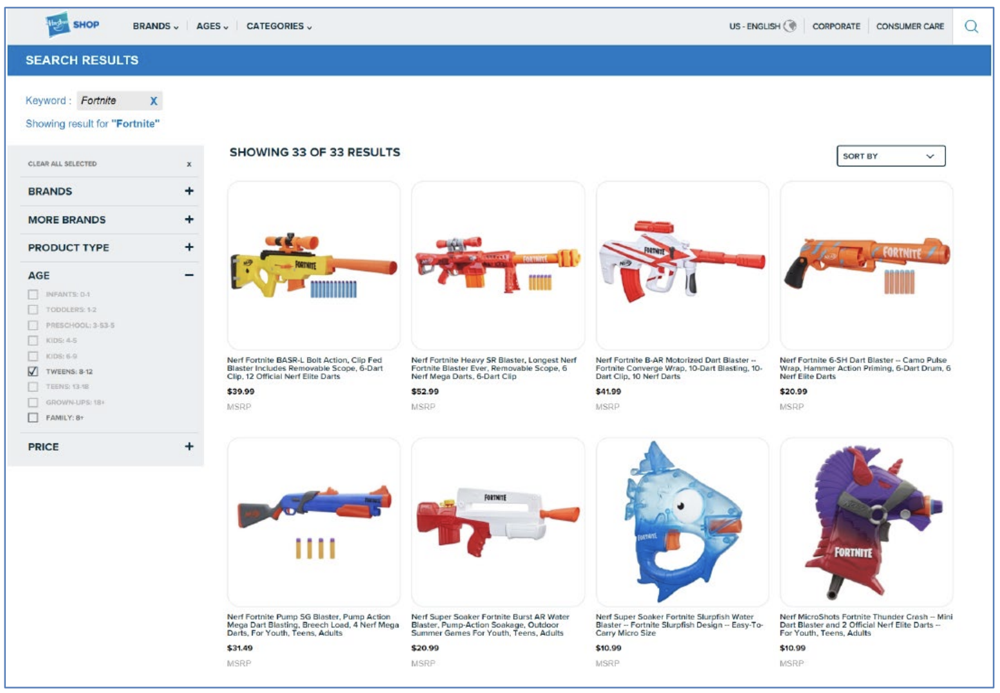
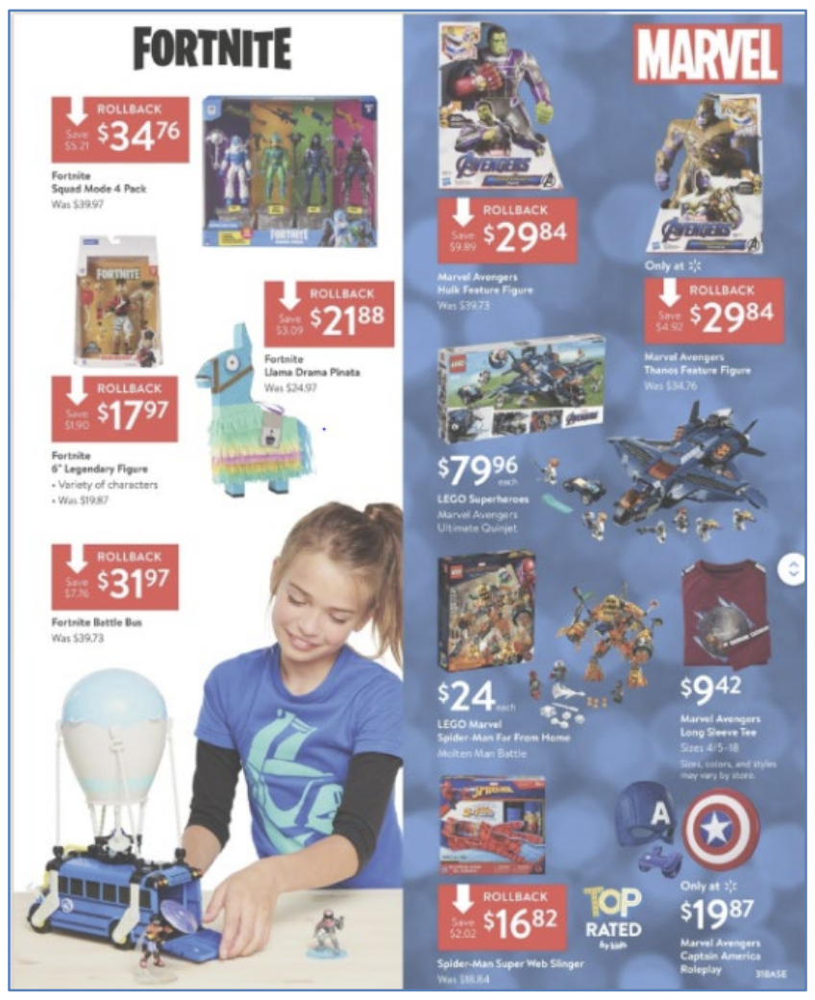

**IN THE UNITED STATES DISTRICT COURT**  
**FOR THE EASTERN DISTRICT OF NORTH CAROLINA**  

**WESTERN DIVISION**  
**No. 5:22-CV-00518**  

**UNITED STATES OF AMERICA,**  
Plaintiff,  

v.  

**EPIC GAMES, INC.,**  
Defendant.  

**COMPLAINT FOR PERMANENT INJUNCTION, CIVIL PENALTIES, AND OTHER RELIEF**  

Plaintiff, the United States of America, acting upon notification and on behalf of the Federal Trade Commission (“Commission” or “FTC”), for its Complaint alleges:  

**1.** Plaintiff brings this action under Sections 5(a)(1), 5(m)(1)(A), 13(b), 16(a)(1), and 19 of the Federal Trade Commission Act (“FTC Act”), 15 U.S.C. §§ 45(a)(1), 45(m)(1)(A), 53(b), 56(a)(1), 57b, and Sections 1303(c) and 1306(d) of the Children’s Online Privacy Protection Act of 1998 (“COPPA”), 15 U.S.C. §§ 6502(c), 6505(d), to obtain monetary civil penalties, a permanent injunction, and other relief for Defendant’s violations of Section 5 of the FTC Act and the Children’s Online Privacy Protection Rule (“Rule” or “COPPA Rule”), 16 C.F.R. pt. 312.  

# **SUMMARY OF CASE**  

**2.** Epic Games, Inc. (“Epic,” “Epic Games,” or “Defendant”) is the developer and distributor of the hit online video game “Fortnite.” Through Fortnite, Epic matches children and teens with strangers around the world in interactive gameplay, encourages real-time communications by featuring on-by-default voice and text chat features, and publicly broadcasts players’ account names. Even though Fortnite is directed to children, and even when Epic had actual knowledge that Fortnite users were children, Epic failed to comply with the COPPA Rule’s parental notice, consent, review, and deletion requirements.  Although Epic has changed its practices over time, those changes have not cured the violations.  

**3.** Ultimately, Epic’s matchmaking children and teens with strangers while broadcasting players’ account names and imposing live on-by-default voice and text communications has caused substantial injury that is neither offset by countervailing benefits nor reasonably avoidable by consumers. Children and teens have been bullied, threatened, and harassed within Fortnite, including sexually. Children and teens have also been exposed to dangerous and psychologically traumatizing issues, such as suicide and self-harm, through Fortnite. And the few relevant privacy and parental controls Epic has introduced over time have not meaningfully alleviated these harms or empowered players to avoid them.  

# **JURISDICTION AND VENUE**  

**4.** This Court has subject matter jurisdiction pursuant to 28 U.S.C. §§ 1331, 1337(a), and 1345.  

**5.** Venue is proper in this District under 28 U.S.C. § 1391(b)(1), (b)(2), (c)(2), and (d), and 15 U.S.C. § 53(b).  

# **SECTION 5 OF THE FTC ACT**  

**6.** Section 5(a) of the FTC Act, 15 U.S.C. § 45(a), prohibits “unfair or deceptive acts or practices in or affecting commerce.”  

# **CHILDREN’S ONLINE PRIVACY PROTECTION RULE**  

**7.** Congress enacted COPPA in 1998 to protect the safety and privacy of children online by prohibiting the unauthorized or unnecessary collection of children’s personal information online by operators of Internet websites and online services. COPPA directed the Commission to promulgate a rule implementing COPPA. The Commission promulgated the COPPA Rule on November 3, 1999, under Section 1303(b) of COPPA, 15 U.S.C. § 6502(b), and Section 553 of the Administrative Procedure Act, 5 U.S.C. § 553. The Rule went into effect on April 21, 2000. The Commission promulgated revisions to the Rule that went into effect on July 1, 2013. Pursuant to Section 1303(c) of COPPA, 15 U.S.C. § 6502(c), and Section 18(d)(3) of the FTC Act, 15 U.S.C. § 57(a)(d)(3), a violation of the Rule constitutes an unfair or deceptive act or practice in or affecting commerce, in violation of Section 5(a) of the FTC Act, 15 U.S.C. § 45(a).  

**8.** The Rule applies to any operator of a commercial website or online service directed to children under 13 years of age that collects, uses, and/or discloses personal information from children, and to any operator of a commercial website or online service that has actual knowledge that it collects, uses, and/or discloses personal information from children. The Rule requires an operator to meet specific requirements prior to collecting, using, or disclosing children’s personal information online, including but not limited to:  

**a)** Posting a privacy policy on its website or online service providing clear, understandable, and complete notice of its information practices, including what information the operator collects from children online, how it uses such information, its disclosure practices for such information, and other specific disclosures set forth in the Rule;  

**b)** Providing clear, understandable, and complete notice of its information practices, including specific disclosures, directly to parents;  

**c)** Obtaining verifiable parental consent prior to collecting, using, and/or disclosing personal information from children;  

**d)** Providing a reasonable means for parents to review personal information collected from children online, at a parent’s request; and  

**e)** Deleting personal information collected from children online, at a parent’s request.  

# **DEFINITIONS**  

**9.** For purposes of this Complaint, the terms “child,” “collects,” “collection,” “disclose,” “disclosure,” “Internet,” “obtaining verifiable parental consent,” “online contact information,” “operator,” “parent,” “personal information,” and “Web site or online service directed to children,” are defined as those terms are defined in Section 312.2 of the COPPA Rule, 16 C.F.R. § 312.2.  

# **DEFENDANTS**  

**10.** Defendant Epic Games, Inc. is a Maryland corporation with its principal place of business at 620 Crossroads Blvd., Cary, North Carolina 27518. Epic transacts or has transacted business in this District and throughout the United States. At all times relevant to this Complaint, acting alone or in concert with others, Epic has advertised, marketed, distributed, or sold the video game Fortnite and in-game Fortnite content to consumers throughout the United States.  

# **COMMERCE**  

**11.** At all times relevant to this Complaint, Epic has maintained a substantial course of trade in or affecting commerce, as “commerce” is defined in Section 4 of the FTC Act, 15 U.S.C. § 44.  

# **EPIC’S BUSINESS ACTIVITIES**  

## **About Epic and Fortnite**  

**12.** Epic is the developer of Fortnite, a hit online video game available to players on multiple consoles, including the Sony PlayStation, Microsoft Xbox, and Nintendo Switch, mobile devices with Android or iOS operating systems, and personal computers with Windows or MacOS operating systems.  Launched in July 2017, Fortnite quickly caught the attention of young consumers—teens and children under age 13—in the United States and abroad and, today, has more than 400 million players.  

**13.** Available in different modes, Fortnite is generally free to download and play (although one mode, called “Save the World,” costs money). Epic has earned billions of dollars in revenue through Fortnite, primarily by selling Fortnite players in-game digital content like costumes (called “cosmetics” or “skins”) and dance moves (called “emotes”) for their avatars, and through licensing partnerships with companies selling Fortnite-branded merchandise.  

## **Epic Collects Personal Information From Fortnite Players**  

**14.** To play Fortnite using a personal computer or mobile device, players must first create an Epic Games account.  Prior to September 2019, anyone could create an Epic Games account by providing Epic Games with their first name, last name, and email address, and choosing a name (called a “display name”) for their account. This remains the process for players located outside the United States and Europe.  For players in the United States or Europe, however, Epic began requiring birthdate information as part of the account creation process on September 11, 2019 (for U.S. players), September 2, 2021 (for U.K. players), and November 30, 2021 (for European players outside the U.K.).  

**15.** To play Fortnite on a PlayStation, Xbox, or Switch console, players can choose to create an Epic Games account, register their console to an already-created Epic Games account, or access Fortnite using what Epic refers to as a “nameless” account.  If a player chooses this last option to play Fortnite on their PlayStation, Xbox, or Switch console, Epic creates a “nameless” Epic Games account for that player on Epic’s backend automatically—generating a unique account ID for the player, associating that unique account ID to the player’s PlayStation, Xbox, or Switch console, and collecting the player’s PlayStation, Xbox, or Switch account name for use as the player’s display name within Fortnite.  

**16.** Regardless of the console or type of account a player uses, several social features are enabled within Fortnite by default that convert the game into a platform for connecting with other players.  Among other things, these social features allow players to find and friend each other (by display name), play matches together, exchange personal information, and converse with each other in real time by voice and text. On the backend, Epic collects and uses various unique device IDs, account IDs, and other persistent identifiers to keep track of players’ progress, purchases, settings, and friends lists, among other player-specific information.  

## **Fortnite Is Directed to Children Under 13**  

**17.** Considering the factors set forth in the COPPA Rule, including the game’s subject matter, use of animation, child-oriented activities and language, and music content, evidence of intended audience, and empirical evidence about the game’s player demographics, Fortnite is directed to children under age 13.  

### **Fortnite’s Gameplay, Visual Content, and Features are Directed to Children**  

**18.** Revolving around a “shooter-survival” style of gameplay, Fortnite’s various game modes include “build-and-create” mechanics like those in other games popular with children, and feature other elements that appeal to children, like cartoony graphics and colorful animation. For example, in Fortnite’s popular “Battle Royale” mode, players’ colorful avatars enter the game by hang gliding to various places in a virtual world (e.g., “Loot Lake,” “Tilted Towers,” “Retail Row”) after jumping from a whimsical flying blue school bus, called the “Battle Bus.”  

**19.** Akin to digital laser tag, there is no blood or gore in Fortnite, and players are “eliminated” from the game (not “killed”).  

**20.** Prominent in Fortnite gameplay is an emphasis on building “forts” and other creations—offering children a digital playground to explore. As Epic noted when announcing the game’s release in 2017, the “soul of Fortnite” derives from the common childhood experience of fort-building—“whether it was blankets and couch cushions, or building a fort in the woods by your house, you and your friends could spend Saturday afternoons hiding out, or repelling hordes of imaginary creatures”—and the game incorporates “sculpted ‘puzzle pieces’ to create interesting play spaces to explore.”1  

### **Fortnite Theming Decisions Ensure Content Appeals to Children**  

**21.** Epic strives to create a “Living room safe, but barely” environment using content that appeals to children when making Fortnite theming decisions, including potential music, celebrity, and brand partnerships. In so doing, Epic Games employees have explained:  

- “We want to be living room safe, but barely. We don’t want your mom to love the game – just accept it compared to alternatives”  
- “Agree with the idea that, generally, all theming should be relevant to a 8-14 y.o., as a litmus test”  
- “We are NOT adult: experience must allow for parental comfort for ages 10+”  

Based on these guiding principles, Fortnite has promoted and hosted live in-game concerts featuring celebrities popular with children, such as Marshmello, Travis Scott, Ariana Grande, and BTS.  

### **Epic Has Made Millions in Royalties Selling Official Fortnite Toys, Halloween Costumes, and Youth Apparel**  

**22.** Further evidencing the game’s intended audience, Epic has made millions in royalties by partnering with companies to sell officially licensed Fortnite merchandise for children. Within a year of Fortnite’s public release, Epic retained a licensing agent and launched a consumer products program to give players official Fortnite-branded merchandise.  

**23.** Acknowledging that “Youth and Kids are obsessed with Fortnite” and “want to show their allegiance to their favorite pastime,” Epic’s agent developed a licensing plan with a “core” component that targeted “Kids” and “Youth Universes,” and worked closely with Epic to broker partnerships between Epic and other companies to create Fortnite-branded costumes, toys, books, youth-sized apparel, and “back to school” merchandise (e.g., backpacks, pencil cases, etc.).  And while Epic’s licensing agent has helped source and manage these merchandising partnerships, Epic carefully scrutinizes all potential licensees, sets the terms governing each partnership, and approves every Fortnite-branded product that gets produced—including the product’s design and packaging, and related advertising and marketing plans.  

**24.** In its first consumer products deal, Epic partnered with Spirit Halloween to offer officially licensed Fortnite Halloween costumes. Available in children’s sizes, these costumes have been very popular with kids and spawned articles with headlines like “Excited Kids Are Baffling Adults With Their Fortnite Halloween Fervor.”2 Indeed, Spirit Halloween sold hundreds of thousands of child-sized Fortnite costumes between 2018 and 2020, which account for more than half of all Fortnite costumes sold by Spirit Halloween during those years.  

**25.** In another early consumer products deal, Epic partnered with Hasbro to offer players Fortnite-branded Nerf guns, Super Soaker water guns, and other popular kids’ toys. Consistent with the core demographic for Hasbro’s Nerf products, the “Fortnite X Nerf” product line launched in early 2019 using a “#FortniteIRL [In Real Life]” tagline with paid advertisements in media channels targeting “6-11 year old boys.” Today, through its partnership with Epic, Hasbro offers more than 40 different officially licensed Fortnite toys on its website, including three Super Soaker products for “Kids: 6-9,” and 33 different Nerf, Super Soaker, and other toys for “Tweens: 8-12.”  

**26.** In addition to Hasbro, Epic has partnered with other companies like Jazwares and Moose Toys to produce official Fortnite action figures, playsets, and other toys. As with the Epic-Hasbro partnership, toys from the Epic-Jazwares and Epic-Moose Toys partnerships were marketed to and for kids, including through television commercials targeting those aged 12-17 that aired on the Cartoon Network, Nickelodeon, and Nicktoons (Epic-Jazwares), and video advertisements on YouTube and Twitch intended to reach “Fortnite fans 8-12” and “Fortnite fans 13-21” (Epic-Moose Toys). And toys from all three partnerships were marketed through seasonal toy catalogs from retailers like Amazon, Target, and Walmart.  

**27.** Notably, a toy from the Epic-Jazwares partnership—the Fortnite Llama Loot Pinata—tied with Lego’s Harry Potter products to win the “Toys / Games / Novelties for Ages 0-12” category at the 2019 International Licensing Awards.  As the head of Epic’s consumer products program explained internally, Epic won the “Newcomer” award that year after Fortnite or Fortnite-branded products won first place awards in five categories—despite being “up against some heavy hitters like Harry Potter, Jurassic World, and Lego.”  

**28.** By the first half of 2020, Epic’s consumer products program had generated more than $1 billion in gross sales of Fortnite-branded merchandise, bringing more than $130 million in gross royalties to Epic and its licensing agent. Most of this success was driven by the popularity of Epic’s official Fortnite toys, which accounted for nearly 70% (~$650 million) of all Fortnite-branded merchandise sales, and more than 60% (~$80 million) of the royalties from such sales, through the first quarter of 2020.  

### **Many Children Play Fortnite, and Many Fortnite Players Are Children**  

**29.** Not surprisingly, empirical evidence shows that many children play Fortnite, which is disproportionately popular with “tweens.” For example, publicly available survey results from a 2019 report show that 53% of U.S. children aged 10-12 played Fortnite weekly, compared to 33% of U.S. teens aged 13-17, and 19% of the U.S. population aged 18-24.3 And Epic, which had previously contracted with the company that conducted this survey (to conduct a different survey in connection with Fortnite), received pre-publication copies of the survey results along with a private briefing by the researchers who conducted the survey.  

**30.** Results from Epic’s own player surveys are consistent with this data. While Epic avoided collecting Fortnite players’ precise ages (until it instituted the limited age gating described below in Paragraphs 54 through 58), Epic has consistently asked about players’ living situation and occupation through player surveys—and used the results as a proxy for players’ age demographics. The results show that most Fortnite players (i.e., approximately 70%) live at home with their parents or guardians, and, of those who live with their parents or guardians, most (i.e., approximately 80%) identify as students. And when soliciting potential brand partnerships for Fortnite, Epic has used social media data to emphasize Fortnite’s popularity among young gamers—noting that a third of Fortnite players, based on social media data, are teens aged 13-17 (i.e., the youngest age demographic available in the social media data, which cuts off at age 13).  

## **Epic Knows that Children Play Fortnite**  

**31.** Epic knows that children play Fortnite. Epic employees and player support agents review and respond to thousands of player-related requests, reports, and complaints that come in each day, many of which identify specific Fortnite players as being children under 13.  

**32.** Epic and its employees also regularly monitor, read, and circulate news articles and social media posts chronicling Fortnite’s popularity among children, and sometimes incorporate kids’ ideas directly into the game. For example, the concept behind a popular “cosmetic” (i.e., outfit for players’ in-game avatars) in Fortnite, called “Tender Defender,” originated in the mind of an eight-year-old Fortnite player whose father had shared his son’s idea on the social media site Reddit.com, where it caught the attention of Epic’s Fortnite development team.  

**33.** Epic, too, has sent Fortnite “swag”—i.e., Fortnite-branded merchandise—intended for children under 13, including in response to celebrities’ swag requests for their “Fortnite obsessed” children. And to help Epic evaluate potential new features, the former Game Director for Fortnite would bring his son, who was under 13 years old, to participate in internal company playtests of Fortnite.  

**34.** Further, when Epic lobbied Microsoft and Sony to support cross-console gameplay, allowing, e.g., Xbox Fortnite users to play with PlayStation Fortnite users, Epic stressed the feature’s impact on kids, noting for example that “many Fortnite players are kids” and that cross-console gameplay would “bring together current and potential gamers in real-world social groups: college dorms, high school classes, even kids . . .”  

**35.** Epic’s records include other acknowledgements, too. In numerous internal communications, Epic employees have reported being inundated with Fortnite questions and requests during in-person conversations with players under 13, watching kids perform Fortnite dances in public, and receiving notes from teachers about Fortnite’s popularity with their middle and elementary school students. In other ordinary course business communications, Epic employees have noted that “a large portion of our player base” consists of “underage kids,” acknowledged Fortnite’s “high penetration among tweens/teens,” flagged “that Fortnite is enjoyed by a very young audience at home and abroad,” and described putting on Fortnite “dance cam,” “makeup booth (for kids),” and other events at public gaming conferences (where most attendees were “very young”)—including events where “[t]he idea was that any kid or teenager playing could feel like a pro.”  

## **Fortnite’s Unfair Default Settings Have Harmed Children and Teens**  

**36.** Predictably, Epic has caused substantial harm by matching children and teens with strangers in interactive gameplay while publicly broadcasting players’ display names and imposing real-time communications through on-by-default voice and text chat.  

**37.** Epic has known about this harm and nevertheless allowed it to persist. Shortly after Fortnite’s launch, Epic’s then Director of User Experience (“UX”) emailed Epic leadership in August 2017 seeking “basic toxicity prevention” mechanisms—noting that “surely a lot of kids” were currently playing the game, and imploring Epic to “avoid voice chat or have it opt-in at the very least.” To no avail. Voice chat remained on by default, including in Fortnite’s Battle Royale mode when Epic enabled voice chat for that mode in October 2017. While Epic contemporaneously added a toggle on a settings page enabling those who happened to find it to switch voice chat off, the feature remained on as part of Fortnite’s default configuration for all players.  

**38.** Within two weeks of Epic’s October 2017 decision to enable voice chat in Battle Royale, a high-profile gamer verbally harassed a young player while publicly streaming to an audience of thousands of viewers. As an Epic Games employee acknowledged: “. . . we honestly should have seen this coming or [at least] expected this with an on-by-default voice chat system. Situations like this are bound to happen . . .” But Epic again declined to modify its on-by-default voice chat system (or implement any other changes) to stop subjecting kids to such abuse within Fortnite.  

**39.** Eight months later, in June 2018, Epic’s UX research team analyzed the parental and privacy controls offered by a wide range of other games and game platforms, and presented the results of their assessment to Epic executives and other employees. Epic’s UX team reiterated their recommendation to move to an opt-in voice chat configuration for Fortnite, noting that most players did not use the feature when playing with strangers, which presented “a risk in terms of negative social behavior,” and acknowledging “[f]rom social/media stories we have seen both ‘Fortnite is positive’ and ‘child charity warns parents about predators in Fortnite’ . . .” Epic leadership praised the “very well-researched and thoughtful” work, but the UX team “got no traction” around opt-in voice chat. Epic continued to reject the UX team’s recommendation.  

**40.** All the while, kids have been bullied, threatened, and harassed, including sexually, through Fortnite. Numerous news stories chronicle reports of predators blackmailing, extorting, or coercing children and teens they met through Fortnite into sharing explicit images or meeting offline for sexual activity. Such issues are also the subject of numerous player support tickets submitted to Epic by distressed parents and players.  

**41.** In addition, Epic’s Fortnite practices have exposed kids to dangerous and psychologically traumatizing issues, such as suicide and self-harm. For example, in a May 2018 email to Epic’s customer support leads, one employee noted that Epic’s player support tickets included “834 cases created in the last year that contain the words ‘kill myself’ and 485 containing the word ‘suicide,’” including “cases such as toxicity reports from players who were told to kill themselves by others.” As one parent explained in an email to Epic, “[t]his morning, while on Fortnite, my 9 year old son had a ‘friend’ (someone he doesn’t know in real life, but has been playing with for months) tell him that he was going to kill himself tonight. It shook him to the core.”  

**42.** As reflected in internal exchanges between Epic employees, these harms are not outweighed by countervailing benefits, nor are they reasonably avoidable by consumers. Shortly before the UX team’s unsuccessful push to convince leadership to change Fortnite’s default settings in June 2018, an Epic employee who had helped create Fortnite emailed Epic’s PR manager and Epic’s Creative Director:

I think you both know this, but our voice and chat controls are total crap as far as kids and parents go. It’s not a good thing. It was on my list a year ago, but never bubbled to the surface. This is one of those things that the company generally has weak will to pursue, but really impacts our overall system and perception. I’ve made a coppa [sic] compliant game and we are far from it, but we don’t need to be that far . . .

To which Epic’s PR manager responded:

100% agree here. Communication-wise, we are staying out of the debate, even though Fortnite is right in the middle of it. We’d come out looking way better if we offered the proper tools across the board here. I agree the best response is doing the right thing, and not debating it . . .

The employee then forwarded the exchange to Epic’s lead UX researcher, who replied “I would really like to see even the small step of on first load asking if people want voice on or off. Even hardcore games like Monster Hunter have done this.” And when articulating the UX team’s position to Epic executives a week later, Epic’s lead UX researcher noted a good opt-in system yielded only upside: it would align with players’ reported preferences (“when playing with strangers the majority [of Fortnite players] are not typically using it to talk or listen to them”), preserve the feature’s utility (“[t]here is no doubt that voice is strongly valued by folks when talking to people they know, and by a significant minority who like to use it to talk to strangers . . . A good opt-in system should maintain this”), and reduce toxicity (“[f]or example when Riot moved to opt-in text chat they saw the same volume of chat usage, but reduced toxicity as those who want to chat were able to communicate and those that did not were not exposed”).  

**43.** As noted in Paragraph 37, Epic did introduce a toggle switch allowing Fortnite players to turn voice chat off, but the control was buried on a hard-to-find settings page. As one Fortnite programmer lamented:

So when I was at my brother's house, and was watching my 10 yr old nephew play. I’m like, hey, why is there no sound on the TV? And he’s like, we turn off the volume because you can hear people talking. People related to me by blood were no sh[**] muting the TV instead of looking for a way to disable voice chat. Not a proud day . . . The settings are not a land most folks venture to, certainly not technophobic parents . . .

When this message was forwarded to Epic’s lead UX researcher, he responded with exasperation: “Sigh. Can we just suggest popping up a dialog asking people if they want it on or not?”  

## **Epic’s Changes Have Not Cured the Law Violations**  

**44.** Over time, Epic has introduced a few changes to Fortnite in weak-willed attempts to provide players and their parents with some privacy and parental controls, and comply with COPPA’s parental notice, consent, review, and deletion requirements. But these overdue efforts have not cured the law violations.  

### **Epic Has Consistently Resisted, Deprioritized, and Delayed Privacy and Parental Controls**  

**45.** Fortnite launched with no parental controls and minimal privacy settings. Initially, the only such options consisted of a few settings allowing players to “mute,” “block,” or “kick” (i.e., remove from shared gameplay activities)4 individual problematic players they encountered, or narrow the set of players who could join them in collaborative gameplay (i.e., by changing their “Party Privacy” setting from “public” to “friends of friends,” “friends,” or “private”). Neither players nor their parents could prevent a player’s display name from being publicly broadcast or disable voice and text chat (except by using parental controls and voice chat settings when playing Fortnite on gaming consoles that provide such controls and settings).  

**46.** Shortly after launch, Epic introduced the toggle switch discussed above, allowing Fortnite players to disable voice chat, but did not inform players of the setting’s availability and placed the control in the middle of a detailed settings page. Seven months later, in May 2018, Epic introduced a setting called “Streamer Mode” that, when enabled, hid a player’s display name and the display names of those the player encountered during gameplay. After surveying players and finding that many who enabled this control were seeking to avoid harassment—and were not actual “streamers” (i.e., players who publicly live-streamed their gameplay)—Epic split the feature into an “Anonymous Mode” setting (which hides a player’s display name during gameplay, when enabled) and “Hide Other Player Names” setting (which hides other players’ display names during gameplay, when enabled) in January 2019. In between, Epic added settings allowing Fortnite players to hide their display name from appearing in global game statistic leaderboards (in September 2018) and disable friend requests from other players (in January 2019).  

**47.** In June 2019, nearly two years after Fortnite’s launch, Epic finally introduced parental controls to the game. Starting on that date, parents could set a PIN code that must be entered to adjust various privacy settings—i.e., Auto Decline Friend Requests, Hide Other Player Names, Anonymous Mode, and Voice Chat.5 Of course, to enable parental controls, parents would first need to know they existed, have access to their child’s or teen’s Fortnite account, and know where to find the controls.  

### **For More Than Two Years, Epic Took No Steps to Seek Parental Consent Before Collecting Children’s Personal Information or Explain How the Company Handled It**  

**48.** From July 2017, when Fortnite launched, until September 2019, Epic took no steps to (a) provide a direct notice to parents describing Epic’s practices regarding the collection, use, and disclosure of children’s personal information; (b) explain what information Epic collected from children through Fortnite; or (c) seek verifiable parental consent (“VPC”) from parents before collecting their children’s personal information through Fortnite.  

**49.** Instead, Epic included one paragraph on the second-to-last page of its global privacy policy disavowing that it directed any services to children or intentionally collected any personal information from such players, and asking parents to contact Epic if they believed Epic had received personal information from their child:

Epic does not direct its websites, games, game engines, or applications to children (usually considered to be under the age of 13, depending on the country where you reside). We also do not intentionally collect personal information from children through our websites, games, game engines, or applications. If you are the parent or guardian of a child and you believe that we have inadvertently received personal information about that child, please contact us as described in the How to Contact Us section of this policy and we will delete the information from our records.

**50.** When parents contacted Epic to review or delete the information Epic collected from their child through Fortnite, or delete their child’s Epic Games account, and those parents did not have access to their child’s Fortnite account, Epic made those parents jump through extraordinary hoops to “verify” their parental status. For example, Epic required some parents to provide all IP addresses used by their child to play Fortnite, the date the child’s Epic Games account was created, an invoice ID for an Epic Games purchase, the locations (city, state/province) where purchases were made, the last 4 digits of the first payment card used on the child’s Epic Games account, the date of their child’s last Fortnite login, their child’s original Epic Games account display name, and the names of any PlayStation, Xbox, or Switch consoles connected to their child’s Epic Games account. Where parents were able to provide such information, Epic sometimes required them to provide even more information before Epic would agree to process the parent’s review or deletion request—like the name of a cosmetic item their child purchased more than 30 days ago and a copy of the parent’s passport, identification card, or recent rent or mortgage statement.  

**51.** Even when Epic obtained actual knowledge that particular Fortnite players were under 13, Epic took no steps to comply with COPPA. Indeed, Epic went to great lengths to pretend it never obtained actual knowledge at all.  

**52.** In March 2018, Microsoft personnel told Epic that Epic would have to block Xbox accounts belonging to children under 13 from participating in cross-console gameplay through Fortnite. In particular, Microsoft wanted Epic to use an existing Xbox mechanism (an API called the UserAgeGroup) to check whether a given Xbox player was using an “Adult,” “Child,” “Teen,” or “Unknown” Xbox account, and block any Xbox players using “Child” accounts (defined as accounts belonging to players under age 13) from using Fortnite’s cross-console gameplay feature. In other words, Microsoft wanted Epic to use Microsoft’s API to determine which Xbox accounts belonged to children under age 13 and block those accounts from participating in Fortnite’s cross-console gameplay feature.  

**53.** Although Epic initially resisted, the company ultimately acquiesced and began blocking Xbox accounts identified via the UserAgeGroup API as belonging to a player under 13 from participating in cross-console gameplay within Fortnite. But Epic did not take any other steps to limit those players’ communications with third parties, seek VPC for them, provide their parents with any notices explaining how Epic handled children’s personal information, or otherwise comply with COPPA. Instead, as reflected in company records, Epic pretended they had no idea these players were children for any purpose other than determining whether they could participate in cross-console gameplay.  

### **Epic’s Dilatory COPPA Measures Fail to Comply With The Law**  

**54.** Epic eventually began to change its approach to COPPA compliance. On September 11, 2019—long after Epic obtained empirical evidence pointing to large numbers of Fortnite players under 13, received actual knowledge that many particular players were under 13, and profited from Fortnite-branded merchandise clearly directed to children—Epic introduced an age gate to the account creation process for prospective Fortnite players attempting to create an Epic Games account on the Epic Games website from an internet connection with a U.S. IP address. For any such prospective player who self-identified as being 12 years old or younger, Epic would collect a parent’s email address from the player and send an email to the player’s parent describing how Epic handled children’s personal information and asking the parent to complete a VPC process—such as using a credit card to make a small refundable charge.  

**55.** But this initiative had no effect on the default configurations of Fortnite players’ privacy controls—which continue to enable the public broadcast of players’ display names and direct communication between players, regardless of a player’s age.  

**56.** Nor did this initiative apply to those seeking to play Fortnite using new nameless accounts (i.e., accounts generated by Epic for PlayStation, Xbox, or Switch users, as described in Paragraph 15), or those creating Epic Games accounts from internet connections with an IP address outside the U.S.  

**57.** Nor did Epic’s September 11, 2019, changes apply to the hundreds of millions of Fortnite players who already had accounts, with a few limited exceptions. In the weeks before implementation, Epic employees searched Fortnite player support tickets to find those with indicia that a U.S. player may be under the age of 13. These efforts surfaced 36,000 such tickets, which Epic associated with 15,300 identifiable Fortnite players. Regardless of whether a ticket specifically identified a particular player as being under 13, or merely suggested that a player might be under 13, Epic logged all 15,300 players out of their accounts and asked them to provide their birthdate the next time the player attempted to log in—emailing parents a direct notice and asking them to complete a VPC process only if the player then self-identified as being under age 13.  

**58.** Contemporaneously, Epic began instructing player support agents to flag accounts belonging to U.S. Fortnite players associated with new player support tickets in which players self-identified (or were identified by others) as being 12 years old or younger. Beginning on September 11, 2019, Epic started logging out any accounts with such a flag and requiring the player to pass Epic’s age gate the next time the player attempted to log in, with Epic requesting a parent’s email address, sending a direct notice, and asking the parent to complete a VPC process only if the player then self-identified as being under 13.  

**59.** Around the same time, Epic began changing how it handled emails identifying specific Fortnite players as being age 12 or younger. Previously, Epic did not take any steps to ensure the company sought VPC for such players or provided such players’ parents with any notices describing how Epic handled their children’s personal information. But starting in late 2019, Epic began forwarding these types of emails to player support agents, who try to determine whether the underlying player is based in the U.S. If so, and if the player has not already been subjected to Epic’s age gate, the player is logged out and required to provide their birthdate the next time the player attempts to log in. Only if the player then self-identifies as being twelve or younger does Epic send their parent a direct notice and seek VPC.  

**60.** Based on the facts and violations of law alleged in this Complaint, the FTC has reason to believe that Defendant is violating or is about to violate laws enforced by the Commission.  

# **VIOLATIONS OF THE COPPA RULE AND FTC ACT**  

## **Count I**  
### **COPPA Rule**  

**61.** As described in Paragraphs 10 through 16 above, Defendant is an “operator” subject to the COPPA Rule.  

**62.** In numerous instances, in connection with the acts and practices described above, Defendant collected, used, and disclosed personal information from children younger than age 13 in violation of the Rule by:  

**a)** Failing to provide notice on its website or online service of the information it collects online from children, how it uses such information, and its disclosure practices, among other required content, in violation of Section 312.4(d) of the Rule, 16 C.F.R. § 312.4(d);  

**b)** Failing to provide direct notice to parents of the information it collects online from children, how it uses such information, and its disclosure practices for such information, among other required content, in violation of Section 312.4(b) of the Rule, 16 C.F.R. § 312.4(b);  

**c)** Failing to obtain consent from parents before any collection or use of personal information from children, in violation of Section 312.5(a)(1) of the Rule, 16 C.F.R. § 312.5(a)(1);  

**d)** Failing to provide, at the request of parents, a means of reviewing any personal information collected from children, in violation of Section 312.6(a)(3) of the Rule, 16 C.F.R. § 312.6(a)(3); and  

**e)** Failing to delete, at the request of parents, personal information collected from children, in violation of Section 312.6(a)(2) of the Rule, 16 C.F.R. § 312.6(a)(2).  

**63.** Pursuant to Section 1303(c) of COPPA, 15 U.S.C. § 6502(c), and Section 18(d)(3) of the FTC Act, 15 U.S.C. § 57a(d)(3), a violation of the Rule constitutes an unfair or deceptive act or practice in or affecting commerce, in violation of Section 5(a) of the FTC Act, 15 U.S.C. § 45(a).  

**64.** Defendant violated the Rule as described above with the knowledge required by Section 5(m)(1)(A) of the FTC Act, 15 U.S.C. § 45(m)(1)(A).  

**65.** Each collection, use, or disclosure of a child’s personal information in which Defendant violated the Rule in one or more of the ways described above constitutes a separate violation for which Plaintiff seeks monetary civil penalties.  

**66.** Section 5(m)(1)(A) of the FTC Act, 15 U.S.C. § 45(m)(1)(A), as modified by Section 4 of the Federal Civil Penalties Inflation Adjustment Act of 1990, 28 U.S.C. § 2461; the Federal Civil Penalties Inflation Adjustment Act Improvements Act of 2015, Public Law 114-74, sec. 701, 129 Stat. 599 (2015); and Section 1.98(d) of the FTC’s Rules of Practice, 16 C.F.R. § 1.98(d), authorizes this Court to award monetary civil penalties of not more than $46,517 for each violation of the Rule after January 10, 2022.  

## **Count II**  
### **Unfair Default Settings**  

**67.** Section 5(a) of the FTC Act, 15 U.S.C. § 45(a), prohibits “unfair or deceptive acts or practices in or affecting commerce.”  

**68.** Acts or practices are unfair under Section 5 of the FTC Act if they cause or are likely to cause substantial injury to consumers that consumers cannot reasonably avoid themselves and that is not outweighed by countervailing benefits to consumers or competition. 15 U.S.C. § 45(n).  

**69.** As described in Paragraphs 10 through 35 above, Defendant has developed and operated, and continues to develop and operate, a ubiquitous, freely-available, and internet-enabled video game directed at children and teens that publicly broadcasts players’ display names while putting children and teens in direct, real-time contact with others through on-by-default lines of voice and text communication. Even after instituting an age gate on its service, Defendant has continued to broadcast display names and enable such direct communication by default for all players, including children who identify themselves as under 13 and young teens.  

**70.** As described in Paragraphs 36 through 43 above, Defendant’s actions cause or are likely to cause substantial injury to consumers that consumers cannot reasonably avoid themselves and that is not outweighed by countervailing benefits to consumers or competition.  

**71.** Therefore, Defendant’s acts or practices as set forth in Paragraph 69 constitute unfair acts or practices in violation of Section 5 of the FTC Act, 15 U.S.C. § 45(a), (n).  

# **CONSUMER INJURY**  

**72.** Consumers are suffering, have suffered, and will continue to suffer substantial injury as a result of Defendant’s violations of the FTC Act and the Rule. Absent injunctive relief by this Court, Defendant is likely to continue to injure consumers and harm the public interest.  

# **PRAYER FOR RELIEF**  

**73.** Wherefore, Plaintiff United States of America requests that the Court:  

**A.** Enter a permanent injunction to prevent future violations of the FTC Act and the Rule by Defendant;  

**B.** Award Plaintiff monetary civil penalties from Defendant for each violation of the Rule alleged in this Complaint; and  

**C.** Award any additional relief as the Court determines to be just and proper.  

**Dated: December 19, 2022**  

**FOR THE FEDERAL TRADE COMMISSION:**  

**BENJAMIN WISEMAN**  
Acting Associate Director  
Division of Privacy & Identity Protection  

**MARK EICHORN**  
Assistant Director  

**ANDREW HASTY**  
**JAMES TRILLING**  
**AMANDA KOULOUSIAS**  
Attorneys  
Federal Trade Commission  
600 Pennsylvania Avenue, NW  
Washington, DC 20580  
(202) 326-2861 (Hasty)  
(202) 326-3497 (Trilling)  
(202) 326-3334 (Koulousias)  
ahasty@ftc.gov  
jtrilling@ftc.gov  
akoulousias@ftc.gov  

**Respectfully submitted,**  

**FOR THE UNITED STATES OF AMERICA:**  

**BRIAN M. BOYNTON**  
Principal Deputy Assistant Attorney General  
Civil Division  

**ARUN G. RAO**  
Deputy Assistant Attorney General  

**AMANDA N. LISKAMM**  
Acting Director, Consumer Protection Branch  

**LISA K. HSIAO**  
Assistant Director, Consumer Protection Branch  

**JOSH
