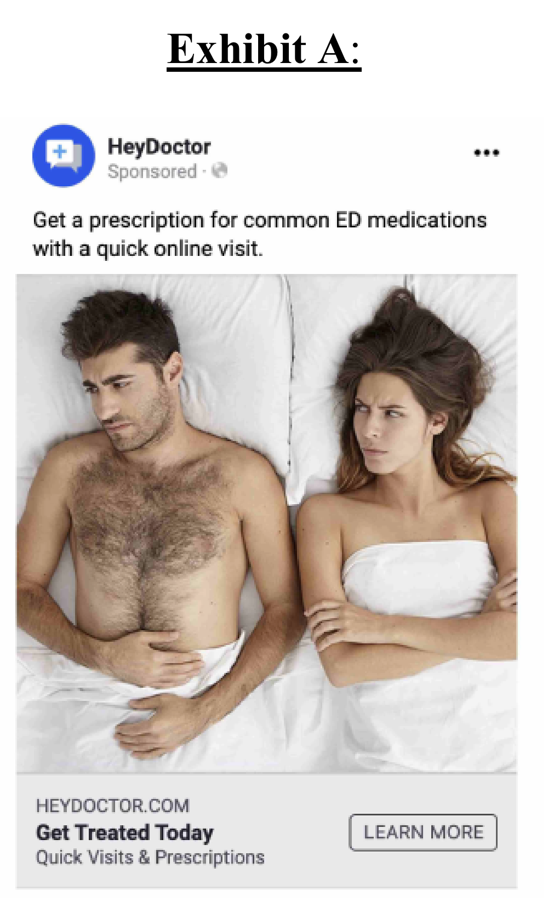

# UNITED STATES DISTRICT COURT  
## NORTHERN DISTRICT OF CALIFORNIA  
### UNITED STATES OF AMERICA,  
Plaintiff,  
**v.**  
GOODRX HOLDINGS, INC., a corporation, also d/b/a GoodRx Gold, GoodRx Care, HeyDoctor, and HeyDoctor by GoodRx,  
Defendant.  
**Case No. 23-cv-460**  

---

# COMPLAINT FOR PERMANENT INJUNCTION, CIVIL PENALTIES, AND OTHER RELIEF  

Plaintiff, the United States of America, acting upon notification and on behalf of the Federal Trade Commission (“Commission” or “FTC”), for its Complaint alleges:

---

## **I. SUMMARY**

**1.** Plaintiff brings this action under Sections 5(a)(1), 5(m)(1)(A), 13(b), 16(a)(1), and 19 of the Federal Trade Commission Act (“FTC Act”), 15 U.S.C. §§ 45(a)(1), 45(m)(1)(A), 53(b), 56(a)(1), 57b, which authorizes the Plaintiff to seek, and the Court to order, permanent injunctive relief, civil penalties, and other relief for GoodRx’s acts and practices in violation of Section 5 of the FTC Act, 15 U.S.C. § 45(a)(1), and in violation of the Health Breach Notification Rule (the “Rule” or the “HBNR”), 16 C.F.R. § 318.  

**2.** Founded in 2011, GoodRx Holdings, Inc. (“GoodRx” or the “Company”) is a “consumer-focused digital healthcare platform” based in Santa Monica, California.  GoodRx advertises, distributes, and sells health-related products and services directly to consumers, including purported prescription medication discount products branded as “GoodRx” and “GoodRx Gold.” GoodRx also advertises, distributes, and sells telehealth services, branded as “GoodRx Care,” and previously as “HeyDoctor by GoodRx,” and “HeyDoctor,” through its subsidiary HeyDoctor, LLC (“HeyDoctor”).

**3.** Since at least 2017, GoodRx has promised its users that it would share their personal information, including their personal health information, with limited third parties and only for limited purposes; that it would restrict third parties’ use of such information; and that it would never share personal health information with advertisers or other third parties.

**4.** GoodRx repeatedly violated these promises, however, by sharing sensitive user information with third-party advertising companies and platforms (“Advertising Platforms”) like Facebook, Google, and Criteo, and other third parties like Branch and Twilio.  The information GoodRx shared included its users’ prescription medications and personal health conditions, personal contact information, and unique advertising and persistent identifiers. GoodRx shared this information without providing notice to its users or seeking their consent. Moreover, GoodRx permitted third parties that received users’ personal health information to use and profit from the information for their own business purposes.

**5.** And, in the case of Facebook, GoodRx did more than just share its users’ sensitive information.  GoodRx exploited the information shared with Facebook to target GoodRx users with advertisements on Facebook and Instagram.  Using Facebook’s ad targeting platform, GoodRx matched specific users to their personal health information and designed campaigns that targeted users with advertisements based on their health information—all of which was visible to Facebook. These campaigns featured advertisements relating to specific medications (e.g., Viagra), or specific health conditions (e.g., erectile dysfunction) that GoodRx believed would be of interest to them, such as the one in Exhibit A below:

---

## **II. JURISDICTION, VENUE, AND DIVISIONAL ASSIGNMENT**

**10.** This Court has subject matter jurisdiction pursuant to 28 U.S.C. §§ 1331, 1337(a), and 1345.  

**11.** Venue is proper in this District under 28 U.S.C. §§ 1391(b)(1), (b)(2), (c)(2), and (d), and 15 U.S.C. § 53(b)(2).  

**12.** Assignment to the San Francisco Division or Oakland Division is proper pursuant to Local Rule 3–2(d), because Defendant GoodRx has a corporate office in San Francisco County, where certain of its employees and executives are located.

---

## **III. THE PARTIES**

**13.** Plaintiff is the United States of America, acting on behalf of and upon the notification of the FTC.  

**14.** Defendant GoodRx is a Delaware corporation with its principal office or place of business at 2701 Olympic Boulevard, West Building, Suite 200, Santa Monica, CA, 90404. GoodRx transacts or has transacted business in this District and throughout the United States.

---

## **IV. COMMERCE**

**15.** At all times relevant to this Complaint, GoodRx has maintained a substantial course of trade in or affecting commerce, as “commerce” is defined in Section 4 of the FTC Act, 15 U.S.C. § 44.

## **V. GOODRX’S PRODUCTS AND SERVICES**

### **A. GoodRx’s Prescription Discount Products**

**16.** GoodRx offers a platform, available through its website (www.GoodRx.com) or mobile application (“Mobile App”), to search for and compare prescription medication pricing at nearby pharmacies, and to obtain prescription discount cards (the “GoodRx Coupon”).  Since January 2017, 55.4 million consumers have visited or used GoodRx’s website or Mobile App.

**17.** GoodRx claims that consumers can save money using GoodRx Coupons to purchase prescription medications, as compared to the “retail” or cash price of a medication. GoodRx contracts with Pharmacy Benefit Managers (“PBMs”), which are companies that manage prescription drug benefits, to offer its users access to PBM pricing. GoodRx offers a free version of its prescription discount product and a paid monthly subscription version called “GoodRx Gold,” which claims to offer greater discounts. GoodRx receives a portion of a fee that pharmacies pay to PBMs when users purchase medications using GoodRx Coupons.

**18.** To find a GoodRx Coupon via the website or Mobile App, users input a medication name (e.g., “Lipitor”) or a health condition (e.g., “high cholesterol”), location information, and their desired dosage (e.g., 40 mg), form (e.g., tablet), and quantity (e.g., 30 tablets). After finding the desired medication, price, and pharmacy, users access a custom GoodRx Coupon, which users then present at the pharmacy to obtain the medication at the advertised price.

**19.** GoodRx routinely collects users’ personal and health information, and prompts users to provide their email address or phone number, to access electronic coupons and refill reminders.

**20.** GoodRx also collects personal and health information when users register for an account, which is required for GoodRx Gold, the product charging a monthly subscription fee. Users of the free GoodRx product can set up an account using an email address or phone number, and can save, track, and receive alerts about their prescriptions, such as price alerts, refill reminders, and drug recall and shortage information. GoodRx Gold requires users to create an account by providing contact information (first and last name, email address, street address, phone number), as well as their date of birth and credit card information; GoodRx Gold may also collect patient clinical information.  Through their account, GoodRx Gold users can track their medication purchase history (medication name, purchase date, dosage, pharmacy, and prescriber).

**21.** GoodRx also receives personal and health information from PBMs. When users purchase medication using GoodRx Coupons, the PBM processes the transaction and sends a claims record to GoodRx (“Medication Purchase Data”), containing name, date of birth, and information about the prescription filled.

---

### **B. GoodRx’s Telehealth Services**

**22.** Through another product, “GoodRx Care,” GoodRx offers online primary care visits with healthcare providers (“Telehealth Services”), through its website (www.Goodrx.com/Care) or through the GoodRx Care mobile app.  GoodRx began offering telehealth services in April 2019, after it acquired HeyDoctor, LLC. Until April 2021, GoodRx marketed its telehealth services as “HeyDoctor” and “HeyDoctor by GoodRx.”

**23.** GoodRx Care advertises its services for specific health conditions, including treatment and prescriptions relating to sexual health, general health and preventive care services, and prescription medication refills. To access Telehealth Services, users must first access a condition-specific “Treatment Page,” which details GoodRx Care’s services relating to a specific condition. Users must also provide their personal contact, health, and payment information.

**24.** GoodRx cross-markets its prescription discount products and telehealth services. When a medical professional prescribes a medication during a telehealth session, GoodRx may prompt the user to fill the prescription using a GoodRx Coupon.

---

## **VI. GOODRX’S DECEPTIVE AND UNFAIR BUSINESS PRACTICES**

### **A. Deceptive Statements about Privacy and Data Sharing in GoodRx’s Privacy Policies**

**25.** In connection with the advertising and sale of GoodRx’s goods and services, GoodRx has disseminated, or caused to be disseminated, false and deceptive statements about GoodRx’s use and disclosure of health and personal information, including privacy policies on the GoodRx and HeyDoctor websites and mobile applications.

---

#### 1. **Promises about Sharing Health Information**

**26.** GoodRx has itself acknowledged that the information it collects from its users is sensitive, and promised users that GoodRx would treat their information in accordance with its privacy policies.

**27.** GoodRx’s privacy policy, in describing its use of third-party tracking tools, assured users that GoodRx would never disclose personal health information to advertisers or any third parties. Between at least October 2017 through March 2019, GoodRx promised:  

_"However, we never provide advertisers or any other third parties any information that reveals a personal health condition or personal health information."_

**28.** GoodRx also promised users that it “rarely shares” personal health information with third parties. And it promised that, when it did share such information, it “ensures that these third parties are bound to comply with federal standards as to how to treat ‘medical data’ that is linked with your name, contact information and other personal identifiers.” This promise appeared in its privacy policy between at least October 2017 and October 2019.

**29.** GoodRx further assured users, between at least October 2017 through December 2019, that it would use “personal medical data,” such as information about prescription drugs, only “in limited cases” to fulfill services that users requested. The privacy policy enumerated examples of such uses, including to text or email GoodRx Coupons to users, to provide prescription drug price alerts, and to otherwise contact users directly.

**30.** GoodRx’s privacy policy also promised users that it would ensure the confidentiality of personal health information it disclosed to third parties. Between October and December 2019, GoodRx promised “[w]hen we do disclose your personal information in conjunction with your specific medical information, GoodRx takes steps such that these third parties are subject to confidentiality obligations.”

**31.** Further, beginning in or around March 2019, GoodRx promised users that “GoodRx adheres to Digital Advertising Alliance principles. The Digital Advertising Alliance (“DAA”) is an independent organization that establishes and enforces self-regulatory principles relating to privacy and digital advertising. The DAA’s “Self-Regulatory Program for Online Behavioral Advertising” provides that entities “should not collect and use . . . pharmaceutical prescriptions, or medical records about a specific individual for Online Behavioral Advertising without Consent” (the “Sensitive Data Principle”).

**32.** Emphasizing these promises of heightened privacy protections, in December 2019, in a public discussion on Twitter relating to GoodRx’s privacy practices, GoodRx co-CEO Doug Hirsch responded to a tweet by another user, and stated (through use of Twitter handle @dougjoe): “[a]ny information we do receive is stored under the same guidelines as any health entity.”

---

#### 2. **Promises about Sharing Personal Information**

**33.** GoodRx promised users that it would share users’ personal information, such as name, phone number, and email address, with third parties only for the limited purposes of providing services to users or to contact them directly. Between at least October 2017 through December 2019, GoodRx’s privacy policy informed users:

_"By providing your personal information, you agree to let us use such personal information in order to fulfill your requested service and to reach out to you about prescription savings opportunities."_

**34.** GoodRx privacy policies in effect between at least October 2017 through at least March 2020 also told users that GoodRx would share their personal contact information only to provide services directly to users; to comply with the law or legal process; to protect and defend GoodRx’s rights or property; to act in an emergency to protect someone’s safety; in the case of a merger, acquisition, or reorganization; to securely store and process data; and to handle customer requests.

---

#### 3. **HeyDoctor’s Privacy Policy**

**35.** HeyDoctor’s privacy policy told users that it would make use of their personal information only for limited purposes, and made no mention of using or sharing personal health information with third-party advertising platforms. In privacy policies in effect between at least October 2018 and July 2020, HeyDoctor told users that it collected and shared user information with third-party service providers only for the limited purpose of providing access to its Telehealth Services. HeyDoctor further promised users that it implemented contractual and technical protections that limit third-party use of user information to assisting HeyDoctor in providing Telehealth Services. HeyDoctor told users that it would otherwise seek users’ consent before sharing personal information with third parties for other purposes.

**36.** GoodRx’s privacy policy representations described above were false and deceptive. In fact, since 2017, GoodRx has shared its users’ personal and health information with Advertising Platforms and other third parties in violation of its promises, including for targeted advertising, without providing notice or obtaining affirmative express consent.

**37.** Moreover, between April and September 2019, GoodRx displayed a seal at the bottom of the HeyDoctor homepage attesting to its purported compliance with the Health Insurance Portability and Accountability Act of 1996 (“HIPAA”), a statute that sets forth privacy and information security protections for health data. The seal, which bore the Caduceus symbol often associated with the medical field, advertised the following statement: “HIPAA Secure. Patient Data Protected.” In advertising a HIPAA seal, GoodRx signaled to users that it is a HIPAA-covered entity, and that its practices complied with HIPAA’s requirements. Exhibit B shows the HIPAA seal that GoodRx displayed.

---

### **B. For Years, GoodRx Shared Sensitive Information About Millions of Users with Advertising Platforms or Other Third Parties**

**38.** Beginning in at least 2017, GoodRx violated its privacy promises by sharing information with Advertising Platforms, including Facebook, Google, and Criteo, about users’ prescription medications or personal health conditions, or that users were seeking medical treatment for specific health conditions, along with users’ personal contact information and/or persistent identifiers. GoodRx did so without notice to users, and without obtaining consent. This was despite GoodRx’s promise that it would never reveal personal health information, including health conditions, to advertisers or other third parties.

**39.** Specifically, GoodRx integrated third-party tracking tools from Facebook, Google, Criteo, and other third parties into its websites and Mobile App. These tracking tools (including automated web beacons called tracking “pixels” and other automated trackers called “Software Development Kits” (“SDKs”)) collect and send data to third parties so that they can provide advertising, data analytics, or other business services to the owner of the website or mobile app. The information sent can include users’ contact information, persistent identifiers, location information, and “Events Data,” which is information about users’ activities while using a website or mobile app.

**40.** GoodRx tracked and shared “Standard Events,” which are records of routine website or app functions, such as the fact that a user launched or closed a mobile app or website. GoodRx also tracked and shared “Custom Events,” which are customized records of website or Mobile App interactions unique to the GoodRx user experience. Whereas Standard Events have standardized titles that are applicable to any website or mobile app (such as “Add to Wishlist”), Custom Events have unique, customized names. Rather than giving its Custom Events anonymous names (e.g., “Event_1”), GoodRx chose descriptive titles that conveyed health information about its users. For example, GoodRx created Custom Events with names like “Drug Name” and “Drug Category” that tracked and shared the prescription medication name and health condition(s) associated with each unique GoodRx Coupon that users accessed. As a result, at times, when GoodRx shared a Custom Event, it was sharing its users’ health information.

---

#### 1. **GoodRx Shared Medication and Health Condition Information with Facebook**

**41.** In 2017, GoodRx configured a Facebook tracking pixel on its GoodRx and GoodRx Gold websites to share Standard and Custom Events, which conveyed user health information to Facebook. This included the name of the medication for which users accessed a GoodRx Coupon (“Drug Name,” such as “Lipitor”); the website URL, which in many cases included a medication name; the health condition related to the medication (“Drug Category,” such as “high cholesterol”); the medication quantity (“Drug Quantity,” such as “30-day supply”); the pharmacy name (“PharmName”); and the user’s city, state and zip code. The pixel also collected website microdata with additional information about the prescription medication and health condition(s) for which users accessed GoodRx Coupons. Finally, the pixel collected users’ IP addresses.

**42.** In May 2019, GoodRx configured the pixel to automatically share with Facebook additional personal information, including user first and last name; email address; phone number; city, state, and zip code; and gender.

**43.** GoodRx shared additional personal and health information with Facebook through the pixel beginning in December 2019, when it configured certain of its URL addresses to embed user first and last name, email address, date of birth, phone number, and in some instances, prescription medication name. These URLs were shared with Facebook.

**44.** Similarly, in 2018, HeyDoctor configured a Facebook tracking pixel on its website to share Standard and Custom Events that conveyed user health information to Facebook. This pixel shared HeyDoctor website URLs, which referenced specific health conditions, such as HeyDoctor Treatment Page URLs.

**45.** In August 2019, HeyDoctor began prompting users to view a GoodRx Coupon for medications prescribed during their telehealth consultation. When a user did so, GoodRx configured the pixel to share information about the prescribed medication with Facebook, through a Custom Event called “drug.” It shared the medication name (such as “nitrofurantoin”); dosage (such as “100 mg”); form (such as “capsule”); whether the user was interested in viewing the GoodRx Coupon (such as “interested: Yes”); and the name and location of the users’ pharmacy (such as “Pharmacy: Capsule Pharmacy, New York, NY”). The pixel also shared users’ IP address, and website microdata with additional information about the prescription medication and health condition(s) for which users accessed GoodRx Coupons.

---

#### 2. **GoodRx Shared Medication and Health Condition Information with Google and Criteo**

**46.** GoodRx configured a Google tracking pixel on its website and an SDK on its GoodRx Mobile App to share Custom Events that conveyed users’ health information with Google, including the name of the medication for which users accessed a GoodRx Coupon (such as “atorvastatin”); drug type (such as “generic”); drug quantity (such as “30”); drug dosage (such as “40 mg”); drug form (such as “tablet”); pharmacy ID; and related health condition. It also configured the Google pixel and SDK to share users’ phone number, email address, and zip code, and collected users’ IP address. In addition, the Google Android and iOS SDKs shared users’ latitude and longitude coordinates, and unique advertising IDs, such as IDFA (Apple’s ID for advertisers), AAID (Android’s Advertiser ID), and Android ID, which may be used to target individuals with advertisements.

**47.** GoodRx has also shared user health information, including information about GoodRx Coupons users accessed or used, with Criteo (a digital advertising company).

---

### **C. GoodRx Used Personal and Health Information to Target Users with Advertisements on Facebook and Instagram**

**48.** In the case of Facebook, GoodRx’s conduct went beyond sharing personal health information. GoodRx used and monetized the personal health information it shared to target GoodRx users with advertisements on the Facebook and Instagram platforms. Through Facebook’s “Ads Manager,” a self-serve digital advertising tool, and its “Custom Audiences” ad-targeting feature, GoodRx used the information it shared with Facebook to identify its users who had Facebook and Instagram accounts. GoodRx then grouped the resulting list of users into Custom Audiences that it categorized based on health information (such as an audience of users who took Lipitor); gave its Custom Audiences descriptive titles that in some cases contained medication names or health conditions; and targeted these users with health-related advertisements that marketed GoodRx’s services. In some cases, these targeted advertisements featured specific medications like Viagra or health conditions like erectile dysfunction.

**49.** GoodRx built these Custom Audiences in two ways. In some cases, GoodRx built Custom Audiences based upon Medication Purchase Data. GoodRx compiled lists of its users who had used a GoodRx Coupon to purchase particular medications, and uploaded their email addresses, phone numbers, and mobile identifiers to Ads Manager to identify those individuals on Facebook or Instagram. GoodRx then created medication-specific advertising audiences consisting of these users, named each Custom Audience according to the medication they had purchased (for instance, a Custom Audience named “atorvastatin claims,” representing an audience of Facebook or Instagram users who had purchased the medication atorvastatin), and targeted these users with health-related advertisements.

**50.** GoodRx also used Events Data and personal identifiers shared through the pixel to create Custom Audiences of users who had accessed or used a GoodRx Coupon for a particular prescription medication, or who had accessed a HeyDoctor Treatment Page for a specific health condition. GoodRx also targeted these users with health-related advertisements.

---

**51.** Between 2017 and 2020, GoodRx created and ran targeted advertising campaigns on Facebook and Instagram based on personal health information, as described below:

**Ad Campaigns Based on Medication Purchase Data**

- August 4 – 8, 2019: Based on Medication Purchase Data it receives from PBMs, GoodRx created four Custom Audiences of users who had used a GoodRx Coupon to fill a prescription for Lisinopril, Azithromycin, Atorvastatin, or Prednisone, and named each Custom Audience according to the medication purchased: “lisinopril claims,” “atorvastatin claims,” “azith claims” and “pred claims.” It created these Custom Audiences by uploading the email address, phone number, and/or mobile advertising IDs of these users. GoodRx targeted these users with advertisements that featured the purchased prescription.

**Ad Campaigns Based on Information Shared through the Facebook Pixel**

- August 2017 – March 2018: GoodRx targeted users who had visited drug pages for five specific medications: Losartan, Amlodipine, Zolpidem, Topiramate, and Quetiapine.

- August 31 – October 31, 2018: HeyDoctor targeted users who had visited HeyDoctor Treatment Pages relating to specific health conditions. It named each Custom Audience by the health condition corresponding to the Treatment Page visited, including “Acne,” “Birth Control,” “Blood Type,” “Cold Sore,” “Eyelash,” “Female condom,” “Hair Loss,” “Hepatitis C,” “HIV,” “Metabolism,” “Pre Diabetes,” “Pregnancy,” “Smoking,” “Sinus,” “TB,” “UTI,” and “Vitamin D.”

- November 1, 2018 – February 20, 2019: GoodRx targeted users who previously visited HeyDoctor’s Treatment Page(s) relating to HeyDoctor’s sexually transmitted disease services. The targeted advertisements promoted HeyDoctor’s STD testing services.

- July 22 – August 4, 2019: GoodRx targeted users who had viewed a GoodRx Coupon for Lipitor, Lisinopril, Neurontin, Prednisone, and Zithromax. The targeted advertisements featured these prescriptions.

- November 1 – December 6, 2019: GoodRx targeted users who viewed HeyDoctor’s Treatment Page for erectile dysfunction. The targeted advertisements promoted obtaining prescriptions for erectile dysfunction through HeyDoctor.

- January 9, 2020 – February 25, 2020: GoodRx targeted users who had viewed a GoodRx Coupon for Cialis or Sildenafil. The targeted advertisements promoted HeyDoctor’s services.

- January 15 – 17, 2020: GoodRx targeted users who viewed a GoodRx Coupon for birth control medication. The targeted advertisements promoted HeyDoctor’s services.

- February 3 – 8, 2020: GoodRx targeted users who accessed a GoodRx Coupon for Cialis or Sildenafil. The targeted advertisements promoted GoodRx Coupons for Viagra.

### **D. GoodRx Failed to Limit Advertising Platforms and Other Third Parties’ Use of Sensitive Information**

**52.** Since 2017, GoodRx has taken no action to limit how Advertising Platforms like Facebook, Google, and Criteo, and other third parties like Branch and Twilio, could use the personal health information it shared with them. Rather, GoodRx agreed to each of these third parties’ standard terms of service, or entered into agreements that permitted each Advertising Platform to use GoodRx users’ personal health information expansively, including for other advertising or for their own internal business purposes. This was despite GoodRx’s promise that it would take steps to ensure that third parties that received personal health information were bound to comply with “federal standards” and “confidentiality obligations,” and HeyDoctor’s promise that it would employ “contractual and technical protections” to limit third-party use of users’ information.

**53.** As a result of GoodRx’s sharing of personal and health information, at least one third party (Facebook) used Events Data for its own purposes, including its own research and development and ad optimization purposes. Facebook employees also have had access to GoodRx’s Ads Manager Account, including Custom Audience names that referenced specific drugs or health conditions.

---

### **E. GoodRx Lacked Formal Internal Policies Governing Privacy and Data Sharing**

**54.** Prior to February 2020, despite promises that users could trust GoodRx with their sensitive information, GoodRx did not have sufficient formal, written, or standard internal data sharing policies or procedures that governed how all types of health and personal information could be shared. Nor did it have sufficient or formal compliance programs for reviewing and approving all data sharing requests or third-party tracking tool integrations. It also had no policies or procedures for notifying users of breaches of their personal and health information. As a result, GoodRx marketing department employees created Custom Events conveying personal health information to third parties without going through any formal review or approval process. GoodRx also did not have any employee, manager, executive, or team formally dedicated to the management or oversight of GoodRx’s company-wide privacy and data sharing practices.

---

### **F. GoodRx’s Privacy Violations First Came to Light in February 2020**

**55.** On February 25, 2020, Consumer Reports published an article (the “Consumer Reports article”) reporting that GoodRx was sharing health information with Facebook, Google, and other third parties.

**56.** On February 25, 2020, in response to the Consumer Reports article, GoodRx’s Chief Technology Officer (“CTO”) stated in an internal email: “[w]e need to strengthen our policies and procedures to ensure that we are consistent about what data we share to whom.” The CTO further stated, “As a first step we need to place 3rd party pixels/sdks and the data that is shared under a strict control process,” and acknowledged, “What we do not have is the data we are sharing by partner along with its business purpose.”

**57.** On February 28, 2020, GoodRx issued a public response acknowledging its sharing of health information with Facebook, stating:  

_"[Consumer Reports’] feedback led us to re-examine our policies. In the course of our review, we found that in the case of Facebook advertising, we were not living up to our own standards. For this we are truly sorry, and we will do better."_

GoodRx also announced that it had “made changes to ensure that personal medical information (for example, a drug name or condition) that you type in on GoodRx will never be shared with Facebook, even in encrypted form.” GoodRx and Data Privacy, available at: [GoodRx and Data Privacy](https://www.GoodRx.com/blog/GoodRx-data-privacy) (last accessed on October 30, 2020).

**58.** Despite its own use of health information for advertising, GoodRx reaffirmed that use of health information for advertising purposes was against its policies: “[w]e . . . do not target users with advertising specifying any particular medication based on our data.” GoodRx and Data Privacy, available at: [GoodRx and Data Privacy](https://www.GoodRx.com/blog/GoodRx-data-privacy) (last accessed on October 30, 2020).

**59.** In February 2020, GoodRx created a new position, Vice President of Data Privacy, to oversee and coordinate its data privacy efforts, and to limit data sharing. GoodRx also created an internal, written policy governing third-party data sharing, which reiterated GoodRx’s policy against sharing personal health information for advertising purposes.

**60.** A March 2020 GoodRx Board Meeting Presentation acknowledged the Company’s sharing of “information that could be linked to user’s interest in certain drugs (specific drug names) with Facebook.”

**61.** In April 2020, GoodRx conducted a limited privacy audit of its data sharing with Facebook and Google, which confirmed its sharing of health information. The April 2020 Audit Report (“Audit Report”) concluded that before the privacy audit, “there were no formal data sharing policies and procedures in place at GoodRx. . . . This audit illustrates why these kinds of policies and procedures are needed.” The Audit Report recommended that GoodRx adopt “written policies and standard procedures requiring a cross-functional team to look at every data sharing request.”

**62.** In response to the Consumer Reports article, Facebook conducted an investigation and determined that GoodRx had violated Facebook’s advertising policy terms, which prohibit the sharing of health information with Facebook.

### **G. GoodRx Continued Sharing Personal Health Information with Facebook Until at Least November 2020**

**63.** Despite GoodRx’s statements that it had ceased sharing personal health information with Facebook, its Facebook pixel continued to transmit information, including health information for users who had cached the pixel on their browsers, for several thousand users between April 2020 and November 2020. GoodRx did not notify users of this continued transmission of health information.

**64.** Based on the facts and violations of law alleged in this Complaint, the FTC has reason to believe that GoodRx is violating or is about to violate laws enforced by the Commission.

**65.** GoodRx’s violation of the HBNR is ongoing. GoodRx has not notified users, in accordance with the notification provisions of the HBNR, that it breached the security of GoodRx users’ individually identifiable health information through GoodRx’s unauthorized disclosures to Facebook, Google, and others.

**66.** Moreover, GoodRx shared users’ personal health information with third parties in violation of its privacy policy over a period of several years, and announced changes to GoodRx’s privacy and data sharing policies only after GoodRx’s conduct was publicly revealed. And, while GoodRx publicly announced that it had stopped sharing personal health information with Facebook in February 2020, GoodRx continued to transmit personal health information to Facebook until at least November 2020.

---

## **VII. VIOLATIONS OF THE FTC ACT**

**67.** Section 5(a) of the FTC Act, 15 U.S.C. § 45(a), prohibits “unfair or deceptive acts or practices in or affecting commerce.”

**68.** Misrepresentations or deceptive omissions of material fact constitute deceptive acts or practices prohibited by Section 5(a) of the FTC Act.

**69.** Acts or practices are unfair under Section 5 of the FTC Act if they cause or are likely to cause substantial injury to consumers that consumers cannot reasonably avoid themselves and that is not outweighed by countervailing benefits to consumers or competition. 15 U.S.C. § 45(n).

**70.** Counts I through VII, infra state claims for violations of the FTC Act.

---

## **VIII. VIOLATIONS OF THE HEALTH BREACH NOTIFICATION RULE**

**71.** In 2009, Congress directed the FTC, through Section 13407 of the Health Information Technology (“HITECH”) Provisions of the American Recovery and Reinvestment Act of 2009 (the “2009 Recovery Act”), to promulgate rules requiring that certain entities that handle health information provide notice to individuals whose individually identifiable health information has been breached.

**72.** The Federal Trade Commission promulgated the Health Breach Notification Rule (“HBNR”), which implements Section 13407 of the 2009 Recovery Act, and which became final on August 25, 2009. The HBNR requires that any “vendor of personal health records” and related entities notify individuals when the security of their individually identifiable health information has been breached.

**73.** Under Sections 318.3(a)(1)–(2) of the HBNR, “each vendor of personal health records, following the discovery of a breach of security of unsecured PHR identifiable health information that is in a personal health record maintained or offered by such vendor” shall notify “each individual who is a citizen or resident of the United States whose unsecured PHR identifiable health information was acquired by an unauthorized person as a result of such breach of security,” and “the Federal Trade Commission.” 16 C.F.R. §§ 318.3 (a)(1)–(2).

**74.** Under Section 318.5(b) of the HBNR, vendors of personal health records must also provide notice to “prominent media outlets serving a State or jurisdiction, following the discovery of a breach of security, if the unsecured PHR identifiable health information of 500 or more residents of such State or jurisdiction is, or is reasonably believed to have been, acquired during such breach.” 16 C.F.R. § 318.5(b).

**75.** Section 318.2(j) defines “vendor of personal health records” as “an entity, other than a HIPAA-covered entity or an entity to the extent that it engages in activities as a business associate of a HIPAA-covered entity, that offers or maintains a personal health record.” 16 C.F.R. § 318.2(d).

**76.** Section 318.2(d) defines “personal health record” as “an electronic record of PHR identifiable health information on an individual that can be drawn from multiple sources and that is managed, shared, and controlled by or primarily for the individual.”

**77.** Section 318.2(e) defines “PHR identifiable health information” as “individually identifiable health information,” as defined in section 1171(6) of the Social Security Act (42 U.S.C. § 1320d(6)), and, with respect to an individual, information: (1) that is provided by or on behalf of the individual; and (2) that identifies the individual or with respect to which there is a reasonable basis to believe that the information can be used to identify the individual.” 16 C.F.R. § 318.2(e).

**78.** Section 318.2(a) defines “breach of security” as “with respect to unsecured PHR identifiable health information of an individual in a personal health record, acquisition of such information without the authorization of the individual.” 16 C.F.R. § 318.2(a).

**79.** Count VIII infra states a claim for violating the HBNR.

---

## **IX. CONSUMER INJURY**

**80.** GoodRx users are suffering, have suffered, and will continue to suffer, substantial injury as a result of GoodRx’s violations of the FTC Act and the HBNR. GoodRx has also been unjustly enriched as a result of these violations. GoodRx’s sharing of personal and health information has revealed highly sensitive and private details about its users, most of whom suffer from chronic health conditions. This has led to the unauthorized disclosure of facts about individuals’ chronic physical or mental health conditions, medical treatments and treatment choices, life expectancy, disability status, parental status, substance addiction, sexual and reproductive health, and sexual orientation, as well as other information. Disclosure of this information without authorization is likely to cause GoodRx users stigma, embarrassment, or emotional distress, and may also affect their ability to obtain or retain employment, housing, health insurance, disability insurance, or other services. Moreover, it has increased the risk of further unauthorized disclosures.

**81.** GoodRx’s failure to notify users of its unauthorized disclosures, pursuant to the HBNR, further harms users by depriving them of notice and an opportunity to mitigate the unauthorized disclosures, and any past, present, or future harm that may occur.

## **Count I**  
### **Privacy Misrepresentation: Disclosure of Health Information to Third Parties**

**82.** Paragraphs 1-81 are incorporated as if set forth herein.

**83.** In numerous instances in connection with the advertising, distribution, or sale of GoodRx’s prescription savings products and Telehealth Services, including through the means described in Paragraphs 25–37, GoodRx has represented, directly or indirectly, expressly or by implication, that GoodRx would not disclose personal health information to advertisers or other third parties.

**84.** In truth and in fact, GoodRx did disclose users’ personal health information to Advertising Platforms and other third parties, such as Facebook, Google, and Criteo, and used the information to target users with health-related advertisements on the Facebook and Instagram platforms.

**85.** Therefore, GoodRx’s representations as set forth in Paragraph 25–37 above are false or misleading, and constitute deceptive acts or practices in violation of Section 5(a) of the FTC Act, 15 U.S.C. § 45(a).

---

## **Count II**  
### **Privacy Misrepresentation: Disclosure of Personal Information to Third Parties**

**86.** Paragraphs 1-81 are incorporated as if set forth herein.

**87.** In numerous instances in connection with the advertising, distribution, or sale of GoodRx’s prescription savings products and Telehealth Services, including through the means described in Paragraphs 25–37, GoodRx has represented, directly or indirectly, expressly or by implication, that GoodRx would use or disclose users’ personal information only for limited purposes, such as in connection with providing GoodRx’s services to users or contacting users directly. GoodRx, through its subsidiary HeyDoctor, further represented that it would obtain users’ consent before disclosing personal information to third parties for purposes beyond providing users access to its services.

**88.** In truth and in fact, GoodRx did disclose users’ personal information, including their first and last name, physical address, email address, phone number, gender, and other personal identifiers, to Advertising Platforms for advertising, and used the information to identify and target users with health-related advertisements on the Facebook and Instagram platforms.

**89.** Therefore, GoodRx’s representations as set forth in Paragraphs 25–37 above are false or misleading and constitute deceptive acts or practices in violation of Section 5(a) of the FTC Act, 15 U.S.C. § 45(a).

---

## **Count III**  
### **Privacy Misrepresentation: Failure to Limit Third-Party Use of Health Information**

**90.** Paragraphs 1-81 are incorporated as if set forth herein.

**91.** In numerous instances in connection with the advertising, distribution, or sale of GoodRx’s prescription savings products and Telehealth Services, including through the means described in Paragraphs 28, 30, 32, and 35, GoodRx has represented, directly or indirectly, expressly or by implication, that GoodRx would take steps to limit third-party use of users’ personal health information, including by ensuring that third parties complied with “federal standards” regarding the treatment of health information and by taking steps to ensure that third parties are subject to confidentiality obligations. GoodRx, through its subsidiary HeyDoctor, further represented that it would implement “contractual and technical protections” to limit third-party use of users’ information, beyond use of information for the provision of telehealth services.

**92.** In truth and in fact, GoodRx failed to take steps to limit third-party use of users’ personal health information. Third parties that received personal health information, including Facebook, Branch, Criteo, and Twilio, were permitted to, or did, make use of this information for their own internal business purposes, including for their own research and development or ad optimization purposes. GoodRx took insufficient action to limit what these third parties could do with users’ personal health information, and either agreed to each company’s standard terms of service, or entered into agreements that permitted these third parties to use GoodRx users’ personal health information for their own internal business purposes.

**93.** Therefore, GoodRx’s representations as set forth in Paragraphs 28, 30, 32, and 35 above are false or misleading and constitute deceptive acts or practices in violation of Section 5(a) of the FTC Act, 15 U.S.C. § 45(a).

---

## **Count IV**  
### **Privacy Misrepresentation: Misrepresenting Compliance with the Digital Advertising Alliance Principles**

**94.** Paragraphs 1-81 are incorporated as if set forth herein.

**95.** In numerous instances in connection with the advertising, distribution, or sale of GoodRx’s prescription savings products and Telehealth Services, including through the means described in Paragraph 31, GoodRx has represented, directly or indirectly, expressly or by implication, that GoodRx adheres to the Digital Advertising Alliance’s principles, including its Sensitive Data Principle.

**96.** In truth and in fact, GoodRx violated the Digital Advertising Alliance’s Sensitive Data Principle, when it used personal health information to target users with health-related advertisements on the Facebook and Instagram platforms, without obtaining users’ affirmative express consent.

**97.** Therefore, GoodRx’s representations as set forth in Paragraph 31 above are false or misleading and constitute deceptive acts or practices in violation of Section 5(a) of the FTC Act, 15 U.S.C. § 45(a).

## **Count V**  
### **Privacy Misrepresentation: HIPAA Compliance**

**98.** Paragraphs 1-81 are incorporated as if set forth herein.

**99.** In numerous instances in connection with the advertising, distribution, or sale of GoodRx’s Telehealth Services, including through the means described in Paragraph 37, GoodRx has represented, directly or indirectly, expressly or by implication, that GoodRx is a HIPAA-covered entity, and that its privacy and information practices were in compliance with HIPAA’s requirements.

**100.** In truth and in fact, GoodRx is not a HIPAA-covered entity, and its privacy and information practices did not comply with HIPAA’s requirements.

**101.** Therefore, GoodRx’s representations as set forth in Paragraph 37 above are false or misleading and constitute deceptive acts or practices in violation of Section 5(a) of the FTC Act, 15 U.S.C. § 45(a).

---

## **Count VI**  
### **Unfairness: Failure to Implement Measures to Prevent the Unauthorized Disclosure of Health Information**

**102.** Paragraphs 1-81 are incorporated as if set forth herein.

**103.** In numerous instances in connection with the advertising, distribution, or sale of GoodRx’s prescription savings products and Telehealth Services, GoodRx failed to implement any sufficient policies or procedures to prevent the improper or unauthorized disclosure of users’ personal health information, or to notify users of breaches of that information.

**104.** GoodRx’s actions have caused or are likely to cause substantial injury to consumers that consumers cannot reasonably avoid themselves and that is not outweighed by countervailing benefits to consumers or competition.

**105.** Therefore, GoodRx’s acts or practices as set forth in Paragraphs 38–54 and 63 constitute unfair acts or practices in violation of Section 5 of the FTC Act, 15 U.S.C. §§ 45(a), (n).

---

## **Count VII**  
### **Unfairness: Failure to Provide Notice and Obtain Consent Before Use and Disclosure of Health Information for Advertising**

**106.** Paragraphs 1-81 are incorporated as if set forth herein.

**107.** In numerous instances in connection with the advertising, distribution, or sale of GoodRx’s prescription savings products and telehealth services, GoodRx has collected and disclosed users’ personal health information to Advertising Platforms, such as Facebook. GoodRx did so without users’ knowledge, and without providing users notice or obtaining users’ affirmative express consent.

**108.** GoodRx’s actions have caused or are likely to cause substantial injury to consumers that consumers cannot reasonably avoid themselves and that is not outweighed by countervailing benefits to consumers or competition.

**109.** Therefore, GoodRx’s acts or practices as set forth in Paragraphs 38–54 and 63 constitute unfair acts or practices in violation of Section 5 of the FTC Act, 15 U.S.C. §§ 45(a), (n).

---

## **Count VIII**  
### **Violation of the Health Breach Notification Rule**  
16 C.F.R. § 318

**110.** Paragraphs 1-81 are incorporated as if set forth herein.

**111.** Defendant GoodRx is a “vendor of personal health records,” as defined by Sections 318.2(d), 318.2(e), and 318.2 (j) of the HBNR. 16 C.F.R. §§ 318.2 (d),(e),(j). Defendant GoodRx is an entity, other than a HIPAA-covered entity or an entity to the extent that it engages in activities as a business associate of a HIPAA-covered entity, that maintains “an electronic record of PHR identifiable health information on an individual that can be drawn from multiple sources and that is managed, shared, and controlled by or primarily for the individual.” GoodRx’s website and Mobile Apps are electronic records of PHR identifiable health information that are capable of drawing information from multiple sources, including inputs from users; Medication Purchase Data, pricing, and refill information from Pharmacy Benefit Managers; pharmacy information from pharmacies; information about prescribed medications from healthcare professionals (such as the name of a medication prescribed during a telehealth session); and users’ geographic location information from a third-party vendor that approximates geolocation based on IP address. The information is also managed, shared, or controlled by or primarily for the user. GoodRx lets users keep track of their personal health information, including to save, track, and receive alerts about their prescriptions, refills, pricing, and medication purchase history.

**112.** In numerous instances, beginning in at least 2017, and through at least February 2020, GoodRx, as a “vendor of personal health records,” experienced “breaches of security” of more than 500 consumers’ unsecured PHR identifiable health information through the disclosure to, and subsequent acquisition of such information by, third parties such as Facebook and Google, without the authorization of GoodRx users.

**113.** GoodRx has failed to provide the required notifications, as prescribed by the HBNR, to (1) individuals whose unsecured PHR identifiable health information was acquired by an unauthorized person, (2) to the Federal Trade Commission, or (3) to media outlets. 16 C.F.R. §§ 318.3–6.

**114.** Pursuant to Section 13407(e) of the 2009 Recovery Act, and Section 318.7 of the HBNR, a violation of the HBNR constitutes an unfair or deceptive act or practice in or affecting commerce, in violation of Section 5(a) of the FTC Act. 42 U.S.C. § 17937(e); 16 CFR § 318.7; 15 U.S.C. §§ 45(a), 57a(d)(3).

**115.** Therefore, GoodRx’s acts or practices as set forth in Paragraphs 25–53 and 63 are deceptive and unfair acts or practices that violate Section 5(a) of the FTC Act, 15 U.S.C. § 45(a).

## **X. PRAYER FOR RELIEF**

Wherefore, Plaintiff requests that the Court:

**A.** Enter a permanent injunction to prevent future violations of the FTC Act and the HBNR by GoodRx;

**B.** Award Plaintiff civil penalties from GoodRx for each violation of the Rule alleged in this Complaint;

**C.** Award Plaintiff other relief within the Court’s power to grant; and

**D.** Award any additional relief as the Court determines to be just and proper.

---

Dated: February 1, 2023

---

**OF COUNSEL:**  
RONNIE SOLOMON  
DENISE M. OKI  
Attorneys  
Federal Trade Commission  
Western Region San Francisco  
90 7th St, Suite 14–300  
San Francisco, CA 94103  
(415) 848-5100  
(415) 848-5184  
rsolomon@ftc.gov  
doki@ftc.gov  

---

**Respectfully submitted,**  

**FOR THE UNITED STATES OF AMERICA:**  
BRIAN M. BOYNTON  
Principal Deputy Assistant Attorney General  
Civil Division  

ARUN G. RAO  
Deputy Assistant Attorney General, Consumer Protection Branch  

AMANDA N. LISKAMM  
Director, Consumer Protection Branch  

LISA K. HSIAO  
Assistant Director, Consumer Protection Branch  

/s/ Sarah Williams  
SARAH WILLIAMS  
Trial Attorney  
Consumer Protection Branch  
450 5th St NW, Suite 6400-S  
Washington, D.C. 20530  
Telephone: (202) 616-4269  
sarah.williams@usdoj.gov  

STEPHANIE M. HINDS  
United States Attorney  

/s/ Sharanya Mohan  
SHARANYA MOHAN  
Assistant United States Attorney  
Northern District of California  
450 Golden Gate Avenue  
San Francisco, CA 94102  
Telephone: (415) 436-7198  
sharanya.mohan@usdoj.gov
