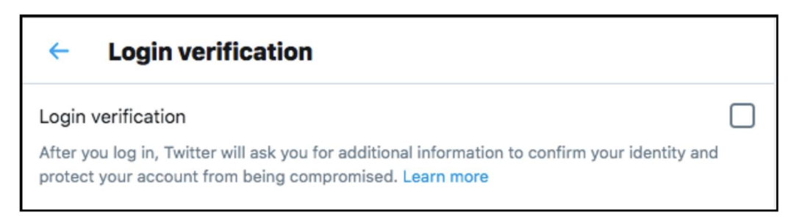
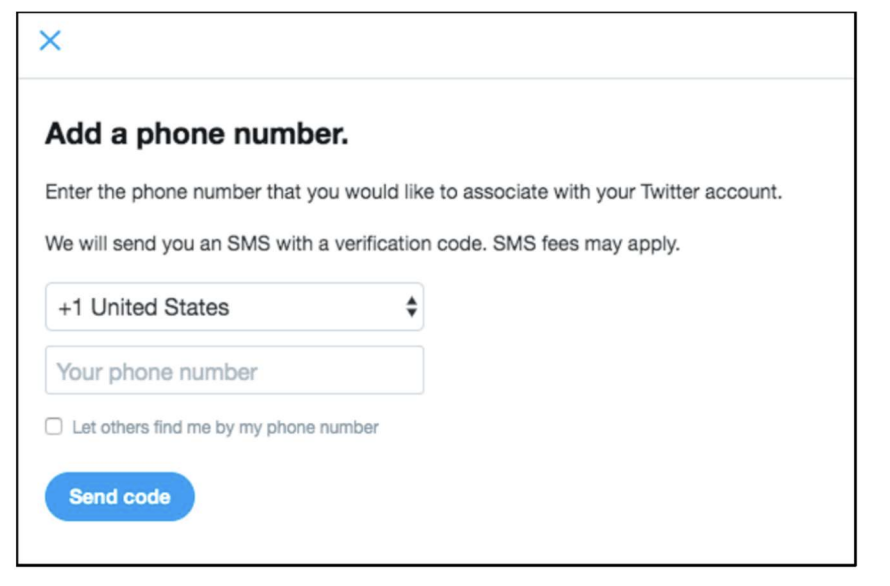
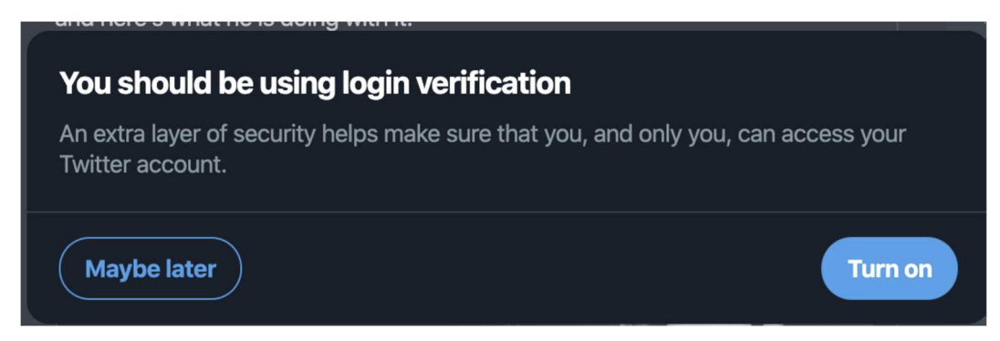
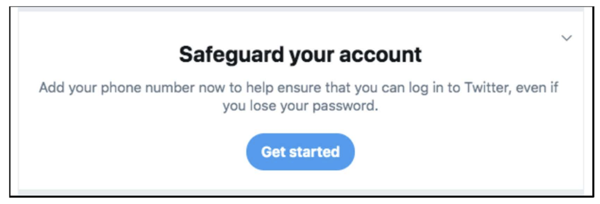
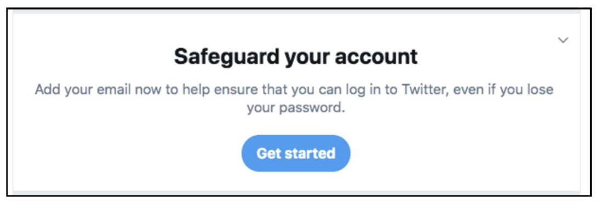
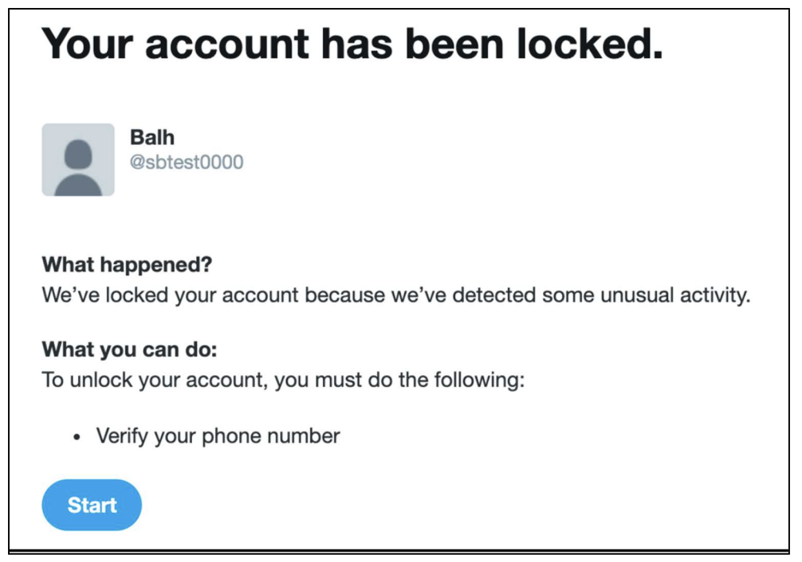
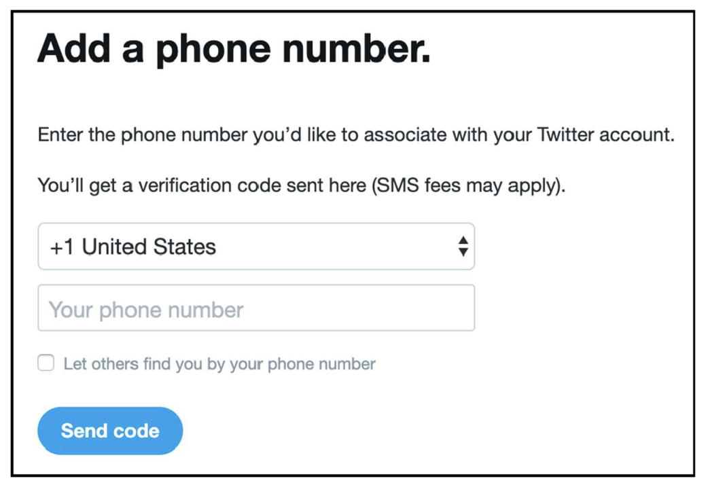
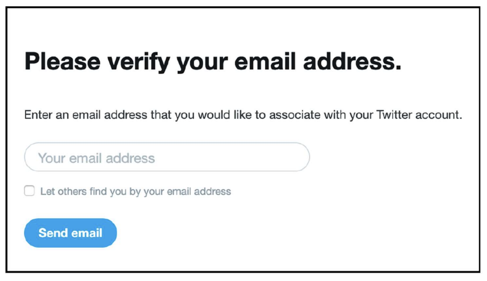

BRIAN M. BOYNTON, Principal Deputy Assistant Attorney General ARUN G. RAO, Deputy Assistant Attorney General

GUSTAV W. EYLER, Director LISA K. HSIAO, Assistant Director

ZACHARY L. COWAN, Trial Attorney (NCBN 53432)

DEBORAH S. SOHN, Trial Attorney (NYBN 5118096, DCBN 1025098)

U.S. Department of Justice Civil Division

Consumer Protection Branch 450 5th Street NW, Suite 6400-S Washington, DC 20530

Telephone: (202) 451-7468 Zachary.L.Cowan@usdoj.gov Deborah.S.Sohn@usdoj.gov

STEPHANIE M. HINDS, United States Attorney (CABN 154284) MICHELLE LO, Chief, Civil Division (NYBN 4325163)

SHARANYA MOHAN, Assistant United States Attorney (NYBN 5027768) EMMET P. ONG, Assistant United States Attorney (NYBN 4581369)

Northern District of California 450 Golden Gate Avenue

San Francisco, California 94102 Telephone: (415) 436-7198 sharanya.mohan@usdoj.gov emmet.ong@usdoj.gov

Attorneys for Plaintiff

UNITED STATES OF AMERICA

UNITED STATES DISTRICT COURT NORTHERN DISTRICT OF CALIFORNIA

Case No. 	

COMPLAINT FOR CIVIL PENALTIES, PERMANENT INJUNCTION, MONETARY RELIEF, AND OTHER EQUITABLE RELIEF

 
Plaintiff, the United States of America, acting upon notification and authorization to the Attorney General by the Federal Trade Commission (“FTC” or “Commission”), for its Complaint alleges:

**1.**	Plaintiff brings this action against Defendant Twitter, Inc. (“Twitter”) under Section 16(a)(1) of the Federal Trade Commission Act (“FTC Act”), 15 U.S.C. § 56(a)(1), which authorizes Plaintiff to seek, and the Court to order, permanent injunctive relief, monetary relief, civil penalties, and other equitable relief for Twitter’s acts or practices in violation of Section 5(a) of the FTC Act, 15 U.S.C. § 45(a), and a 2011 order previously issued by the FTC for alleged violations of Section 5(a) of the FTC Act. See Exhibit A, In re Twitter, Inc., C-4316, 151 F.T.C. 162 (Mar. 11, 2011) (Decision and Order) (“Commission Order” or “2011 Order”).

**2.**	From at least May 2013 until at least September 2019, Twitter misrepresented to users of its online communication service the extent to which it maintained and protected the security and privacy of their nonpublic contact information. Specifically, while Twitter represented to users that it collected their telephone numbers and email addresses to secure their accounts, Twitter failed to disclose that it also used user contact information to aid advertisers in reaching their preferred audiences. Twitter’s misrepresentations violate the FTC Act and the 2011 Order, which specifically prohibits the company from making misrepresentations regarding the security of nonpublic consumer information. Plaintiff therefore seeks civil penalties for Twitter’s violations, as well as a permanent injunction and other equitable relief, to ensure Twitter’s future compliance with the law.

# JURISDICTION, VENUE, AND DIVISIONAL ASSIGNMENT

**3.**	This Court has subject matter jurisdiction over this action pursuant to 28 U.S.C. §§ 1331, 1337(a), 1345, and 1355, and 15 U.S.C. § 56(l), because it involves claims arising under federal laws regulating commerce and is commenced by the United States of America.

**4.**	Venue is proper in this District under 28 U.S.C. §§ 1391(b)(1), (b)(2), (c)(2), (d), and 1395(a), as well as 15 U.S.C. § 53(b), because Twitter has its principal place of business in this District, because Twitter transacts business in this District, and because a substantial part of the events or omissions giving rise to the claims occurred in this District.

**5.**	Divisional assignment to the San Francisco or Oakland Division is proper under Local Rule 3-2(c) and (d) because Twitter has its principal place of business in San Francisco and because a substantial part of the events or omissions giving rise to the claims occurred there.

# PLAINTIFF

**6.**	Plaintiff, the United States of America, brings this action under Sections 5(a) and (l), 13(b), and 16(a)(1) of the FTC Act, 15 U.S.C. §§ 45(a) and (l), 53(b), and 56(a)(1), which prohibit unfair or deceptive acts or practices in or affecting commerce, and the 2011 Order.

# DEFENDANT

**7.**	Twitter is a Delaware corporation with its principal place of business at 1355 Market Street, Suite 900, San Francisco, California, 94103. Twitter transacts or has transacted business in this District and throughout the United States. At all times material to this Complaint, Twitter has operated its online communication service through its website, www.twitter.com, and through its mobile applications.

# COMMERCE

**8.**	At all times relevant to this Complaint, Twitter has maintained a substantial course of trade in or affecting commerce, as “commerce” is defined in Section 4 of the FTC Act, 15 U.S.C. § 44.

# THE FTC ACT

**9.**	Section 5(a) of the FTC Act, 15 U.S.C. § 45(a), prohibits “unfair or deceptive acts or practices in or affecting commerce.”

**10.**	Acts or practices are unfair under Section 5(a) of the FTC Act if they cause or are likely to cause substantial injury to consumers that those consumers cannot reasonably avoid themselves and that is not outweighed by countervailing benefits to consumers or competition. 15 U.S.C. § 45(n).

**11.**	Misrepresentations or deceptive omissions of material fact constitute deceptive acts or practices prohibited by Section 5(a) of the FTC Act.

**12.**	Section 5(l) of the FTC Act, 15 U.S.C. § 45(l), declares that “[a]ny person, partnership, or corporation who violates an order of the Commission after it has become final, and while such order is in effect, shall forfeit and pay to the United States a civil penalty[.]”
 
# THE COMMISSION ORDER

**13.**	In the Commission’s 2011 Administrative Complaint in the proceeding bearing Docket No. C-4316 (the “Administrative Complaint”), the Commission charged Twitter with engaging in deceptive acts or practices in violation of Section 5(a) of the FTC Act, 15 U.S.C. § 45(a), for its failures to provide reasonable security measures to prevent unauthorized access to nonpublic user information and to honor the privacy choices exercised by Twitter users.

**14.**	Specifically, the Administrative Complaint asserted that Twitter had engaged in deceptive acts or practices by misrepresenting that users could control who had access to their tweets through a “protected account” or could send private “direct messages” that could only be viewed by the recipient when, in fact, Twitter lacked reasonable safeguards to ensure those choices were honored, such as restricting employee access to nonpublic user information based on a person’s job requirements.

**15.**	The Administrative Complaint also alleged that Twitter had misrepresented the controls it implemented to keep user accounts secure, when, in fact, Twitter lacked reasonable safeguards to limit or prevent unauthorized access to nonpublic user information, such as secure password requirements and other administrative, technical, or physical safeguards. See Exhibit B, In re Twitter, Inc., C-4316, 151 F.T.C. 162 (Mar. 11, 2011) (Administrative Complaint) at ¶¶ 10-12.

**16.**	Twitter settled the Commission’s Administrative Complaint with the Commission Order. The Commission Order became final in March 2011 and remains in effect.

**17.**	Provision I of the Commission Order, in relevant part, states:

IT IS ORDERED that respondent, directly or through any corporation, subsidiary, division, website, or other device, in connection with the offering of any product or service, in or affecting commerce, shall not misrepresent in any manner, expressly or by implication, the extent to which respondent maintains and protects the security, privacy, confidentiality, or integrity of any nonpublic consumer information, including, but not limited to, misrepresentations related to its security measures to: (a) prevent unauthorized access to nonpublic consumer information; or (b) honor the privacy choices exercised by users.

 See Exhibit A, Commission Order, Provision I.

**18.**	The Commission Order defines “nonpublic consumer information” as, in relevant part, “an individual consumer’s: (a) email address… [and] (c) mobile telephone number[.]” See Exhibit A, Commission Order, Definition 3.

# TWITTER’S NOTICE OF THE COMMISSION ORDER

**19.**	Twitter’s General Counsel signed the Commission Order on behalf of Twitter. The Commission served the Commission Order in March 2011.

# NATURE OF THE CASE

**20.**	Twitter operates an online communication service through its website, www.twitter.com, and through text messaging and mobile applications. The service allows registered users to communicate with one another by posting “tweets,” or short messages currently limited to 280 characters or less, with which other users may interact through a “like,” reply, or “retweet.”

**21.**	In order to follow other accounts, or post, like, and retweet tweets, users must register for a Twitter account. The main page for a registered user who navigates to www.twitter.com or who opens the Twitter mobile application, is known as a Twitter “timeline.” The timeline displays a stream of tweets from accounts the user has chosen to follow. The timeline also displays a search engine, recommendations for additional accounts to follow, and a list of trending topics. Registered users can also navigate to their own profile page to view, among other things, their own tweets.

**22.**	Twitter’s service is widely used. As of September 2019, Twitter had more than 330 million monthly active users worldwide, which includes journalists, celebrities, commercial brands, and government officials.

**23.**	Commercial entities regularly use Twitter to promote offers or advertise to consumers, and many tweets contain links to other websites, including websites that users may use to purchase commercial products or services.

**24.**	Twitter’s core business model monetizes user information by using it for advertising. In fact, of the $3.4 billion in revenue that Twitter earned in 2019, $2.99 billion flowed from advertising.

**25.**	Twitter primarily allows companies to advertise on its service through “Promoted Products,” which can take one of three forms: (1) Promoted Tweets, which appear within a user’s timeline, search results, or profile pages, similar to an ordinary tweet; (2) Promoted Accounts, which typically appear in the same format and place as other recommended accounts; and (3) Promoted Trends, which appear at the top of the list of trending topics for an entire day.

**26.**	Twitter offers various services that advertisers can use to reach their existing marketing lists on Twitter, including “Tailored Audiences” and “Partner Audiences.” Tailored Audiences allows advertisers to target specific groups of Twitter users by matching the telephone numbers and email addresses that Twitter collects to the advertisers’ existing lists of telephone numbers and email addresses. Partner Audiences allows advertisers to import marketing lists from data brokers like Acxiom and Datalogix to match against the telephone numbers and email addresses collected by Twitter. Twitter has provided advertisers the ability to match against lists of email addresses since January 2014 and against lists of telephone numbers since September 2014.

**27.**	Twitter has prompted users to provide a telephone number or email address for the express purpose of securing or authenticating their Twitter accounts. However, through at least September 2019, Twitter also used this information to serve targeted advertising and further its own business interests through its Tailored Audiences and Partner Audiences services. For example, from at least May 2013 until at least September 2019, Twitter collected telephone numbers and email addresses from users specifically for purposes of allowing users to enable two-factor authentication, to assist with account recovery (e.g., to provide access to accounts when users have forgotten their passwords), and to re-authenticate users (e.g., to re-enable full access to an account after Twitter has detected suspicious or malicious activity). From at least May 2013 through at least September 2019, Twitter did not disclose, or did not disclose adequately, that it used these telephone numbers and email addresses to target advertisements to those users through its Tailored Audiences and Partner Audiences services.

**28.**	In 2011, after an FTC investigation, Twitter settled allegations that it had misrepresented the extent to which Twitter protected the privacy and security of nonpublic consumer information. The resulting Commission Order, among other things, prohibits Twitter from misrepresenting the extent to which Twitter maintains and protects the security, privacy, confidentiality, or integrity of any nonpublic consumer information. See Exhibit A, Commission Order, Provision I.

**29.**	More than 140 million Twitter users provided email addresses or telephone numbers to Twitter based on Twitter’s deceptive statements that their information would be used for specific purposes related to account security. Twitter knew or should have known that its conduct violated the 2011 Order, which prohibits misrepresentations concerning how Twitter maintains email addresses and telephone numbers collected from users.

# TWITTER’S BUSINESS ACTIVITIES

## Twitter Deceptively Used Information Provided for Two-Factor Authentication to Serve Targeted Advertisements

**30.**	Since May 2013, Twitter has allowed users to log into Twitter with two-factor authentication using their telephone numbers. Users who enable this security feature log into their Twitter accounts with their usernames, passwords, and a code texted to their telephone numbers whenever they log in from a new or unrecognized device.

**31.**	Twitter prompts users to enable two-factor authentication through notices on their timelines and after users reset their passwords. Twitter also encourages users to turn on two-factor authentication in tweets from Twitter-operated accounts, Help Center documentation, and blog posts.

**32.**	To enable two-factor authentication, Twitter users must navigate to an account settings page. After clicking on “Security,” users see a screen similar to the one depicted below.

**33.**	When users click on the “Learn more” link, they see a webpage that says, “How to use two-factor authentication.” This page states, in relevant part:
 
Two-factor authentication is an extra layer of security for your Twitter account. Instead of only entering a password to log in, you’ll also enter a code or use a security key. This additional step helps make sure that you, and only you, can access your account.

**34.**	After clicking on the “Login Verification” checkbox above, users see additional instructions about how to enable two-factor authentication. The last screen in the user flow related to two-factor authentication using a telephone number is similar to the one depicted below:
 

**35.**	Since at least September 2018, Twitter has prompted users to enable two-factor authentication directly on users’ timelines through a prompt similar to the screen depicted below:

**36.**	Until September 2019, Twitter did not disclose at any point in the two-factor authentication pathway or in any of the associated links described in Paragraphs 32 through 35 that it was using the telephone numbers users provided for two-factor authentication to target advertisements to those users.
 
**37.**	From May 2013, approximately two million users provided a telephone number to enable two-factor authentication.

**38.**	The fact that Twitter used the telephone numbers provided for two-factor authentication for advertising would be material to users when deciding whether to provide a telephone number for two-factor authentication. In fact, public reaction to Twitter’s disclosure of this practice in late 2019 was largely negative, with one news outlet describing the practice as “particularly shameful.”

## Twitter Deceptively Used Information Provided for Future Account Recovery to Serve Targeted Advertisements

**39.**	In June 2015, Twitter began prompting users to add a telephone number to their Twitter accounts as a safeguard in the event of a lost password. Then, in April 2018, Twitter also began prompting users to add an email address.

**40.**	Since June 2015, if users do not have a telephone number associated with their accounts, Twitter may prompt the users to add a telephone number through a message similar to the one depicted below:
 

**41.**	Similarly, since April 2018, if a user does not have an email address associated with their account, Twitter may prompt the user to add an email address through a message similar to the one depicted below:

**42.**	Through September 2019, Twitter did not disclose at any point in the account recovery pathway or any of the messages described in Paragraphs 40 and 41 that it was using the telephone numbers or email addresses users provided for account recovery to target advertisements to those users.

**43.**	From June 2015, approximately 37 million users provided a telephone number or email address for account recovery purposes.

**44.**	The fact that Twitter used the telephone numbers and email addresses provided by users to safeguard their accounts for advertising would be material to users when deciding whether to provide their information for account recovery purposes.

## Twitter Deceptively Used Information Provided for Re-authentication to Serve Targeted Advertisements

**45.**	In December 2013, Twitter began requiring users to provide a telephone number or email address for re-authentication (e.g., to re-enable full access to an account after Twitter has detected suspicious or malicious activity).
 
**46.**	If Twitter detects suspicious or malicious activity on a user’s account, or suspects that the account may belong to a previously-banned user, Twitter may require the user to re-authenticate by providing a telephone number through a prompt similar to the one depicted below:

**47.**	If users click the “Start” button pictured above, they are instructed to enter a telephone number through a prompt similar to the one depicted below:

**48.**	Similarly, Twitter may require users to provide an email address to re-enable full access to their accounts with a prompt similar to the one depicted below:
 

**49.**	Through September 2019, Twitter did not disclose at any point in the re-authentication pathway described in Paragraphs 46 through 48 that it was using the telephone numbers or email addresses users provided for re-authentication to target advertisements to those users.

**50.**	From September 2014, approximately 104 million users provided a telephone number or email address in response to a prompt for re-authentication.

**51.**	The fact that Twitter used the telephone numbers and email addresses provided for re-authentication for advertising would be material to users when deciding whether to provide their information in response to a prompt for re-authentication.

## Twitter Misrepresented that it Processed Personal Data in Accordance with the EU-U.S. and Swiss-U.S. Privacy Shield Frameworks

**52.**	The European Union and Switzerland have each established regulatory regimes to protect individuals’ right to privacy with respect to the processing of their personal data. Both privacy regimes generally prohibit businesses from transferring personal data to third countries unless the recipient jurisdiction’s laws are deemed to adequately protect personal data.

**53.**	To ensure adequate privacy protections for commercial data transfers, the International Trade Administration of the U.S. Department of Commerce (“Commerce”) coordinated with the European Commission and the Swiss Administration to craft the EU-U.S. and Swiss-U.S. Privacy Shield Frameworks (“Privacy Shield” or “Frameworks”). The Frameworks are materially identical.

**54.**	To rely on the Privacy Shield for data transfers, a company needed to self-certify and annually affirm to Commerce that it complied with the Privacy Shield Principles (the “Principles”). Of note, Principle 5(a) provided that “[a]n organization may not process personal information in a way that is incompatible with the purposes for which it has been collected or subsequently authorized by the individual.” The Frameworks defined “processing” to include “any operation or set of operations which is performed upon personal data, whether or not by automated means” and includes, among other things, “collection,” “storage,” and “use” of personal information.

**55.**	Companies under the enforcement jurisdiction of the FTC, as well as the U.S. Department of Transportation, were eligible to join the EU-U.S. and Swiss-U.S. Privacy Shield Frameworks. A company under the FTC’s jurisdiction that self-certified to the Privacy Shield Principles, but failed to comply with the Privacy Shield, may be subject to an enforcement action based on the FTC’s deception authority under Section 5 of the FTC Act.

**56.**	Commerce maintains a public website, https://www.privacyshield.gov, where it posts the names of companies that have self-certified to the Privacy Shield. The listing of companies, found at https://www.privacyshield.gov/list, indicates whether the company’s self-certification is current.

**57.**	On November 16, 2016, Twitter self-certified its participation in the Privacy Shield. Twitter has reaffirmed its participation in the Privacy Shield to Commerce each year thereafter.

**58.**	As described in Paragraphs 30 through 51, through at least September 2019, Twitter deceptively used personal information collected for specific security-related purposes for advertising. Twitter’s use of such personal information for advertising purposes was not compatible with the purposes for which the information was collected, and Twitter did not obtain subsequent authorization from any individual to use such information for advertising.

## Ongoing Conduct

**59.**	Based on the facts and violations of law alleged in this Complaint, the FTC has reason to believe that Twitter is violating or is about to violate laws enforced by the Commission. Among other things, Twitter is a recidivist that engaged in unlawful conduct even after law enforcement action. In addition, Twitter still makes most of its money by directing advertisements to its users, including by targeting particular users based on information the users provide. Therefore, Twitter has an incentive to resume its unlawful conduct, and it retains the means and ability to do so. Twitter also engaged in the unlawful conduct at issue here from at least January 2014 through at least September 2019—a period of almost six years.

# VIOLATIONS OF THE FTC ACT

## Count 1—Deceptive Practices Regarding the Use of Telephone Numbers Provided for Two-Factor Authentication

**60.**	Paragraphs 1 through 59 are incorporated as if set forth herein.

**61.**	As described above in Paragraphs 30 through 38, Twitter represented, directly or indirectly, expressly or by implication, that users’ telephone numbers provided for two-factor authentication would be used for security purposes.

**62.**	In numerous instances in which Twitter has made the representation set forth in Paragraph 61, Twitter failed to disclose, or failed to disclose adequately, that Twitter would also use telephone numbers provided by users for two-factor authentication for targeting advertisements to those users.

**63.**	Twitter’s failure to disclose or disclose adequately the material information described in Paragraph 62, in light of the representations set forth in Paragraph 61, is a deceptive act or practice in violation of Section 5(a) of the FTC Act, 15 U.S.C. § 45(a).

## Count 2—Deceptive Practices Regarding the Use of Telephone Numbers and Email Addresses Provided for Account Recovery

**64.**	Paragraphs 1 through 59 are incorporated as if set forth herein.

**65.**	As described above in Paragraphs 39 through 44, Twitter represented, directly or indirectly, expressly or by implication, that users’ telephone numbers and email addresses provided for account recovery would be used for security purposes.

**66.**	In numerous instances in which Twitter has made the representation set forth in Paragraph 65, Twitter failed to disclose, or failed to disclose adequately, that Twitter would also use telephone numbers and email addresses provided by users for account recovery for targeting advertisements to those users.

**67.**	Twitter’s failure to disclose or disclose adequately the material information described in Paragraph 66, in light of the representations set forth in Paragraph 65, is a deceptive act or practice in violation of Section 5(a) of the FTC Act, 15 U.S.C. § 45(a).

## Count 3—Deceptive Practices Regarding the Use of Telephone Numbers and Email Addresses Provided for Re-authentication

**68.**	Paragraphs 1 through 59 are incorporated as if set forth herein.

**69.**	As described above in Paragraphs 45 through 51, Twitter represented, directly or indirectly, expressly or by implication, that users’ telephone numbers and email addresses provided for account re-authentication would be used for security purposes.

**70.**	In numerous instances in which Twitter has made the representation set forth in Paragraph 69, Twitter failed to disclose, or failed to disclose adequately, that Twitter would also use telephone numbers and email addresses provided by users for account re-authentication for targeting advertisements to those users.

**71.**	Twitter’s failure to disclose or disclose adequately the material information described in Paragraph 70, in light of the representations set forth in Paragraph 69, is a deceptive act or practice in violation of Section 5(a) of the FTC Act, 15 U.S.C. § 45(a).

## Count 4—Deceptive Practices Regarding Twitter’s Compliance with the EU-U.S. and Swiss-U.S. Privacy Shield Frameworks

**72.**	Paragraphs 1 through 59 are incorporated as if set forth herein.

**73.**	As described in Paragraph 57, Twitter has represented, directly or indirectly, expressly or by implication, that it has complied with the Privacy Shield Principles since at least November 16, 2016.

**74.**	In fact, as described in Paragraph 58, until at least September 2019, Twitter failed to comply with the Privacy Shield Principles’ requirement that it may not process personal information in a way that is incompatible with the purposes for which it was collected or subsequently authorized by the individual about whom the information pertains. Therefore, the representation set forth in Paragraph 73 was false or misleading.

**75.**	The acts and practices of Twitter as alleged in this Complaint constitute unfair or deceptive acts or practices in or affecting commerce in violation of Section 5(a) of the Federal Trade Commission Act, 15 U.S.C. § 45(a).

# VIOLATIONS OF THE COMMISSION ORDER

**76.**	Each representation Twitter has made in violation of the Commission Order constitutes a separate violation for which Plaintiff may seek a civil penalty pursuant to Section 5(l) of the FTC Act, 15 U.S.C. § 45(l).

**77.**	Section 5(l) of the FTC Act, 15 U.S.C. § 45(l), as modified by Section 4 of the Federal Civil Penalties Inflation Adjustment Act of 1990, 28 U.S.C. § 2461, and Section 1.98(c) of the FTC’s Rules of Practice, 16 C.F.R. § 1.98(c), directs that a defendant who violates an order of the Commission after it has become final, and while such order is in effect, “shall forfeit and pay to the United States a civil penalty of not more than $46,517 for each violation.”

**78.**	Sections 5(l) and 13(b) of the FTC Act, 15 U.S.C. §§ 45(l) and 53(b), also authorize this Court to grant an “injunction[] and such other and further equitable relief” as it may deem appropriate to halt and redress violations of any provision of law enforced by the FTC Act and to enforce the Commission Order.

## Count 5—Misrepresenting the Extent to Which Twitter Maintains and Protects the Privacy of Nonpublic Consumer Information as it Relates to Telephone Numbers Provided for Two-Factor Authentication

**79.**	Paragraphs 1 through 59 are incorporated as if set forth herein.

**80.**	Provision I of the Commission Order prohibits Twitter from misrepresenting “the extent to which [Twitter] maintains and protects the security, privacy, confidentiality, or integrity of any nonpublic consumer information, including, but not limited to, misrepresentations related to its security measures to: (a) prevent unauthorized access to nonpublic consumer information; or (b) honor the privacy choices exercised by users.”

**81.**	As described above in Paragraphs 30 through 38, Twitter represented, directly or indirectly, expressly or by implication, that it would maintain and protect the privacy of users’ telephone numbers collected specifically for purposes of enabling two-factor authentication.

**82.**	In fact, Twitter failed to disclose, or failed to disclose adequately, that Twitter would also use the telephone numbers described in Paragraph 81 for targeted advertising.

**83.**	Twitter’s failure to disclose or disclose adequately the material information described in Paragraph 82, in light of the representations set forth in Paragraph 81, misrepresented the extent to which Twitter maintains and protects the privacy of nonpublic consumer information.

**84.**	Therefore, the representations described in Paragraph 81 violated Provision I of the Commission Order.

## Count 6—Misrepresenting the Extent to Which Twitter Maintains and Protects the Privacy of Nonpublic Consumer Information as it Relates to Telephone Numbers and Email Addresses Provided for Account Recovery

**85.**	Paragraphs 1 through 59 are incorporated as if set forth herein.

**86.**	Provision I of the Commission Order prohibits Twitter from misrepresenting “the extent to which [Twitter] maintains and protects the security, privacy, confidentiality, or integrity of any nonpublic consumer information, including, but not limited to, misrepresentations related to its security measures to: (a) prevent unauthorized access to nonpublic consumer information; or (b) honor the privacy choices exercised by users.”

**87.**	As described above in Paragraphs 39 through 44, Twitter represented, directly or indirectly, expressly or by implication, that it would maintain and protect the privacy of users’ telephone numbers and email addresses collected for purposes of account recovery.

**88.**	In fact, Twitter failed to disclose, or failed to disclose adequately, that Twitter would also use the telephone numbers and email addresses described in Paragraph 87 for targeted advertising.

**89.**	Twitter’s failure to disclose or disclose adequately the material information described in Paragraph 88, in light of the representations set forth in Paragraph 87, misrepresented the extent to which Twitter maintains and protects the privacy of nonpublic consumer information.

**90.**	Therefore, the representations described in Paragraph 87 violated Provision I of the Commission Order.

## Count 7—Misrepresenting the Extent to Which Twitter Maintains and Protects the Privacy of Nonpublic Consumer Information as it Relates to Telephone Numbers and Email Addresses Provided for Re-authentication

**91.**	Paragraphs 1 through 59 are incorporated as if set forth herein.

**92.**	Provision I of the Commission Order prohibits Twitter from misrepresenting “the extent to which [Twitter] maintains and protects the security, privacy, confidentiality, or integrity of any nonpublic consumer information, including, but not limited to, misrepresentations related to its security measures to: (a) prevent unauthorized access to nonpublic consumer information; or (b) honor the privacy choices exercised by users.”

**93.**	As described above in Paragraphs 45 through 51, Twitter represented, directly or indirectly, expressly or by implication, that it would maintain and protect the privacy of users’ telephone numbers and email addresses collected to re-authenticate a user’s Twitter account.

**94.**	In fact, Twitter failed to disclose, or failed to disclose adequately, that Twitter would also use the telephone numbers and email addresses described in Paragraph 93 for targeted advertising.

**95.**	Twitter’s failure to disclose or disclose adequately the material information described in Paragraph 94, in light of the representations set forth in Paragraph 93, misrepresented the extent to which Twitter maintains and protects the privacy of nonpublic consumer information.

**96.**	Therefore, the representations described in Paragraph 93 violated Provision I of the Commission Order.

# CONSUMER INJURY

**97.**	Consumers have suffered and will continue to suffer substantial injury as a result of Twitter’s violations of the FTC Act and the 2011 Order. In addition, Twitter has been unjustly enriched as a result of its unlawful acts or practices. Absent injunctive relief by this Court, Twitter is likely to continue to injure consumers, reap unjust enrichment, and harm the public interest.

# PRAYER FOR RELIEF

**98.**	WHEREFORE, Plaintiff requests that the Court:

A.	Enter judgment against Twitter and in favor of Plaintiff for violating the 2011 Order and the FTC Act as alleged in this Complaint;

B.	Award Plaintiff monetary civil penalties from Twitter for each violation of the 2011 Order;

C.	Enter a permanent injunction to prevent future violations by Twitter of the 2011 Order, or as it is subsequently modified by operation of law, and the FTC Act;

D.	Award monetary and other relief within the Court’s power to grant; and

E.	Award any additional relief as the Court determines to be just and proper.

 
 
Dated: [Date]

Of Counsel:

JAMES A. KOHM

Associate Director Division of Enforcement

LAURA KOSS

Assistant Director Division of Enforcement

REENAH L. KIM

Attorney

Division of Enforcement

ANDREA V. ARIAS

Attorney

Division of Privacy and Identity Protection

Federal Trade Commission

600 Pennsylvania Avenue, N.W., Mail Stop CC-9528

Washington, D.C. 20580

Tel: (202) 326-2272 (Kim)

Tel: (202) 326-2715 (Arias)

rkim1@ftcgov aarias@ftc.gov

 
Respectfully submitted,

FOR THE UNITED STATES OF AMERICA: BRIAN M. BOYNTON

Principal Deputy Assistant Attorney General Civil Division

ARUN G. RAO

Deputy Assistant Attorney General

GUSTAV W. EYLER

Director

Consumer Protection Branch

LISA K. HSIAO

Assistant Director

    [e-signature]	

ZACHARY L. COWAN DEBORAH S. SOHN

Trial Attorneys

Consumer Protection Branch

U.S. Department of Justice

450 5th Street, N.W. Suite 6400-S Washington, D.C. 20530

Tel: (202) 598-7566

Fax: (202) 514-8742

Zachary.L.Cowan@usdoj.gov Deborah.S.Sohn@usdoj.gov

STEPHANIE M. HINDS

United States Attorney

MICHELLE LO

Chief

Civil Division

SHARANYA MOHAN EMMET P. ONG

Assistant United States Attorneys Northern District of California 450 Golden Gate Avenue

San Francisco, CA 94102 Tel: (415) 436-7198

sharanya.mohan@usdoj.gov emmet.ong@usdoj.gov