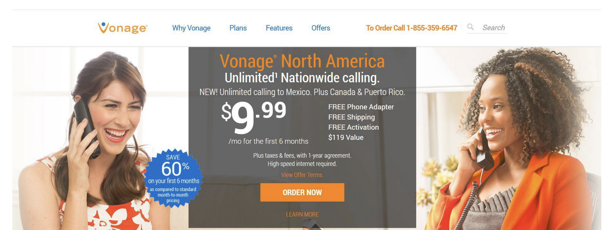
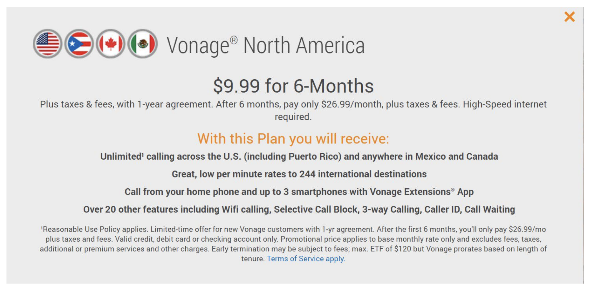
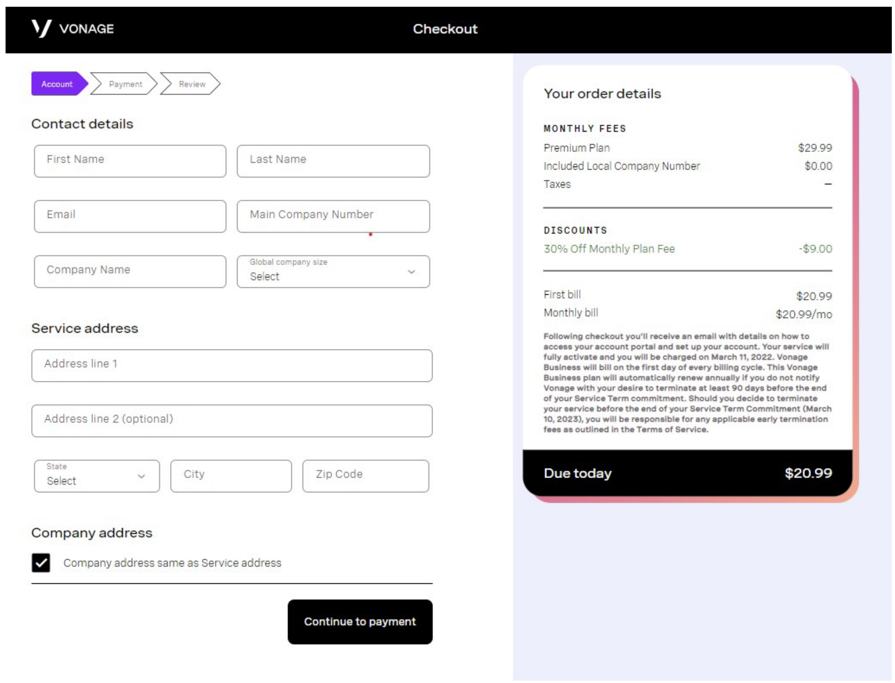

GREGORY A. ASHE STEPHANIE LIEBNER ANGEL E. REYES

FEDERAL TRADE COMMISSION

600 Pennsylvania Ave., NW Washington, DC 20580

Telephone: (202) 326-3719 (Ashe)

Telephone: (202)326-2908 (Liebner)

Telephone: (202) 326-2872 (Reyes)

Facsimile: (202) 326-3768

Email: gashe@ftc.gov, sliebner@ftc.gov, areyes@ftc.gov

Attorneys for Plaintiff

FEDERAL TRADE COMMISSION

UNITED STATES DISTRICT COURT DISTRICT OF NEW JERSEY

Case No. 3:22-cv-6435

COMPLAINT FOR PERMANENT INJUNCTION, MONETARY RELIEF, AND OTHER RELIEF

Plaintiff, the Federal Trade Commission (“FTC”), for its Complaint alleges:

**1.**	The FTC brings this action under Sections 13(b) and 19 of the Federal Trade Commission Act (“FTC Act”), 15 U.S.C. §§ 53(b), 57b, and Section 5 of the Restore Online Shoppers’ Confidence Act (“ROSCA”), 15 U.S.C. § 8404, which authorize the FTC to seek, and the Court to order, permanent injunctive relief, monetary relief, and other relief for Defendants’ acts or practices in violation of Section 5(a) of the FTC Act, 15 U.S.C. § 45(a), and in violation Section 4 of ROSCA, 15 U.S.C. § 8403, in connection with Defendants’ failure to provide

required disclosures and simple mechanisms for customers to cancel their telephone services and charging customers without their consent.

# SUMMARY OF CASE

**2.**	Vonage advertises and sells communication services, including Voice over Internet Protocol (“VoIP”) phone services, to residential and small business consumers. Vonage’s services renew automatically, and it charges most customers’ credit cards or debits their bank accounts directly and on a recurring basis.

**3.**	Since at least 2015, Vonage has failed to provide a simple method for customers to cancel their telephone services, employing a panoply of hurdles, sometimes referred to as “dark patterns,” which compound to deter and prevent customers from stopping recurring charges. To begin with, although Vonage allows consumers to enroll for services on their own and at any time through its website, Vonage has required cancelling customers to speak to a live “retention” agent over the phone during limited working hours before processing their request. Vonage has made the requirement to cancel via a live agent difficult for customers to satisfy through obscured contact information, circuitous and redundant procedural requirements, long wait times, dropped or unanswered calls, lengthy and repeated sales pitches, and unexpected high-dollar Early Termination Fees (“ETFs”). Even when customers have managed to navigate Vonage’s process and have reached a live agent and canceled their accounts, in many instances, Vonage has continued to charge them without consent. These actions violate the FTC Act and ROSCA.

# JURISDICTION AND VENUE

**4.**	This Court has subject matter jurisdiction pursuant to 28 U.S.C. §§ 1331, 1337(a), and 1345.

**5.**	Venue is proper in this District under 28 U.S.C. § 1391(b)(2), (b)(3), and (c)(2), and 15 U.S.C. § 53(b).

# PLAINTIFF

**6.**	The FTC is an independent agency of the United States Government created by the FTC Act, which authorizes the FTC to commence this district court civil action by its own attorneys. 15 U.S.C. §§ 41–58. The FTC enforces Section 5(a) of the FTC Act,

15 U.S.C. § 45(a), which prohibits unfair or deceptive acts or practices in or affecting commerce. The FTC also enforces ROSCA, 15 U.S.C. §§ 8401-05, which, inter alia, prohibits the sale of goods or services on the Internet through negative option marketing without meeting certain requirements to protect consumers. A negative option is an offer in which the seller treats a consumer’s silence – their failure to reject an offer or cancel an agreement – as consent to be charged for goods or services. 16 C.F.R. § 310.2(w).

# DEFENDANTS

**7.**	Defendant Vonage Holdings Corp. (“Vonage Holdings”) is a Delaware corporation with its principal place of business at 23 Main Street, Holmdel, New Jersey 07733. Vonage Holdings transacts or has transacted business in this District and throughout the United States. Vonage Holdings is the parent company of Vonage America LLC and Vonage Business, Inc. At all times relevant to this Complaint, acting alone or in concert with others, Vonage Holdings has advertised, marketed, distributed, or sold communications services, including VoIP services, to consumers and businesses throughout the United States.

**8.**	Defendant Vonage America LLC (“Vonage America”) is a Delaware limited liability company with its principal place of business at 23 Main Street, Holmdel, New Jersey 07733. Vonage America transacts or has transacted business in this District and throughout the United States. At all times relevant to this Complaint, acting alone or in concert with others,

## Vonage America has been responsible for Vonage Holdings’ residential business throughout the United States.

**9.**	Defendant Vonage Business, Inc. (“Vonage Business”), is a Delaware corporation with its principal place of business at 3200 Windy Hill Rd SE, Ste 200E, Atlanta, GA 30339- 8435. Vonage Business transacts or has transacted business in this District and throughout the United States. At all times relevant to this Complaint, acting alone or in concert with others, Vonage Business has been responsible for Vonage Holdings’ small business services throughout the United States.

# COMMON ENTERPRISE

**10.**	Defendants Vonage Holdings, Vonage America, and Vonage Business (collectively, “Vonage” or “Defendants”) have operated as a common enterprise while engaging in the deceptive and unfair acts and practices and other violations of law alleged below.

**11.**	Defendants have conducted the business practices described below through an interrelated network of companies that have common ownership, officers, managers, business functions, employees, and office locations, and that commingled funds. Because these Defendants have operated as a common enterprise, each of them is liable for the acts and practices alleged below.

# COMMERCE

**12.**	At all times relevant to this Complaint, Defendants have maintained a substantial course of trade in or affecting commerce, as “commerce” is defined in Section 4 of the FTC Act, 15 U.S.C. § 44.

# DEFENDANTS’ BUSINESS ACTIVITIES

**13.**	Since its founding in 2001, Vonage has marketed and sold home phone services to residential consumers using VoIP technology. Beginning in 2013, Vonage also began

marketing and selling phone services to small business consumers. Customers access and utilize Vonage services via their existing internet connections.

**14.**	Since 2015, Vonage has enrolled consumers into millions of residential and small business plans. Vonage’s residential plans generally include a specified number of minutes that a customer can use each month and a geographic restriction (e.g., 400 minutes per month available to use in the U.S. and Canada). Prices for residential plans range from $4.99 to over $50 per month. Vonage’s small business plans are customizable and could include multiple communication channels (such as video, voice, messaging, email), equipment, and add-ons, based on the size and needs of the business. Prices for Vonage’s business plans can be as high as thousands of dollars per month, depending on the size of the business and any add-on services selected.

**15.**	Vonage’s phone services renew automatically, charging consumers on a recurring basis unless they take affirmative action to cancel by a certain date. Month-to-month plans are renewed and charged monthly unless customers complete Vonage’s cancellation procedures. Annual plans either renew for the next year or switch to month-to-month after the initial contract period expires, and thereafter are also charged on a monthly basis unless customers are able to cancel.

## Vonage Offers a Variety of Enrollment Methods

**16.**	Residential and business consumers can enroll in Vonage plans either through Vonage’s website or by calling Vonage at a toll-free number.

**17.**	Residential consumers using Vonage’s website to enroll can click the “ORDER NOW” button on Vonage’s home page, which directs them to select a plan and input their address and payment information. The website enrollment process is available 24/7, takes minutes to complete, does not require any interaction with a live agent, and once enrolled, customers can use their online Vonage account to independently manage services, pay bills, review call activity, and change plans and features.

**18.**	Business consumers using Vonage’s website for enrollment similarly may, at any time and independently, click on the “See Plans” or “See Pricing” buttons on the website’s home page, select the desired plan, pick add-on features, and input address and payment information to enroll.

**19.**	For residential consumers who prefer to enroll by speaking to an agent on the telephone, the toll-free enrollment number is advertised prominently in orange writing at the top of each page on the Vonage website.

**20.**	Likewise, business consumers seeking to enroll over the telephone can click the prominently displayed “Schedule a meeting” or “Talk to an Expert” buttons located on most pages, which bring up a toll-free number they can call or a form they can fill out to have an agent call them.

**21.**	For both residential and business consumers signing up for Vonage’s services online or via telephone, enrollment is processed immediately.

## Vonage Has Made It Difficult for Consumers to Cancel

**22.**	Since at least 2015, Vonage has made its cancellation process more difficult to navigate than its enrollment process.

## Vonage Has Allowed Online Enrollment, But Not Online Cancellation

**23.**	Despite allowing online enrollment for all customers, Vonage did not allow online cancellation for any of them between 2017 and 2022. Instead, Vonage restricted customers to a single method of cancellation: speaking with a live “retention” agent over the telephone. Accordingly, customers requesting cancellation through email or web chat were instructed that Vonage “will not accept cancellation via email, fax, SMS or other electronics [sic] methods.”

**24.**	Vonage did not inform consumers in the enrollment flow of this restrictive and exclusive means of cancellation; rather, the requirement to make a cancellation request only through a live agent was buried in Vonage’s lengthy terms of service.

**25.**	Forcing customers to speak to a live agent to cancel their services has been a central component of Vonage’s retention strategy: in early 2017, Vonage deliberately removed an online cancellation form previously available for its business customers to reduce cancellations and retain more customers.

**26.**	Vonage’s restrictive method of cancellation runs counter to its own guidance to its business clients on effective telecommunication options, which encourages the use of multiple communication channels, particularly for issues that consumers can handle on their own. Vonage’s guidance states that “not offering other channels practically guarantees a poor customer experience” and that “[o]ffering only voice in your contact center won’t cut it in the new normal.” Vonage also advises businesses not to “frustrate customers by requiring them to contact you for support that should be available on a self-service basis” and that “[i]t should be just as easy to return your product as it is to buy it.”

## Vonage Creates Multiple Hurdles for Cancelling Customers

**27.**	Vonage erects additional roadblocks to prevent customers from cancelling and stopping recurring charges. As detailed below, Vonage in numerous instances makes it difficult for consumers to find the correct department, cannot connect a customer to a live agent who can process the request, does not complete promised call-backs, subjects customers to long hold times and aggressive sales pitches, and frequently disconnects calls, requiring customers to restart the entire process from the beginning.

**28.**	First, Vonage does not permit customers to request cancellation via the main customer service telephone number prominently displayed on the website. Rather, customers

must call a special cancellation telephone number, which is obscured within the website and which operates on a more restricted time schedule. Although Vonage agents on the main telephone line can sometimes transfer customers from that line to the cancellation line, doing so often means that the customer waits in two lengthy hold queues: one to speak with a general agent and another to speak with a cancellation agent.

**29.**	Second, customers calling Vonage’s cancellation line experience multiple circuitous transfers and dropped calls. Cancelling customers complained to Vonage about being “bounced around between departments” and internal emails between Vonage agents confirm this was an issue, with agents discussing the fact that customers are “sent in a circle when they want to downgrade or remove the service.” Vonage’s billing task force similarly determined that “[c]ancellation flow does not consistently work as expected” and that teams were working “to address the backlog of open items.”

**30.**	Managers from other Vonage departments also acknowledged difficulties connecting customers to Vonage’s retention department and multiple failed attempts to cancel customers’ accounts. One manager noted, “I would have a rep reach out and offer to transfer him directly [to the retention department], but we have been having issues getting smaller accounts over to retention via the phone system and I don’t want to run the risk of this customer being even angrier.” In another exchange, a different manager messaged the same retention supervisor, stating, “I’ve sent this client to the cancel distro a few times now, need your assistance here please.”

**31.**	Despite internally acknowledging systemic issues surrounding cancelling customers’ ability to reach its retention department, Vonage continued to require these telephone calls as a precondition of cancellation. Indeed, after informing one customer that “the voice team is having system issues and that’s why [sic] is so hard to reach them,” Vonage’s customer service representative stated: “All I can do for you now is to provide you their phone number to keep trying.”

**32.**	Third, the live agent cancellation requirement has been more problematic still for the majority of Vonage’s residential consumers and many of its small business consumers, whose plans are billed at less than $60/month. Starting in September 2020, those “micro” account consumers have been restricted to chat support only and cannot contact Vonage by phone for any reason. For these customers, the path to submit a cancellation request has been even more circuitous. They have first been required to request cancellation via online chat and wait to be connected with a live chat agent. According to one Vonage manager, the cancellation process has stalled for some “micro” customers at this first step: when customers attempt to cancel their accounts via chat, “they are stuck in an endless cycle where their chat never gets picked up. This has happened multiple times.” Next, if the chat has gotten picked up and they are connected with a live chat agent, they then have had to wait for the live chat agent to call them and transfer them to a different “retention” agent or schedule a call-back on their behalf with the retention department.

**33.**	Fourth, even customers who find their way (or are successfully connected) to the cancellation call queue are often unable to request cancellation due to excessively long hold times. Vonage was also aware this was an issue: internal telephone records confirm that in numerous instances, the retention department experienced long average hold times. Indeed, its Senior Vice President of Customer Care was informed multiple times in 2016 that “[w]e are continuing to see complaints online about long wait times and not being able to cancel” and “there has been more feedback recently about holding to cancel accounts and/or never getting thru.”

**34.**	Fifth, although cancelling customers purportedly can also request and wait for a callback from Vonage’s “retention department”—supposedly within 24 to 48 hours—numerous customers report never receiving the requested callback. Internal emails confirm that incomplete callbacks were a problem, with one Vonage supervisor admitting, “While we have gotten better, we still have a bit of a backlog with the cancellations queue.” Even when promised callbacks do occur, if Vonage agents are unable to reach the customer right away, they send an email advising the customer to call back, often resulting in an endless game of “phone tag” that results in more unwanted billing for the customer.

**35.**	Sixth, for any customers who, at long last, manage to reach the retention department, endure the hold time, speak to an agent, and request cancellation, they are subjected to aggressive sales pitches intended to prevent them from closing their accounts. Vonage’s retention agents are required to ask multiple “probing questions,” present at least two alternative offers, and overcome customer resistance to offers presented, and agents who fail to engage in these retention efforts are penalized and disciplined. Customers have complained about being “interrogated” and or subjected to a “hard sell” while attempting to cancel their accounts.

**36.**	Indeed, Vonage provides monetary rewards based on agents’ “save rate” – the rate at which agents are able to persuade cancelling customers to change their minds and remain with Vonage. As a result, retention agents are incentivized to do everything in their power to convince the customer not to cancel, including by escalating the cancellation to a supervisor instead of processing it. Vonage noted that this practice – which it calls “dodging the save rate” or “gaming the save rate” – was occurring in several instances when customers attempted to cancel.

**37.**	Finally, many customers cancelling their Vonage accounts wish to keep their phone number and transfer it to a new carrier, a process known as “porting,” but Vonage makes the already grueling process doubly onerous for business customers by requiring two separate cancellation procedures. After informing Vonage agents (often after the arduous procedure described above) that they wish to cancel their accounts and port out their numbers, these customers are advised that they cannot close their accounts until after the port is complete, at which point they must request cancellation of the account a second time. Failure to do so results in continued billing on these otherwise inactive accounts, and numerous Vonage customers have complained about being billed on accounts they believed were closed after all their phone numbers had been ported to new carriers. According to one Vonage manager, the primary purpose of this additional cancellation requirement, to occur after the business’s number had already been successfully ported to a new carrier, is to “attempt to retain [the account].”

**38.**	Vonage is aware that its aggressive sales pitch and repeated phone call requirements frustrated customers trying to cancel their accounts, particularly for consumers who have ported their numbers out. As one Vonage employee observed, most customers who are trying to cancel “have already ported [their numbers] out, they are frustrated with the experience – they do NOT want to have a Save conversation.” Nevertheless, for many years, Vonage continued to enforce the requirement that cancelling customers speak with a live retention agent and continues to deliver aggressive sales pitches to customers seeking to cancel over the telephone. Vonage’s difficult cancellation path is not disclosed to customers during the enrollment flow.

## Surprise, High Fees Employed as Deterrent to Cancellation

**39.**	In numerous instances, Vonage deters cancellation by requiring customers under contract to pay an “Early Termination Fee” (“ETF”). The existence and amount of the fee is not clearly and conspicuously disclosed to business and residential customers enrolling in Vonage’s services, whether online or via phone. Residential consumers signing up online would see a screen such as the example below:

If the consumer notices and clicks the “View Offer Terms” link, the consumer would next see the following screen:

**40.**	Eleven lines in, amongst other unbolded language, it reads, “Early termination may be subject to fees; max. ETF of $120 but Vonage prorates based on length of tenure.”

**41.**	For business consumers signing up online, information about ETF likewise appears only in small print in the enrollment flow. Consumers must first select a plan and click on the option to “checkout” in order to arrive on a page requesting their address and payment information.

**42.**	On the above-depicted page, consumers must find small print disclosures about early termination, which in any case do not specify the amount of the fees, and instead refer only vaguely to the “Terms of Service.” For those consumers who then seek out the “Terms of Service” document, information about the amount of the ETF is only presented on page 8 of 25.

**43.**	Vonage similarly hides the ETF information for consumers signing up for services over the phone. Specifically, Vonage training materials state that information about the existence of an ETF “should not be proactively offered, but should be mentioned reactively” only if consumers specifically ask what happens if they cancel within the contract term.

**44.**	Unsurprisingly, given the above-described concealment, numerous customers calling to cancel their accounts are surprised to discover Vonage’s ETF fees, complaining that they never saw the ETF policy or that the policy was not brought to their attention at the point of sale.

**45.**	In addition, business customers in one-year agreements who wish to cancel their accounts must pay the entire cost remaining on their contracts. Similarly, for business customers in two-year agreements, the ETF amounts to the entire cost of their remaining contract for the first year and 75% of their remaining contract for the second year. These requirements are similarly buried in Vonage’s Terms of Service. Vonage’s ETF policy presents these business customers with two equally unappealing options: pay out the rest of the contract (or close to that amount) and receive no telephone services or pay out the rest of their contract and continue unwanted services.

**46.**	Being required to pay out the amount of the rest of their contract acts as an effective deterrent to cancellation. For example, one business customer calling Vonage to cancel the business’s account because it had not been able to use the service at all was told she would have to pay an ETF of $675.62 even though, as the retention agent admitted, “the process has been difficult up to this point.” The customer reluctantly agreed to “try one more time” with Vonage because the business could not afford to “pay almost $700” for an unanticipated fee. Another business customer called to cancel the business’s Vonage services on the date the contract was set to renew to prevent being re-charged. Unfortunately, the retention agent said the business was too late and should have canceled the services 60-days prior to his renewal date if it wanted to avoid auto-renewal and now would have to pay the equivalent of an entire year of service.

## Vonage’s Cancellation Process Is an “Endless Loop,” Resulting in Multiple Unwanted  Charges for Consumers

**47.**	Vonage is aware that consumers do not expect its cancellation process to be this difficult or restrictive. Over the years, Vonage received hundreds of complaints about its poor customer service, including from customers expressly wondering why they could enroll online but not cancel the same way. Indeed, in a 2016 analysis of customer website comments, one Vonage employee noted to his manager that “[t]he only thing that I saw consistently was a lack of ways to contact us via phone, and cancelling service online.” One dissatisfied customer emailed Vonage’s former CEO directly to complain, stating, “I can’t understand your policy of having to talk to someone to cancel an account . . . I can order online but can’t cancel online.”

**48.**	Additionally, in 2009, it signed an Assurance of Voluntary Compliance with 32 states which, in part, describes Vonage’s difficult cancellation procedures and the fact that it charged consumers after cancellation, and requires Vonage to address these deficiencies.

**49.**	Customers have detailed their efforts to navigate Vonage’s tiresome cancellation procedures, with many characterizing it as an “endless loop”:

•	“I have been calling the number listed to cancel for more than an hour. I am put into an endless loop and can't get in touch with anyone to cancel our business account. I am filing a complaint with the BBB and cancelling my credit card.”

•	“You should just know that Vonage is being unethical in how it makes it so very difficult to simply cancel my service. I've been stuck in an endless phone menu loop and can't find any way to manage this myself inside my account. It is wrong and ridiculous.”

•	“How can I cancel my account or delay activation for 90 days. . . Your online support indicates I must call. But, when I call, I’m put in an endless loop. Please help.”

•	“It has been literally impossible to reach anybody at Vonage to cancel my account. I wait on hold to speak in a chat for 40 minutes, nobody answers. The phone system sends me around in loops indefinitely with no humans.”

•	“We can’t cancel our vonage account. Their system is in a loop. Press one to talk to a rep, then it says you can chat with a specialist or go back to previous menu. You can’t chat to cancel your service, you need to speak to someone. Can you help? They won’t answer any number I call.”

•	“I have been trying to cancel my account for weeks and can not get through on the phone and every time they say someone will call me back, no one ever does. The company is bankrupt and this is becoming a legal issue.”

•	“I received an email saying my account will be activated. Why can you activate it but I can’t CANCEL It???? I have been trying for 1 week. […] CANCEL CANCEL CANCEL.”

•	“[O]h no, I already said like 10 times to CANCEL the order. . . [P]lease cancel this order! Vonage is driving me nuts over this – never again…”

**50.**	Other customers have complained about repeated unwanted charges due to Vonage’s restrictive, convoluted, and time-consuming cancellation procedures:

•	“I have been trying to cancel this service for months now and every single time I call customer service an agent hangs up. I don’t want this service […] acct is suspended but been charging me for over 4 months and the amount keeps increasing. [T]his is fraud and robbery.”

•	“I have been calling for over a week, multiple times a day. I push zero for an operator and it tells me to please hold while they connect me to someone and then the call is hung up. EVERY SINGLE TIME!! I’ve sent several emails stating what’s happening and to just cancel the service but they refuse to do it. I am continuing to get billed for something I’m no longer using and can’t cancel because they make sure you can't get through so they can continue to bill you.”

•	Consumer called Vonage multiple times over the course of nine months to cancel their account, but every time they called, “after 15-20 mins on hold, the call drops. I wait a few weeks and try again, repeat. They keep charging your card and give you no other way to cancel the account.”

•	Consumer “still being charged for Vonage after 10+ times trying to cancel,” complaining: “this is clearly a scam […] it should not be this hard.”

**51.**	Yet other customers indicate they were duped by free trial offers because they were unable to reach a retention agent and cancel their accounts on time, resulting in unwanted charges. One business customer signed up for a free trial, which it attempted to cancel within the specified time period only to be informed that that Vonage’s system was down and the cancellation could not be processed. Vonage promised the customer a call-back, but no call- back was received, and the customer’s account was subsequently charged. The customer had to call again to process the cancellation, complaining that, “frankly this is the MOST time consuming cancellation I have ever encountered. They are giving me the run around so they can keep billing me.” Another business customer enrolled in Vonage’s free trial called it “a scam with no way to close the account.”

## Vonage Charges Customers After Cancellation

**52.**	Additionally, in numerous instances when customers do manage to navigate Vonage’s convoluted process and complete the required cancellation procedures, Vonage continues to bill them for recurring service fees anyway. And if customers have provided Vonage with payment information, Vonage automatically charges the additional fees to their credit cards or bank accounts. Many customers report having to close down their payment accounts in order to stop Vonage’s unauthorized charges.

**53.**	Vonage is aware that the practice of charging after cancellation is ongoing and widespread, as evidenced by the fact that it has a specific refund policy for agents to use when “customer states the service was disconnected but billing continues.” Vonage has a similarly specific policy for overbilling that occurs due to long hold times on the telephone. Despite these company policies, customers often receive only partial refunds of the overbilled amounts, and many customers receive no refunds of the overbilled amounts at all.

**54.**	At least thousands of consumers, including consumers who enrolled in Vonage’s services online, have been substantially harmed by Vonage charging them between tens and thousands of additional dollars without authorization. Customers are also substantially harmed when they are required to expend significant time and effort requesting and waiting for refunds.

**55.**	The harm from unwanted recurring charges is not reasonably avoidable, as customers do not expect that they will continue to be charged even if they cancel. Finally, there is no countervailing benefit to consumers or competition from this conduct.

**56.**	Based on the facts and violations of law alleged in this Complaint, Plaintiff has reason to believe that Defendants are violating or are about to violate laws enforced by the FTC.

# VIOLATIONS OF THE FTC ACT

**57.**	Section 5(a) of the FTC Act, 15 U.S.C. § 45(a), prohibits “unfair or deceptive acts or practices in or affecting commerce.”

**58.**	Acts or practices are unfair under Section 5 of the FTC Act if they cause or are likely to cause substantial injury to consumers that consumers cannot reasonably avoid themselves and that is not outweighed by countervailing benefits to consumers or competition. 15 U.S.C. § 45(n).

## Count I

### Unfairly Charging Consumers Without Consent

**59.**	In numerous instances, as described in Paragraphs 13 to 56 above, Defendants have charged consumers without their express informed consent.

**60.**	Defendants’ actions cause or are likely to cause substantial injury to consumers that consumers cannot reasonably avoid themselves and that is not outweighed by countervailing benefits to consumers or competition.

**61.**	Therefore, Defendants’ acts or practices as set forth in Paragraph 59 constitute unfair acts or practices in violation of Section 5 of the FTC Act, 15 U.S.C. § 45(a), (n).

# VIOLATIONS OF THE RESTORE ONLINE SHOPPERS’ CONFIDENCE ACT

**62.**	In 2010, Congress passed the Restore Online Shoppers’ Confidence Act, 15 U.S.C. §§ 8401 et seq., which became effective on December 29, 2010. In passing ROSCA, Congress declared that “[c]onsumer confidence is essential to the growth of online commerce. To continue its development as a marketplace, the Internet must provide consumers with clear, accurate information and give sellers an opportunity to fairly compete with one another for consumers’ business.” Section 2 of ROSCA, 15 U.S.C. § 8401.

**63.**	Section 4 of ROSCA, 15 U.S.C. § 8403, generally prohibits charging consumers for goods or services sold in transactions effected on the Internet through a negative option feature, as that term is defined in the Commission’s Telemarketing Sales Rule (“TSR”), 16 C.F.R. § 310.2(w), unless the seller, among other things, provides text that clearly and conspicuously discloses all material terms of the transaction before obtaining the consumer’s billing information, obtains the consumer’s express informed consent for the charges, and provides simple mechanisms for a consumer to stop recurring charges. See 15 U.S.C. § 8403.

**64.**	The TSR defines a negative option feature as a provision in an offer or agreement to sell or provide any goods or services “under which the customer’s silence or failure to take an affirmative action to reject goods or services or to cancel the agreement is interpreted by the seller as acceptance of the offer.” 16 C.F.R. § 310.2(u).

**65.**	As described in Paragraphs 2 to 56 above, Defendants have advertised and sold communication services through a negative option feature as defined by the TSR. 16 C.F.R. § 310.2(u).

**66.**	Pursuant to Section 5 of ROSCA, 15 U.S.C. § 8404, a violation of ROSCA is a violation of a rule promulgated under Section 18 of the FTC Act, 15 U.S.C. § 57a.

## Count II

### Failure to Provide Required Disclosures

**67.**	In numerous instances, in connection with charging consumers for goods or services sold in transactions effected on the Internet through a negative option feature, as described in Paragraphs 13 to 51 above, Defendants have failed to clearly and conspicuously disclose before obtaining consumers’ billing information all material transaction terms, including the following terms of cancellation:

a.	The method of cancellation; and

b.	That consumers who cancel their accounts while in a contract will be required to pay significant Early Termination Fees.

**68.**	Defendants’ acts or practices, as described in Paragraph 67 above, violate Section 4 of ROSCA, 15 U.S.C. § 8403.

## Count III

### Failure to Obtain Express Informed Consent Before Charges

**69.**	In numerous instances, in connection with charging consumers for goods or services sold in transactions effected on the Internet through a negative option feature, as described in Paragraphs 13 to 56 above, Defendants have failed to obtain a consumer’s express informed consent before charging the consumer’s credit card, debit card, bank account, or other financial account for products or services through such transaction.

**70.**	Defendants’ acts or practices, as described in Paragraph 69 above, violate Section 4 of ROSCA, 15 U.S.C. § 8403.

## Count IV

### Failure to Provide Simple Mechanisms for Stopping Recurring Charges

**71.**	In numerous instances, in connection with charging consumers for goods or services sold in transactions effected on the Internet through a negative option feature, as described in Paragraphs 13 to 51 above, Defendants have failed to provide simple mechanisms for a consumer to stop recurring charges from being placed on the consumer’s credit card, debit card, bank account, or other financial account.

**72.**	Defendants’ acts or practices, as described in Paragraph 71 above, violate Section 4 of ROSCA, 15 U.S.C. § 8403.

# CONSUMER INJURY

**73.**	Consumers are suffering, have suffered, and will continue to suffer substantial injury as a result of Defendants’ violations of the FTC Act and ROSCA. Absent injunctive relief by this Court, Defendants are likely to continue to injure consumers and harm the public interest.

# PRAYER FOR RELIEF

Wherefore, Plaintiff requests that the Court:

A.	Enter a permanent injunction to prevent future violations of the FTC Act and ROSCA by Defendants;

B.	Award monetary and other relief within the Court’s power to grant; and

C.	Award any additional relief as the Court determines to be just and proper.

Dated: November 3, 2022	Respectfully submitted,

/s/Gregory A. Ashe

GREGORY A. ASHE STEPHANIE LIEBNER ANGEL E. REYES

FEDERAL TRADE COMMISSION

600 Pennsylvania Ave., NW Washington, DC 20580

Telephone: (202) 326-3719 (Ashe)

Telephone: (202)326-2908 (Liebner)

Telephone: (202) 326-2872 (Reyes)

Facsimile: (202) 326-3768

Email: gashe@ftc.gov, sliebner@ftc.gov, areyes@ftc.gov

Attorneys for Plaintiff

FEDERAL TRADE COMMISSION

