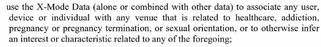
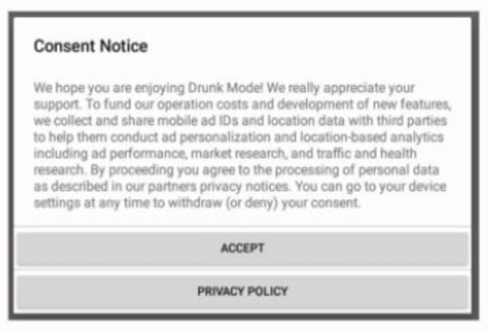
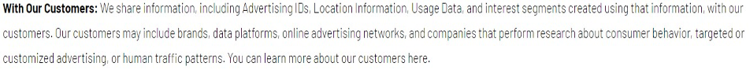
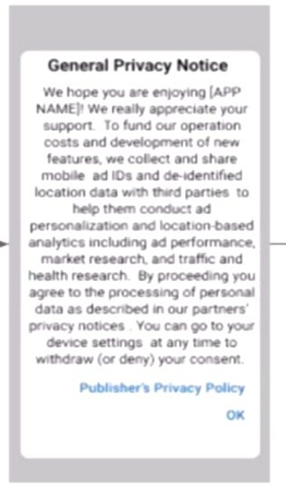
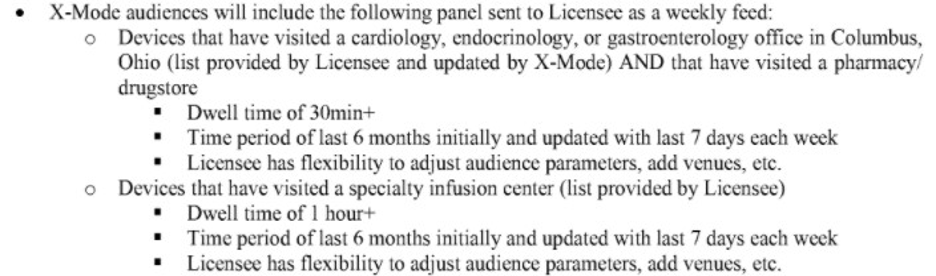
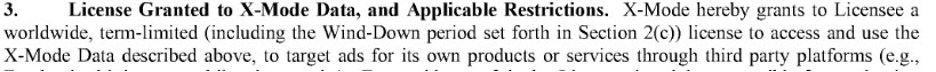

212-3038

UNITED STATES OF AMERICA BEFORE THE FEDERAL TRADE COMMISSION

COMMISSIONERS: 	Lina M. Khan, Chair Rebecca Kelly Slaughter Alvaro M. Bedoya ________________________________________________

In the Matter of

X-MODE SOCIAL, INC., a corporation,

and 	 	 	 	 	 	 	  DOCKET NO.

OUTLOGIC, LLC, a limited liability company.

________________________________________________

# COMPLAINT

The Federal Trade Commission, having reason to believe that X-Mode Social, Inc., a corporation, and Outlogic, LLC, a limited liability company (collectively, “Respondents”), have violated the provisions of the Federal Trade Commission Act, and it appearing to the Commission that this proceeding is in the public interest, alleges:

**1.**	Respondent X-Mode Social, Inc. (“X-Mode”) is a Virginia corporation with its principal office or place of business at 938 Park Ave, Herndon, VA 20170.

**2.**	Respondent Outlogic, LLC (“Outlogic”) is a Virginia Limited Liability Company with its principal office or place of business at 150 Granby St, Norfolk, VA 23510.

**3.**	On approximately May 25, 2021, Respondent X-Mode consummated a joint venture with Digital Envoy, Inc., in which X-Mode transferred its business and substantially all of its assets to its successor, Outlogic, and Outlogic became a wholly-owned subsidiary of Digital Envoy.  Throughout this complaint, “X-Mode” is used to refer to the conduct of both XMode and Outlogic, as its successor in interest.

**4.**	The acts and practices of Respondents alleged in this complaint have been in or affecting commerce, as “commerce” is defined in Section 4 of the Federal Trade Commission Act.

# RESPONDENTS’ BUSINESS ACTIVITIES

**5.**	X-Mode is a location data broker that sells consumer location data to hundreds of clients in industries ranging from real estate to finance, as well as private government contractors.  According to its marketing material, X-Mode is the “2nd  largest US location data company.”   X-Mode sells access to the location data in two forms.

**6.**	First, X-Mode licenses to third parties raw location data tied to unique persistent identifiers.  These third parties can then analyze and use the data for their own purposes, such as advertising or brand analytics, or provide access to the information for their own customers.

**7.**	Typically, such raw location data includes a unique persistent identifier for the mobile device called a Mobile Advertiser ID (“MAID”), the latitude, longitude, and a timestamp of the observation.  This raw location data is capable of matching an individual consumer’s mobile device with the locations they visited.  Until at least May 2023 X-Mode did not have any policies or procedures in place to remove sensitive locations from the raw location data sets it sold. X-Mode’s data could, therefore, be used to identify the sensitive locations that individual  consumers have visited.

**8.**	Second, X-Mode also licenses “X-Mode audience segments” tied to MAIDs for use by third parties. X-Mode analyzes the location data it obtains and based on the locations and  events visited by mobile devices, categorizes MAIDs into “audience segments” based on interests or characteristics purportedly revealed by the locations or events.  X-Mode offers audience segments such as “Size Inclusive Clothing Stores,” “Firehouses,” “Military Bases,” and “Veterans of Foreign Wars.”

**9.**	X-Mode predominantly collects consumer location data through third-party apps that incorporate Respondents’ software development kit (“SDK”), which is a collection of app development tools that, among other things, requests access to the location data generated by a mobile device’s operating system. If the device user allows access, the X-Mode SDK receives  the device’s precise latitude and longitude, along with a timestamp and other information about the device’s operating system.  This information is then passed on to X-Mode.  In some circumstances, X-Mode obtains location data from app developers and publishers through other means, such as server-to-server transfers.

**10.**	X-Mode incentivizes app developers to incorporate the X-Mode SDK into their apps by promising the app developers passive revenue for each consumer’s mobile device that allows the SDK to collect their location data.  The X-Mode SDK has been integrated into more than 300 apps, including games, fitness trackers, and religious apps.

**11.**	In addition to collecting consumer location data through its SDK, X-Mode also purchases location data associated with MAIDs from data brokers and other aggregators.  These third parties transfer data directly to X-Mode daily through various cloud storage structures.

**12.**	X-Mode has also collected consumer location data associated with MAIDs from users of its own mobile apps, Drunk Mode and Walk Against Humanity.

**13.**	X-Mode aggregates the location data – from its SDK, other data brokers, and, in the past, its own apps – and sells it to third parties.  These third parties range from advertisers, software as a service (SaaS) companies, analytics firms, consulting firms, commercial and educational research organizations, and private government contractors.

**14.**	Through its own apps, partner apps, and other data brokers, X-Mode daily has ingested over 10 billion location data points from all over the world.  X-Mode advertises that this location data is 70% accurate within 20 meters or less.

**15.**	X-Mode does not restrict the collection of location data from sensitive locations such as healthcare facilities, churches, and schools.  X-Mode contractually restricts how its customers may use location data. For example, one such restriction is that its customers cannot:

tbc X-Modc Data (alone or combined with other data) to associate any user, device or individual with any venue that is related to healthcare, addiction, pregnancy or pregnancy termination, or sexual oricntatioD, or to otherwise infer an interest or characteristic related to any of the foregoing;

**16.**	However, these contractual restrictions are insufficient to protect consumers from the substantial injury caused by the collection, transfer, and use of the consumers’ location data from visits to sensitive locations.

## X-Mode’s Location Data Could Be Used to Identify People and Track Them to Sensitive Locations

**17.**	X-Mode’s location data associated with MAIDs could be used to track consumers to sensitive locations, including medical facilities, places of religious worship, places that may be used to infer an LGBTQ+ identification, domestic abuse shelters, and welfare and homeless shelters.  For example, by plotting the latitude and longitude coordinates included in the X-Mode data stream using publicly available map programs, it is possible to identify which consumers’ mobile devices visited medical facilities. Further, because each set of coordinates in X-Mode’s  data is time-stamped, it is also possible to identify when a mobile device visited the location.

**18.**	The raw data provided by X-Mode to its customers is not anonymized.  It is possible to use the geolocation data, combined with the mobile device’s MAID, to identify the mobile device’s user or owner.  For example, some data brokers advertise services to match MAIDs with “offline” information, such as consumers’ names and physical addresses.

**19.**	Even without such services, however, location data could be used to identify people.  The location data sold by X-Mode typically includes multiple timestamped signals for each MAID.  By plotting each of these signals on a map, much can be inferred about the mobile device owners.  For example, the location of a mobile device at night likely corresponds to the consumer’s home address.  Public or other records may identify the name of the owner or resident of a particular address.

## X-Mode Failed to Honor Consumers’ Privacy Choices

**20.**	Since approximately 2013, the Android mobile phone operating system has included a privacy control that permitted users to “Opt out of Ads Personalization.”  This privacy control allows consumers to opt out from marketers using their phones’ MAIDs to build profiles about the consumers or show the consumers personalized ads.

**21.**	From approximately 2013 to 2021, when consumers enabled this control on their Android phones, the Android operating system would pass a phone’s MAID to an app when requested by the app, along with other requested information, and would include a “flag” informing the app of the consumers’ choice to opt out from personalized advertising.

**22.**	From at least June 2018 to July 2020, X-Mode ingested the MAIDs, mobile location data, and flags of consumers who had enabled the “Opt out of Ads Personalization” control on their Android mobile phones, and, in many instances and contrary to these consumers’ privacy choices, provided access to this data to marketers and other customers.  X-Mode provided access to this data so that its customers could, among other things, build profiles about those consumers and serve them personalized advertising.  During this time period, consumers were unaware that their privacy choices were not being honored by X-Mode.

**23.**	From at least June 2018 to July 2020, X-Mode failed to employ the necessary technical safeguards and oversight to ensure that consumers’ privacy choices enabled on their Android phones were honored and that their location data was no longer collected or sold for personalized advertising purposes.

## X-Mode Failed to Notify Users of its Own Apps of the Purposes for which Their Location Data Would be Used

**24.**	Although X-Mode primarily obtains its location data through third parties, XMode published two of its own apps (Drunk Mode and Walk Against Humanity) and has collected consumers’ location data from those apps.  As required by iOS and Android policies, X-Mode provided consumers with in-app explanations requesting permission to collect the consumers’ location data and purporting to provide the uses for the information.  X-Mode also published a privacy notice on its website, purporting to provide consumers with information about the company’s use of their personal information, including location data.

**25.**	However, until at least August 2020, the notices provided by X-Mode directly to consumers failed to fully disclose the purposes for which consumers’ location data would be used.  For example, a notice displayed in X-Mode’s “Drunk Mode” app used language suggesting that consumers’ location data would be used solely for “ad personalization and location-based analytics including ad performance, market research, and traffic and health research”:

**26.**	Likewise, in X-Mode’s privacy policy published on or about May 17, 2020, XMode identifies “customers” with which X-Mode shares consumers’ information:

**27.**	While X-Mode’s consumer notices disclosed certain commercial uses of consumer location data, X-Mode failed to inform consumers that it would be selling data to government contractors for national security purposes.

**28.**	These facts would be material to consumers in deciding whether to use or grant location permissions to mobile apps.  Consumers have expressed concern about the amount of personal information various entities - like advertisers, employers, or law enforcement - know about them and about how such entities use their personal data.   Consumers are increasingly reluctant to share their personal information, such as digital activity, emails, text messages, and phone calls, especially without knowing which entities will receive it.  Such collection and use imposes an unwarranted invasion into consumers’ privacy.

**29.**	X-Mode is aware that understanding the purposes for which their personal information is being collected is material to consumers.  Indeed, when advising app publishers on ways to “prime” users to opt-in to the collection of their location data, X-Mode has informed app publishers, “Users are more likely to allow access when trying to complete a task that clearly needs location access.”

**30.**	By failing to fully inform consumers how their data would be used and that their data would be provided to government contractors for national security purposes, X-Mode failed to provide information material to consumers and did not obtain informed consent from consumers to collect and use their location data.

## X-Mode Has Provided App Publishers with Deceptive Consumer Disclosures

**31.**	X-Mode provides sample consumer notices to third-party app publishers that mislead consumers about the purposes for which their location may be used.

**32.**	In most instances, X-Mode does not communicate directly with consumers.

Rather, X-Mode obtains most of its location data from third parties, including app publishers.  Android and iOS policies require app publishers to get users’ permission to collect their precise location information.

**33.**	Because X-Mode obtains most of its location data from third party apps, the company relies on these third parties to obtain informed consumer consent to collect, use, or sell location data.  X-Mode has provided third party app publishers incorporating its SDK with recommended language for consumer disclosures in both apps and privacy policies.

**34.**	For example, one consumer consent notice that X-Mode provided to third-party app publishers stated that consumers’ location data would be shared “with third parties to help them conduct ad personalization and location-based analytics:”

**35.**	This notice and other notices provided by X-Mode to third-party app publishers fail to fully inform consumers how their data would be used and that their geolocation data would be provided to government contractors for national security purposes.

X-Mode Fails to Verify that Third-Party Apps Notified Consumers of the Purposes for which Their Location Data Would be Used

**36.**	In addition to providing app publishers and others with incomplete and misleading notices, X-Mode has failed to verify that third-party apps incorporating its SDK obtain informed consumer consent to grant X-Mode access to their sensitive location data.

**37.**	Although X-Mode has tracked the language used by third party apps in consumer notices, X-Mode, in many cases, has not taken corrective actions based on any review of this language.  As a result of this tracking, X-Mode is aware that apps provided consumers with deficient notices that did not adequately inform consumers how their data would be used and that their location would be provided to government contractors for national security purposes.  However, X-Mode failed to instruct the third party apps to correct the notices, failed to suspend or terminate its relationship with the third party apps, and continued to use the data.

X-Mode Has Targeted Consumers Based on Sensitive Characteristics

**38.**	As discussed above, X-Mode licenses audience segments, categories of MAIDs based on shared characteristics, for use by third parties.  X-Mode has a catalogue of audience segments that it provides standard to the marketplace.  The company also created custom audience segments for customers with special requests.

**39.**	X-Mode has created custom audience segments that were based on sensitive characteristics of consumers.  X-Mode licensed these custom audience segments to a third party for advertising or marketing purposes.  Specifically, X-Mode entered into an agreement with a privately held clinical research company to license custom audience segments of consumers who had visited Cardiology, Endocrinology, or Gastroenterology offices and visited a pharmacy or drugstore in the Columbus, Ohio area and consumers that had visited a specialty infusion center.  The purchase order from the organization explained the categorization and use as follows:

##  X-Mode’s Business Practices Cause or are Likely to Cause Substantial Injury to Consumers

**40.**	X-Mode’s practices cause or are likely to cause substantial injury to consumers.  For example, X-Mode’s licensing agreements do not require their customers to employ reasonable and appropriate data security measures commensurate with the sensitivity of precise consumer location data, which increases the risk the information will be exposed in a data breach.

**41.**	Further, X-Mode has little or no control over downstream uses of the precise location data that it sells.  In fact, in at least two known instances, X-Mode sold location data to customers who violated contractual restrictions limiting the resale of such data.  In such circumstances, X-Mode does not know the full extent of the exposure such as the identities of all third parties that received the data, how those third parties used the data, or whether those third parties further distributed the data to other recipients.

**42.**	As described above, the data sold by X-Mode may be used to identify individual consumers and their visits to sensitive locations, such as visits to houses of worship and doctors’ offices.  The sale of such data poses an unwarranted intrusion into the most private areas of consumers’ lives and causes or is likely to cause substantial injury to consumers.

**43.**	For example, location data may be used to track consumers to places of worship, and thus reveal their religious beliefs and practices.

**44.**	As another example, the location data could be used to track consumers who have visited women’s reproductive health clinics and as a result, may have had or contemplated sensitive medical procedures such as an abortion or in vitro fertilization.  Using the data X-Mode has made available, it is possible for third parties to target consumers visiting such healthcare facilities and trace that mobile device to a single-family residence.

**45.**	Identification of sensitive and private characteristics of consumers from the location data sold by X-Mode is an invasion of consumers’ privacy that causes or is likely to cause substantial injury through loss of privacy, exposure to discrimination, physical violence, emotional distress, and other harms.

**46.**	Additionally, the use of location data to categorize consumers based on sensitive characteristics causes or is likely to cause substantial injury. Such categorizations, particularly by companies that consumers never directly interact with, are far outside the expectations and experience of consumers, and can result in and cause additional injuries to consumers, including by exposing them to risks of discrimination.

**47.**	The market for mobile location data is complex and typically opaque to consumers. Mobile location data, as electronically-stored information, is easily transferable and, as Respondents’ practices demonstrate, may be sold and resold multiple times. Indeed, once the information is collected, many consumers lose the ability to control its use, spread, and retention, and therefore the harms described above are not reasonably avoidable by consumers.

**48.**	These harms are not outweighed by any countervailing benefits to consumers or competition. X-Mode could implement certain safeguards at a reasonable cost and expenditure of resources. For example, X-Mode could audit the process by which its suppliers obtain consent and cease using location data that was not obtained with appropriate consent. Instead, X-Mode relies primarily on contractual language in supplier agreements requiring its suppliers to obtain appropriate consent from consumers and in data licensing agreements prohibiting misuse of its location data, but such language is insufficient to protect consumers from substantial injury. Moreover, even when X-Mode was aware that its suppliers were not obtaining appropriate consent, it continued to use consumers’ location data provided by those suppliers.

# VIOLATIONS OF THE FTC ACT

**49.**	Section 5(a) of the FTC Act, 15 U.S.C. § 45(a), prohibits “unfair or deceptive acts or practices in or affecting commerce.”

**50.**	Acts or practices are unfair under Section 5 of the FTC Act if they cause or are likely to cause substantial injury to consumers that consumers cannot reasonably avoid themselves and that is not outweighed by countervailing benefits to consumers or competition.  15 U.S.C. § 45(n).

**51.**	Misrepresentations or deceptive omissions of material fact constitute deceptive acts or practices prohibited by Section 5(a) of the FTC Act.

## Count I

### Unfair Sale of Sensitive Data

**52.**	As described in Paragraphs 15 to 17 Respondents sell, license, or otherwise transfer precise location data associated with unique persistent identifiers that reveal consumers’ visits to sensitive locations, including, among others, locations associated with medical care, reproductive health, religious worship, mental health, temporary shelters (such as shelters for the homeless, domestic violence survivors, or other at-risk populations), and addiction recovery.

**53.**	This practice has caused or is likely to cause substantial injury to consumers that is not outweighed by countervailing benefits to consumers or competition and is not reasonably avoidable by consumers themselves.  Consequently, this practice is an unfair act or practice.

## Count II

### Unfair Failure to Honor Consumer Privacy Choices

**54.**	As described in Paragraphs 20 to 22, Respondents have collected and sold location data for the purposes of developing consumer profiles, surveilling consumers and targeting consumers with advertising even if consumers had opted-out of having their location  data used for such purposes.

**55.**	This practice caused or is likely to cause substantial injury to consumers that is not outweighed by countervailing benefits to consumers or competition and is not reasonably avoidable by consumers themselves.  Consequently, this practice is an unfair act or practice.

## Count III

### Unfair Collection and Use of Consumer Location Data

**56.**	Through the means described in Paragraphs 24 to 28 Respondents have collected consumers’ location data from apps that Respondents owned without obtaining consumers’ informed consent to the collection, use, or sale of their data.

**57.**	This practice has caused or is likely to cause substantial injury to consumers in the form of loss of privacy about the day-to-day movements of millions of consumers and an increased risk of disclosure of such sensitive information.  This injury is not outweighed by countervailing benefits to consumers or competition and is not reasonably avoidable by consumers themselves.  Consequently, this practice is an unfair act or practice.

## Count IV

### Unfair Collection and Use of Consumer Location Data Without Consent Verification

**58.**	Through the means described in Paragraphs 29 to 34, Respondents collect consumers’ location data through third-party apps that incorporate Respondents SDK without taking reasonable steps to verify that those consumers provide informed consent to the collection, use, or sale of their data.

**59.**	This practice has caused or is likely to cause substantial injury to consumers in the form of loss of privacy about the day-to-day movements of millions of consumers and an increased risk of disclosure of such sensitive information.  This injury is not outweighed by countervailing benefits to consumers or competition and is not reasonably avoidable by consumers themselves.  Consequently, this practice is an unfair act or practice.

## Count V

### Unfair Categorization of Consumers Based on Sensitive Characteristics for Marketing Purposes

**60.**	As described in Paragraphs 38 and 39 Respondents have categorized consumers into audience segments based on sensitive characteristics, such as visits to medical offices derived from location data. They have sold these audience segments to a third party for marketing purposes.

**61.**	This practice has caused or is likely to cause substantial injury to consumers that is not outweighed by countervailing benefits to consumers or competition and is not reasonably avoidable by consumers themselves. Consequently, this practice is an unfair act or practice.

## Count VI
### Deceptive Failure to Disclose Use of Location Data

**62.**	As described in Paragraphs 24 to 30, in numerous instances in connection with the collection, transfer, or sale of consumer location data, Respondents have represented, directly or indirectly, expressly or by implication, that Drunk Mode and Walk Against Humanity app users’ location data would be used by third parties for ad personalization and location based analytics including ad performance, market research, and traffic and health research purposes.

**63.**	In fact, as set forth in Paragraphs 11-13, Respondents have provided location data collected from Drunk Mode and Walk Against Humanity to government contractors for national security purposes.  This fact would be material to consumers in deciding whether to use or grant location permissions to Respondents’ apps.

**64.**	Respondents’ failure to disclose material information described in Paragraph 63, in light of the representation set forth in Paragraph 62, is a deceptive act or practice.

## Count VII
### Means and Instrumentalities to Engage in Deception

**65.**	Through the means described in Paragraphs 29 to 34, Respondents have furnished third party app publishers with language for consumer disclosures in both apps and privacy policies that misleads consumers about the purposes for which their location may be used, such  as by failing to disclose that consumer’s location would be provided to government contractors for national security purposes.

**66.**	By furnishing others with such materials, Respondents have provided the means and instrumentalities for the commission of deceptive acts and practices.  Consequently, this practice is a deceptive act or practice.

## Violations of Section 5

**67.** 	The acts and practices of Respondents as alleged in this complaint constitute unfair or deceptive acts or practices in or affecting commerce in violation of Section 5(a) of the Federal Trade Commission Act.

THEREFORE, the Federal Trade Commission this _______ day of _______, 2022, has issued this Complaint against Respondents.

By the Commission.

April J. Tabor Secretary

SEAL:

