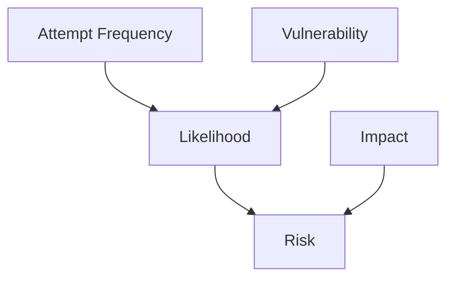

# What are the parts of risk calculation?
Based on FAIR methodology & NIST SP 800-53 ([link](https://nvlpubs.nist.gov/nistpubs/Legacy/SP/nistspecialpublication800-30r1.pdf))

# How is likelihood calculated?

## Calculate threat event occurrence
**TABLE G-2: ASSESSMENT SCALE – LIKELIHOOD OF THREAT EVENT INITIATION (ADVERSARIAL)**

| Qualitative Values | Semi-Quantitative Values | Score | Description                                              |
|--------------------|--------------------------|-------|----------------------------------------------------------|
| Very High          | 96-100                    | 10    | Adversary is almost certain to initiate the threat event. |
| High               | 80-95                     | 8     | Adversary is highly likely to initiate the threat event.  |
| Moderate           | 21-79                     | 5     | Adversary is somewhat likely to initiate the threat event.|
| Low                | 5-20                      | 2     | Adversary is unlikely to initiate the threat event.       |
| Very Low           | 0-4                       | 0     | Adversary is highly unlikely to initiate the threat event.|

TABLE G-3: ASSESSMENT SCALE – LIKELIHOOD OF THREAT EVENT OCCURRENCE (NON-ADVERSARIAL)

| Qualitative Values | Semi-Quantitative Values | Score | Description                                                                                |
|--------------------|--------------------------|-------|--------------------------------------------------------------------------------------------|
| Very High          | 96-100                    | 10    | Error, accident, or act of nature is almost certain to occur; or occurs more than 100 times a year. |
| High               | 80-95                     | 8     | Error, accident, or act of nature is highly likely to occur; or occurs between 10-100 times a year. |
| Moderate           | 21-79                     | 5     | Error, accident, or act of nature is somewhat likely to occur; or occurs between 1-10 times a year. |
| Low                | 5-20                      | 2     | Error, accident, or act of nature is unlikely to occur; or occurs less than once a year, but more than once every 10 years. |
| Very Low           | 0-4                       | 0     | Error, accident, or act of nature is highly unlikely to occur; or occurs less than once every 10 years. |

## Calculate vulnerability
**TABLE G-4: ASSESSMENT SCALE – LIKELIHOOD OF THREAT EVENT RESULTING IN ADVERSE IMPACTS**

| Qualitative Values | Semi-Quantitative Values | Score | Description                                                                                 |
|--------------------|--------------------------|-------|---------------------------------------------------------------------------------------------|
| Very High          | 96-100                    | 10    | If the threat event is initiated or occurs, it is almost certain to have adverse impacts.    |
| High               | 80-95                     | 8     | If the threat event is initiated or occurs, it is highly likely to have adverse impacts.     |
| Moderate           | 21-79                     | 5     | If the threat event is initiated or occurs, it is somewhat likely to have adverse impacts.   |
| Low                | 5-20                      | 2     | If the threat event is initiated or occurs, it is unlikely to have adverse impacts.          |
| Very Low           | 0-4                       | 0     | If the threat event is initiated or occurs, it is highly unlikely to have adverse impacts.   |

## Calculate likelihood
**TABLE G-5: ASSESSMENT SCALE – OVERALL LIKELIHOOD**

Likelihood of Threat Event Initiation or Occurrence - 1st column

Likelihood Threat Events Result in Adverse Impacts - 1st row

|  | **Very Low** | **Low**     | **Moderate** | **High**    | **Very High** |
|-----------------------------------------------------|----------|---------|----------|---------|-----------|
| **Very High**                                       | Low      | Moderate| High     | Very High | Very High |
| **High**                                            | Low      | Moderate| Moderate | High    | Very High |
| **Moderate**                                        | Low      | Low     | Moderate | Moderate| High      |
| **Low**                                             | Very Low | Low     | Low      | Moderate| Moderate  |
| **Very Low**                                        | Very Low | Very Low| Low      | Low     | Low       |

# How is impact calculated?
## Types of harm
**TABLE H-2: EXAMPLES OF ADVERSE IMPACTS**

| Type of Impact          | Impact                                                                                                                                                                                                                                                                                                      |
|-------------------------|-------------------------------------------------------------------------------------------------------------------------------------------------------------------------------------------------------------------------------------------------------------------------------------------------------------|
| **HARM TO OPERATIONS**   | Inability to perform current missions/business functions. In a sufficiently timely manner. With sufficient confidence and/or correctness. Within planned resource constraints. Inability, or limited ability, to perform missions/business functions in the future. Inability to restore missions/business functions. In a sufficiently timely manner. With sufficient confidence and/or correctness. Within planned resource constraints. Harms (e.g., financial costs, sanctions) due to noncompliance. With applicable laws or regulations. With contractual requirements or other requirements in other binding agreements (e.g., liability). Direct financial costs. Relational harms. Damage to trust relationships. Damage to image or reputation (and hence future or potential trust relationships). |
| **HARM TO ASSETS**       | Damage to or loss of physical facilities. Damage to or loss of information systems or networks. Damage to or loss of information technology or equipment. Damage to or loss of component parts or supplies. Damage to or loss of information assets. Loss of intellectual property.                                                                                         |
| **HARM TO INDIVIDUALS**  | Injury or loss of life. Physical or psychological mistreatment. Identity theft. Loss of Personally Identifiable Information. Damage to image or reputation.                                                                                                                                                                           |
| **HARM TO OTHER ORGANIZATIONS** | Harms (e.g., financial costs, sanctions) due to noncompliance. With applicable laws or regulations. With contractual requirements or other requirements in other binding agreements. Direct financial costs. Relational harms. Damage to trust relationships. Damage to reputation (and hence future or potential trust relationships). |
| **HARM TO THE NATION**   | Damage to or incapacitation of a critical infrastructure sector. Loss of government continuity of operations. Relational harms. Damage to trust relationships with other governments or with nongovernmental entities. Damage to national reputation (and hence future or potential trust relationships). Damage to current or future ability to achieve national objectives. Harm to national security.|

## Calculate impact
**TABLE H-3: ASSESSMENT SCALE – IMPACT OF THREAT EVENTS**

| Qualitative Values | Semi-Quantitative Values | Score | Description                                                                                                                                                                                                                                                                                                             |
|--------------------|--------------------------|-------|-------------------------------------------------------------------------------------------------------------------------------------------------------------------------------------------------------------------------------------------------------------------------------------------------------------------------|
| Very High          | 96-100                    | 10    | The threat event could be expected to have multiple severe or catastrophic adverse effects on organizational operations, organizational assets, individuals, other organizations, or the Nation.                                                                                                                        |
| High               | 80-95                     | 8     | The threat event could be expected to have a severe or catastrophic adverse effect on organizational operations, organizational assets, individuals, other organizations, or the Nation. A severe or catastrophic adverse effect means that, for example, the threat event might: (i) cause a severe degradation in or loss of mission capability to an extent and duration that the organization is not able to perform one or more of its primary functions; (ii) result in major damage to organizational assets; (iii) result in major financial loss; or (iv) result in severe or catastrophic harm to individuals involving loss of life or serious life-threatening injuries. |
| Moderate           | 21-79                     | 5     | The threat event could be expected to have a serious adverse effect on organizational operations, organizational assets, individuals, other organizations, or the Nation. A serious adverse effect means that, for example, the threat event might: (i) cause a significant degradation in mission capability to an extent and duration that the organization is able to perform its primary functions, but the effectiveness of the functions is significantly reduced; (ii) result in significant damage to organizational assets; (iii) result in significant financial loss; or (iv) result in significant harm to individuals that does not involve loss of life or serious life-threatening injuries. |
| Low                | 5-20                      | 2     | The threat event could be expected to have a limited adverse effect on organizational operations, organizational assets, individuals, other organizations, or the Nation. A limited adverse effect means that, for example, the threat event might: (i) cause a degradation in mission capability to an extent and duration that the organization is able to perform its primary functions, but the effectiveness of the functions is noticeably reduced; (ii) result in minor damage to organizational assets; (iii) result in minor financial loss; or (iv) result in minor harm to individuals.                     |
| Very Low           | 0-4                       | 0     | The threat event could be expected to have a negligible adverse effect on organizational operations, organizational assets, individuals, other organizations, or the Nation.                                                                                                                                              |

# How is risk calculated?
## Risk Matrix
**TABLE I-2: ASSESSMENT SCALE – LEVEL OF RISK (COMBINATION OF LIKELIHOOD AND IMPACT)**

Likelihood - 1st column

Impact - 1st row
| | **Very Low**  | **Low**      | **Moderate** | **High**     | **Very High** |
|----------------------------------------------------------------------|-----------|----------|----------|----------|-----------|
| **Very High**                                                        | Very Low  | Low      | Moderate | High     | Very High |
| **High**                                                             | Very Low  | Low      | Moderate | High     | Very High |
| **Moderate**                                                         | Very Low  | Low      | Moderate | Moderate | High      |
| **Low**                                                              | Very Low  | Low      | Low      | Low      | Moderate  |
| **Very Low**                                                         | Very Low  | Very Low | Very Low | Low      | Low       |

## Risk Description
**TABLE I-3: ASSESSMENT SCALE – LEVEL OF RISK**

| Qualitative Values | Semi-Quantitative Values | Score | Description                                                                                                                                                                                            |
|--------------------|--------------------------|-------|--------------------------------------------------------------------------------------------------------------------------------------------------------------------------------------------------------|
| Very High          | 96-100                    | 10    | Very high risk means that a threat event could be expected to have multiple severe or catastrophic adverse effects on organizational operations, organizational assets, individuals, other organizations, or the Nation. |
| High               | 80-95                     | 8     | High risk means that a threat event could be expected to have a severe or catastrophic adverse effect on organizational operations, organizational assets, individuals, other organizations, or the Nation.|
| Moderate           | 21-79                     | 5     | Moderate risk means that a threat event could be expected to have a serious adverse effect on organizational operations, organizational assets, individuals, other organizations, or the Nation.          |
| Low                | 5-20                      | 2     | Low risk means that a threat event could be expected to have a limited adverse effect on organizational operations, organizational assets, individuals, other organizations, or the Nation.              |
| Very Low           | 0-4                       | 0     | Very low risk means that a threat event could be expected to have a negligible adverse effect on organizational operations, organizational assets, individuals, other organizations, or the Nation.       |
