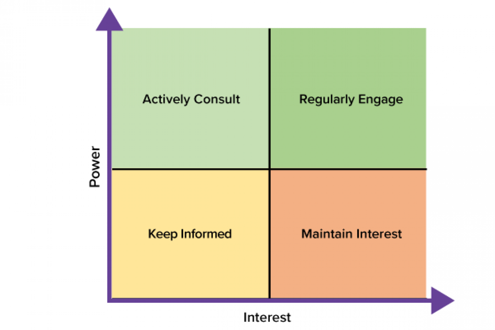

# Project Charter

A project charter is a formal document created during the initiation phase of a project that defines the project’s purpose, objectives, scope, stakeholders, and key deliverables. It acts as a high-level blueprint, authorizing the project to begin and providing a shared understanding among stakeholders.

The project charter is essential for:

- Gaining Approval: Provides formal authorization to proceed.
- Aligning Stakeholders: Establishes a common vision and direction.
- Setting Boundaries: Clearly defines what the project will and won’t do.
- Guiding Planning: Serves as a reference for creating detailed plans later.

Elements:
- **Goals**: Define what you're aiming to achieve.
- **Scope**: Outline the boundaries of the work required.
- **Deliverables**: Specify the tangible outputs or products.
- **Success Criteria**: Establish the benchmarks for measuring project success.
- **Stakeholders**: Identify those impacted or involved in the project.
- **Resources**: Determine the necessary people, time, software, and budget.

**Cost-benefit analysis**: calculate ROI of project. Formula:

$$
ROI = \frac{\text{Profit} - \text{Cost}}{\text{Cost}} \times 100
$$

A ROI of >10% is great.

# Project Goals

- **Project goals** represent the desired outcomes of a project. They answer the "why" behind the project and articulate the overarching objectives the project aims to achieve. 
- **Deliverables**, on the other hand, are the tangible products or services created as a result of the project. They focus on the "what" and represent the specific outputs produced to achieve the project goals. For instance, deliverables for the aforementioned goal could include email templates and training materials for customer service representatives.

## S.M.A.R.T. Goals
Goals have to be S.M.A.R.T.:

- **Specific**:
  - What do I want to accomplish?
  - Why is this a goal?
  - Who is involved?
  - Where should the goal be delivered?
  - To what degree?
- **Measurable**:
  - How much?
  - How many?
  - How will I know I accomplished the goal (metrics, benchmarks)?
- **Attainable**:
  - Can it be reasonably achieved?
  - How can it be accomplished?
- **Relevant**:
  - Does the goal make sense?
  - Is the goal worthwhile?
  - Is it the right time?
- **Time-bound**:
  - Does it have a deadline?

## OKRs

Objective -> Describes a goal or outcome

Key Results -> measurable outcome

OKRs are a valuable framework for setting and tracking goals at various levels within an organization, including company, department, and project levels.

### Objectives
Objectives describe a goal or desired outcome. They should be:
- **Aspirational**: Ambitious and inspiring.
- **Aligned with Organizational Goals**: Connected to the broader mission and strategy.
- **Action-Oriented**: Focused on what needs to be achieved.
- **Concrete**: Clear and unambiguous.
- **Significant**: Meaningful and impactful.

### Key Results
Key Results are the measurable outcomes that demonstrate progress towards achieving the objective. They should be:
- **Result-Oriented, Not Task-Based**: Focused on outcomes rather than activities.
- **Measurable and Verifiable**: Quantifiable with clear criteria for success.
- **Specific and Well-Defined**: Clearly articulated with no ambiguity.
- **Aggressive Yet Realistic**: Challenging but attainable.

### Typical Structure
Each Objective is typically associated with **2-3 Key Results** to maintain focus and clarity.

# Project Scope

## What is Included

Project scope outlines the boundaries of the project, clarifying what's included and, importantly, what's excluded.
When defining the project scope, it's crucial to talk to stakeholders to gain a comprehensive understanding of their perspectives and expectations. Ask stakeholders the following questions:
- Where did this project come from?
- Why is it needed?
- What is it expected to achieve?
- What does the sponsor have in mind?
- Who approves the final result?

It can be broken down into the following elements:
- Stakeholders
- Goals
- Deliverables
- Resources
- Budget
- Schedule

## Project Boundaries
**Project boundaries** are closely linked to the concept of monitoring and maintaining scope.

**Scope creep** refers to the uncontrolled expansion of a project's scope beyond its initially defined boundaries. It often occurs when new features or requirements are added to a project without proper evaluation of their impact on the project timeline, budget, or resources. Scope creep can jeopardize a project's success, leading to delays, cost overruns, and ultimately, project failure.

### Causes of Scope Creep

**External Causes**
These originate from sources outside the project team, such as:
- **Customers**: Clients may request additional features or modifications during the project lifecycle, potentially pushing the scope beyond its original parameters.
- **Environment**: External factors, like changes in regulations or market conditions, can necessitate adjustments to the project scope.
- **Technology**: Advancements or changes in technology might require incorporating new tools or processes, impacting the project's scope.

**Internal Causes**
These stem from within the project team, such as:
- **Team Members**: Project team members might propose new ideas or enhancements without fully considering their implications on the overall scope.

### Solutions to Manage Scope Creep
1. **Make Plans Visible**  
   - Ensure that the project scope and plan are readily available and transparent to all stakeholders, promoting a shared understanding of the project's boundaries.

2. **Clarity on Project Requirements**  

3. **Ground Rules and Expectations for Stakeholder Involvement**  
   - Establish clear guidelines for stakeholder involvement, specifying their roles, responsibilities, and limitations regarding scope changes.

4. **Plan for Delaying or Rejecting Out-of-Scope Requests**  
   - Implement a process for managing change requests that fall outside the agreed-upon scope. This may involve deferring them for future consideration or rejecting them if they don’t align with project goals.

5. **Put Agreements in Writing**  
   - Document all agreed-upon changes and adjustments to the scope, ensuring clarity, accountability, and a traceable record of modifications.

6. **Learn to Say No**  
   - Project leaders should firmly decline requests that misalign with project goals, negatively impact the timeline, budget, or quality, or contribute to scope creep.

## Manage Changes to Scope

The **Triple Constraints Model**, also known as the **Project Management Triangle**, represents the three key factors that define a project's success:

1. **Scope**: The work required to deliver the project's goals.
2. **Time**: The schedule and deadlines for project completion.
3. **Cost**: The budget and financial resources allocated.

These three elements are interdependent: changes to one constraint (e.g., expanding scope) will impact the others (e.g., increasing cost or extending time). Balancing these constraints is essential to achieving project objectives while maintaining quality.

# Success Criteria
Critical concept of **Landing**, which refers to the point at which a project or initiative is completed and its results are delivered and integrated into the organization or stakeholder environment. This stage marks the transition from project execution to closure, where the focus shifts from delivering outputs to ensuring that the desired outcomes and benefits are realized.

- Landing is different from Launch;
- Common mistake to launch & forget.

Success criteria:
- Tell you if the project is successful
- Specific goals, deliverables, requirements and expectations
- Standards by which the project is judged

# Roles & Responsibilities

How to form teams:
- Required roles
- Right size
- Skills (can be taught)
- Availability
- Motivation

## Roles

- **Project Sponsor**: Who is accountable for the project and ensures delivery of business benefits.
- **Team Member**: Doing work.
- **User**: Who will receive value.
- **Stakeholder**: Impacted and/or interested in the project.
- **Project Manager (PM)**: Plans, organizes, executes, and monitors the project throughout its lifecycle.

### Stakeholders
Steps on identifying stakeholders: 
1. Who does the project impact
2. Determine level of interest & influence
3. Assess ability to participate & engage them

Stakeholder power grid:

Top right quadrant: key stakeholders. Consider forming a steering committee with them. Need to **overcommunicate** with key stakeholders.

## Responsibilities

RACI matrices are a was of ensuring everyone understands their responsibilities:
- Responsible - does the work to complete a task
- Accountable - makes sure the work gets done
- Consulted - provides feedback
- Informed - is let know about progress

Features:
- One person can be R&A at the same time
- Only one person can be A
- Failures relating to responsibilities:
  - Unclear expectations
  - Unrealistic expectations
  - Miscommunication
  - Lack of resources
  - Scope creep