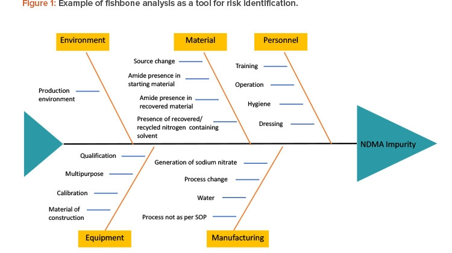

# Planning

- **Schedule**
- **Budget**: Total cost to complete project
- **Risk management plan**:
  - Searching for problems
  - Finding ways to mitigate

## Kickoff

Project kickoff meetings are the first meetings where the team comes together to establish a shared vision and understanding. These meetings help the team:
- Understand individual roles.
- Align on the project scope.
- Establish support and gain buy-in from the team.
- Address questions or clarify misunderstandings.

Kickoff meetings should include team members, stakeholders, and sponsors.

Agenda for the Kickoff Meeting
1. **Intro**
2. **Background**: How the project came to be.
3. **Roles**
4. **Collaboration**
5. **Goals & Scope**
6. **Next Steps**
7. **Q&A**

# Tasks & Milestones

- **Milestones** are points in the project schedule which indicate progress, signifying a deliverable or phase. Tasks are activities to perform within a time constraint.
- **Tasks**: Activities to be performed within allocated time. Each task exists within a milestone.

Setting milestones allows for:
- better assessment of the amount of work
- clear deadlines for when deliverables are provided
- clear areas where you need to adjust scope, time, or resources
- motivation for the team and clarity for stakeholders

When setting milestones for your project, you can follow these steps:
1. Evaluate the project as a whole. What is the goal of the project? What needs to be done to achieve that goal?
2. List out what the team needs to do to achieve the project goal.
3. Assign a deadline for each milestone. You'll want to talk to stakeholders and the team to get input on these deadlines.
Make sure to avoid these common mistakes when setting milestones:
- Too many milestones
- Tasks mistaken for milestones
- Listing tasks and milestones separately

# Project Plan
- Tasks
- Milestones
- People
  - Who
  - Roles
- Documentation
  - Charter
  - RACI
  - Budget
- Timeline

## Project Timeline
Includes:
- Time estimation
- Effort estimation.

3-points technique: 
1. Gather 3 estimates: (1) optimistic; (2) most likely; and (3) pessimistic
2. Use a methodology:
   1. Assign confidence level to estimates; OR
   2. Triangular Distribution (https://www.projectmanagement.com/wikis/540506/triangular-distribution---three-point-estimating-technique#_=_); OR
   3. Beta (or PERT) (https://www.projectmanagement.com/wikis/368763/3-points-estimating)

**Planning fallacy** is the tendency to underestimate the time it will take to complete a task, even when you know similar tasks have taken longer in the past. This can happen because people are often overly optimistic about their ability to complete a task. They may also fail to account for potential problems that could arise.

Create **buffers** to protect against changes and delays in a project. 

The **critical path** is the longest sequence of **dependent** tasks in a project. It determines the shortest possible duration for the project. Any delays on tasks along the critical path will delay the entire project.

## Budget

The **budget** is the total cost required to complete a project. It is comprised of estimated resources, including:
- **Labor costs**
- **Operating costs**
- **Materials**

You should also include **contingency funds** to account for unexpected costs. Breaking the project into phases and estimating the cost of each phase is a helpful approach for budget planning.

### Key Factors to Consider when Managing Budget:
- **Resource Cost Rate**
- **Reserve Analysis**
- **Contingency Budget**
- **Cost of Quality**
  - Prevention costs
  - Appraisal costs
  - Internal failure costs

### Techniques to Determine the Budget:
1. **Historical Data**: Analyze the costs of similar past projects to estimate costs for your project.
2. **Expert Advice**: Consult subject matter experts for insights and recommendations.
3. **Bottom-Up**: Estimate costs for each task and sum them up to calculate the total budget.
4. **Confirming Accuracy with Experts**
5. **Compare to Baselines**

After determining the total budget:
- Add a **5% buffer** for potential delays or cost overruns.

### Types of Costs

1. **Direct Costs**:  
   These are directly tied to the project, such as:
   - Wages and salaries
   - Material costs
   - Equipment rentals
   - Software licenses
   - Travel
   - Staff training

2. **Indirect Costs**:  
   These are not directly tied to the project but are necessary for its completion, such as:
   - Administrative work
   - Utilities
   - Office equipment
   - Security costs

# Risk Management

Risk management is the process of identifying, assessing, and responding to risks that could affect your project.
A risk is an event which can occur and potentially impact the project. An issue is something that has already occurred. There are four ways to respond to risk:
- Accept
- Mitigate
- Transfer
- Avoid
Risk management is a critical part of project management. By taking steps to manage risks, you can increase the chances of your project being successful.

## Core concepts
- Internal risk sources: These risks originate from within the project itself. Examples include time risk (missing deadlines), budget risk (exceeding the budget), and scope risk (risk that the project will not deliver the results sought).
- External risk sources: External risks come from factors outside of the project. These may include environmental or legal risks.
- Single point of failure: This is an event that, if it occurs, will stop the entire project.
- Dependencies: Dependencies occur when a task cannot begin before another task is completed. Dependencies determine the order in which tasks must be completed and can impact the project timeline if a preceding task is delayed.

## Risk analysis

1. **Fishbone diagram**

Typical risk causes:
- People
- Technology
- Materials
- Transport
- Environment

2. Risk matrices

See https://projectmanagementacademy.net/resources/blog/risk-matrix/. 

# Communication
A **communication plan** defines what needs to be communicated, who needs to communicate, when communication needs to happen, and how to communicate. It also defines where the communication should be stored. The context of the communication should also be considered:
- **What** needs to be communicated: Project status updates, meeting minutes, risk assessments
- **Who** needs to communicate: Project manager, team members, stakeholders
- **When** communication needs to happen: Weekly status meetings, after project milestones are achieved, when risks are identified
- **Why & how** to communicate: Email, phone calls, project management software
- **Where** communication is stored: Shared drive, project management software